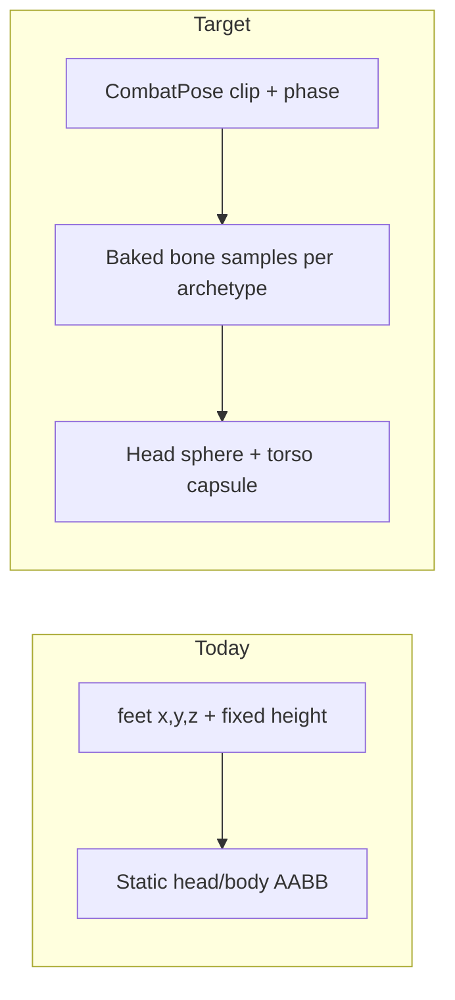
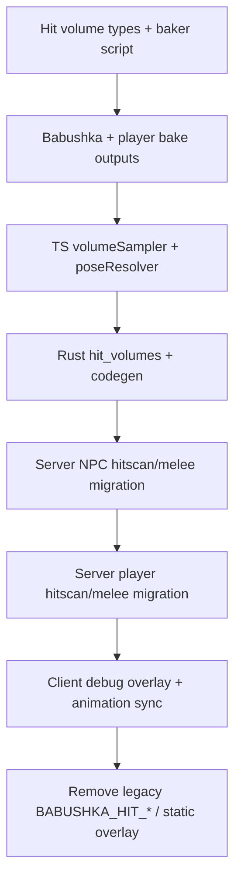

# Animated bone-based hit volumes (NPCs + players)

## Problem

Today all combat hit detection uses **static feet-rooted boxes** ([`combat_stub.rs`](apps/server/src/combat_stub.rs) `head_hit_box_aabb`, [`npc.rs`](apps/server/src/npc.rs) `trace_best_npc_hit`) and the debug overlay ([`NpcHitDebugOverlay.ts`](packages/engine/src/npc/NpcHitDebugOverlay.ts)) hardcodes the same offsets. Animation state (air squat, punch, death, jump, crouch) is ignored on the server; air squat is even **client-only** ([`babushkaNpcBody.ts`](packages/engine/src/npc/archetypes/babushka/babushkaNpcBody.ts) uses `observedTimeMs`).

## Design principle

**Do not replicate bone matrices.** The server cannot run Three.js. The correct production approach:

1. **Author time** — sample each GLB clip at fixed phase steps; bake head/torso volume world offsets relative to feet + yaw.
2. **Runtime** — derive `CombatPose { clipKey, phase01 }` from authoritative state + server timestamp; **lerp** baked samples into world-space hit volumes.
3. **Client debug** — optionally show live GLB bones *alongside* authoritative baked volumes for validation.

This matches the existing codegen pattern ([`scripts/gen-collision-constants.ts`](scripts/gen-collision-constants.ts) → [`generated_collision_constants.rs`](apps/server/src/generated_collision_constants.rs)).

---

## 1. Shared domain model (`packages/game`)

New module: `packages/game/src/combat/hitVolumes/`

| File | Responsibility |
|------|----------------|
| `types.ts` | `HitVolumeProfile`, `CombatPose`, `ResolvedHitVolumes` (head sphere + torso capsule in feet-local space) |
| `volumeSampler.ts` | Pure: `sampleHitVolumes(profile, pose) → ResolvedHitVolumes` (lerp between baked keyframes) |
| `worldVolumes.ts` | Pure: transform feet-local volumes to world AABB/sphere given `(x,y,z,yaw)` |
| `archetypes/babushka/profile.ts` | Bone name lists, radii, clip key enum |
| `archetypes/player/profile.ts` | Shared player bones; variants `player_male` / `player_female` |
| `archetypes/*/bakedSamples.generated.ts` | **Auto-generated** — do not hand-edit |

**Volume shape (keep ray tests fast):**
- **Head**: sphere (center + radius) — sufficient for headshot classification
- **Torso**: vertical capsule approximated as AABB from spine bone chain min/max Y + lateral radius

**Clip keys (union, extensible per archetype):**
- Locomotion: `idle`, `walk`, `run`, `airSquat` (babushka), `crouch`, `jump`
- Overlay: `punch`, `hit`, `dead`
- Sample at **20 phase steps** (0.0, 0.05, … 1.0) per clip — 60fps-equivalent fidelity at 250ms server ticks

---

## 2. Authoring pipeline

New script: [`scripts/gen-npc-hit-volumes.ts`](scripts/gen-npc-hit-volumes.ts) (rename to `gen-hit-volumes.ts` since it covers players too)

For each archetype config entry:
- Load GLB from `apps/client/public/static/models/...`
- Resolve bones via same name-guess lists as [`humanoidAttachmentBones.ts`](packages/engine/src/playerPresentation/humanoidAttachmentBones.ts) + archetype overrides (`Head`, `Neck`, `Spine`, `Hips`, …)
- For each combat clip: run `AnimationMixer` offline, sample at N phases
- Emit per phase: `{ headCenterY, headCenterXZ, headRadius, torsoMinY, torsoMaxY, torsoRadius }` in **feet-local bind space** (after same normalization as [`npcModelUtils.ts`](packages/engine/src/npc/npcModelUtils.ts))

Outputs (checked into repo, regenerated in CI):
- `packages/game/src/combat/hitVolumes/archetypes/*/bakedSamples.generated.ts`
- `apps/server/src/generated_hit_volumes.rs` (compact `const` tables for Rust)

New npm script: `pnpm content:gen-hit-volumes` (add to pre-publish / CI alongside `content:gen-collision-constants`).

**Initial archetypes:**
- `babushka` — clips from [`babushkaNpcBody.ts`](packages/engine/src/npc/archetypes/babushka/babushkaNpcBody.ts)
- `player_male` / `player_female` — clips from [`RemotePlayerPresenter.ts`](packages/engine/src/playerPresentation/remote/RemotePlayerPresenter.ts) (`Idle`, `Walking`, `Running`, `Regular_Jump`) + procedural crouch pose baked from crouch stance

---

## 3. Pose resolution (authoritative, shared logic)

New: `packages/game/src/combat/hitVolumes/poseResolver/`

Separate resolvers with **parity tests** (TS vs Rust):

### NPC pose ([`npc.rs`](apps/server/src/npc.rs) inputs)
Derive from `WorldNpc` + `now_us`:
| Priority | Clip | Phase source |
|----------|------|--------------|
| 1 | `dead` | `(now_us - died_at_micros) / dead_clip_duration` |
| 2 | `hit` | `(now_us - last_hit_micros) / hit_clip_duration` (within clip window) |
| 3 | `punch` | `(now_us - last_melee_micros) / punch_clip_duration` |
| 4 | locomotion | `walk`/`run` from `locomotion` byte; speed-based phase from planar speed |
| 5 | idle variant | **Move air-squat roll to server** — same deterministic formula as client but using `now_us` + `npc_id` (replace `observedTimeMs` dependency) |

### Player pose ([`player_pose`](apps/server/src/pose.rs) + [`player_input`](apps/server/src/movement.rs))
Derive from replicated rows + `now_us`:
| Priority | Clip | Phase source |
|----------|------|--------------|
| 1 | `dead` | vitals dead state |
| 2 | melee/firearm overlay | `melee_presentation_seq` / `firearm_presentation_seq` + timestamps |
| 3 | `jump` | `!grounded && vel_y > 0` |
| 4 | `crouch` | `BIT_CROUCH` |
| 5 | `walk`/`run`/`idle` | velocity magnitude thresholds (mirror remote body logic) |

Port pose resolvers to Rust in [`apps/server/src/hit_volumes.rs`](apps/server/src/hit_volumes.rs) with **identical test vectors** exported from TS tests.

---

## 4. Server combat refactor

### Schema additions ([`WorldNpc`](apps/server/src/npc.rs))
- `last_hit_micros: i64` — set in `apply_damage_to_npc`
- `died_at_micros: i64` — set when `state → DEAD`

(Players already have sufficient presentation seq fields; add `last_hit_micros` on damage if needed for hit-reaction phase.)

### Replace fixed hit math

| Current | Replace with |
|---------|--------------|
| [`head_hit_box_aabb`](apps/server/src/combat_stub.rs) for NPCs | `hit_volumes::npc_world_volumes(archetype, npc, now_us)` |
| [`trace_best_npc_hit`](apps/server/src/npc.rs) | Ray vs animated head sphere + torso AABB |
| [`is_headshot_firearm_ray`](apps/server/src/combat_stub.rs) for NPCs | Ray interval vs animated head sphere |
| [`melee_headshot_from_aim_ray`](apps/server/src/combat_stub.rs) for NPCs | Same, animated head volume |
| Player head/body in hitscan + melee | `hit_volumes::player_world_volumes(pose, input, now_us)` using `player_male`/`player_female` from identity/body choice |

Keep **one generic ray API** in `combat_stub.rs`; delete babushka-specific height constants from [`NpcHitDebugOverlay.ts`](packages/engine/src/npc/NpcHitDebugOverlay.ts) once migrated.

Remove duplicated magic numbers: `BABUSHKA_BODY_HEIGHT_M` remains for **locomotion/collision capsules** ([`bodyCapsules.ts`](packages/game/src/collision/bodyCapsules.ts)) but **not** for combat hit traces.

---

## 5. Client visualization

Replace static [`NpcHitDebugOverlay`](packages/engine/src/npc/NpcHitDebugOverlay.ts) with generic [`AnimatedHitVolumeDebugOverlay`](packages/engine/src/combat/AnimatedHitVolumeDebugOverlay.ts):

- **Authoritative layer** (gold/green): volumes from `sampleHitVolumes` using server-derived pose (recompute pose on client from replicated snapshot + estimated server time skew)
- **Live bone layer** (red/cyan, optional toggle): read actual bone world positions from skinned mesh each frame — for artist/QA validation against baked data

Wire through [`NpcPresenterFrame`](packages/engine/src/npc/NpcPresenter.ts) and remote player presenter for parity.

Extend M-menu toggles:
- Hit volumes (authoritative baked)
- Hit volumes (live bones)
- Show delta when layers diverge > threshold (dev-only warning)

---

## 6. Client animation alignment

Critical for “squat head goes down” to match gameplay:

1. **NPC air squat** — change [`babushkaNpcBody.ts`](packages/engine/src/npc/archetypes/babushka/babushkaNpcBody.ts) idle variant to use **server-time estimate** (from replicated tick / SpacetimeDB timestamp) instead of `observedTimeMs`, matching pose resolver inputs.
2. **Overlay clips** — trigger client punch/hit/death on `melee_presentation_seq` / `hit_presentation_seq` changes (already mostly true); phase sync from `last_*_micros` fields once added.

---

## 7. Tests and acceptance criteria

| Test | Proves |
|------|--------|
| Baker golden file | Babushka `airSquat` phase 0.5 head Y < `idle` phase 0.5 head Y |
| `volumeSampler` unit | Lerp between adjacent phases is continuous |
| Pose resolver parity TS/Rust | Same inputs → same `CombatPose` |
| Server integration | Headshot during baked squat phase registers; standing phase at same XZ does not |
| Client integration | Debug authoritative boxes track squat; live-bone layer within 5cm of baked at bind pose |
| Player crouch/jump | Crouch lowers head box; jump raises it mid-air |
| Regression | Existing combat sim spawn/aggro tests still pass |

Run in CI: `pnpm content:gen-hit-volumes && pnpm test` + `cargo test hit_volumes`.

---

## 8. Implementation order

**Phase 1 — Foundation:** types, baker, babushka bake, TS sampler, unit tests.

**Phase 2 — Server NPCs:** schema fields, Rust module, migrate `trace_best_npc_hit` + melee/firearm NPC paths.

**Phase 3 — Server players:** bake male/female, migrate player branches in `hitscan.rs` + `combat_stub.rs` melee.

**Phase 4 — Client:** animated debug overlay, M-menu toggles, animation clock alignment, delete static overlay constants.

**Phase 5 — Hardening:** CI codegen step, parity tests, docs in `packages/game/src/combat/hitVolumes/README.md` for adding a new NPC archetype (profile + GLB path + clip list + run baker).

---

## Adding a future NPC (after this lands)

1. Add GLB + clip candidates under `archetypes/<name>/profile.ts`
2. Run `pnpm content:gen-hit-volumes`
3. Register archetype in pose resolver + `WorldNpcPresenterPool` factory
4. No hand-tuned head/body constants
