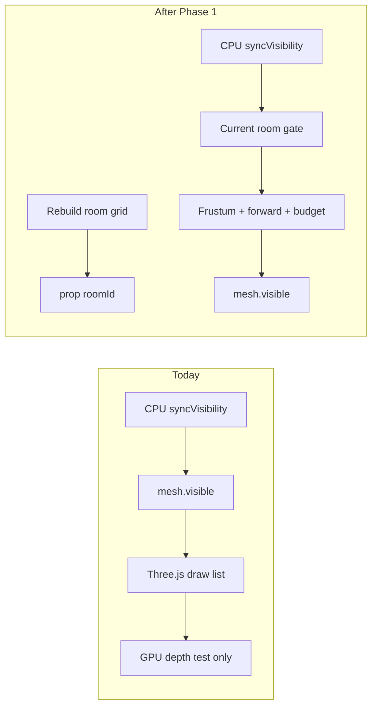

# Apartment room visibility and render cost plan

## Problem

Today, in-unit prop visibility is **CPU-driven** and **non-occluding**:

- [`fpApartmentInteriorPropVisibility.ts`](apps/client/src/game/fpApartment/fpApartmentInteriorPropVisibility.ts): unit scoping, frustum AABB, behind-camera cone, hysteresis, 6-shows/frame budget
- Authored partition walls ([`OwnedApartmentWallItemSchema`](packages/schemas/src/ownedApartmentBuiltins.ts)) block **physics** via [`fpInteriorPartitionSolidCollision.ts`](apps/client/src/game/fpPhysics/fpInteriorPartitionSolidCollision.ts) but **not** render submission
- Fast 180° turns still spike triangles (~84k → ~349k) and WebGPU pipeline warm-up when many decor groups qualify

This is the opposite of Ubisoft GPU-driven visibility (SIGGRAPH 2015): we toggle `.visible` on the CPU and rely on depth at raster time, not pre-cull behind walls.



---

## Architecture decision

**Implement Phase 1: room grid from authored walls** in `@the-mammoth/engine` as pure geometry (no Three.js dependency). Wire into FP client decor + furniture sync paths.

**Do not** implement GPU-driven / Hi-Z / indirect draws — wrong cost for ~40 static props per unit in a WebGPU Three.js client.

**Visibility scope (confirmed):** **current room only**. Props in adjacent rooms stay hidden until the camera cell moves into that room (strict; no doorway peek allowance).

---

## Phase 1 — Room grid module (engine)

### New files

- [`packages/engine/src/spatial/apartmentUnitRoomGrid.ts`](packages/engine/src/spatial/apartmentUnitRoomGrid.ts) — build + query API
- [`packages/engine/src/spatial/apartmentUnitRoomGrid.test.ts`](packages/engine/src/spatial/apartmentUnitRoomGrid.test.ts) — pure geometry tests
- Export from [`packages/engine/src/index.ts`](packages/engine/src/index.ts)

### Input types (plain numbers, reusable from client)

```typescript
type ApartmentUnitBoundsXZ = {
  minX: number; maxX: number;
  minZ: number; maxZ: number;
};

type ApartmentPartitionWallXZ = {
  // World-space center + YXZ rotation + box extents (matches resolveApartmentWallPoses output)
  x: number; z: number;
  yawRad: number; pitchRad: number;
  sizeX: number; sizeZ: number; // XZ footprint only; ignore Y for room graph
};

type ApartmentUnitRoomGrid = {
  cellSizeM: number;
  cols: number; rows: number;
  originX: number; originZ: number;
  /** -1 = blocked (wall/outside hull), 0..N-1 = room id */
  cells: Int16Array;
  roomCount: number;
};
```

### Build algorithm (once per unit rebuild)

1. **Grid setup:** `cellSizeM = 0.4` over unit XZ hull (`boundMin*` / `boundMax*`).
2. **Block outside hull:** cells whose centers fall outside bounds → `-1`.
3. **Block partition walls:** for each wall from [`resolveApartmentWallPoses`](apps/client/src/game/fpApartment/fpOwnedApartmentBuiltinsFromContent.ts), rasterize XZ OBB footprint into blocked cells (small inflation ~0.05m so gaps stay gaps).
4. **Flood-fill:** 4-connected free cells → contiguous `roomId` (0..N-1). No walls → single room 0 (open-plan fallback).
5. **Room adjacency graph:** compute for tests/debug only; **not used for visibility** under strict current-room policy.

### Query API

- `buildApartmentUnitRoomGrid(bounds, walls, cellSizeM?) → ApartmentUnitRoomGrid`
- `roomIdAtWorldXZ(grid, x, z) → number | null` (null if blocked/outside)
- `visibleRoomIdsForCamera(grid, camX, camZ) → ReadonlySet<number>` — **strict:** `{ roomId }` or empty set if camera in blocked cell
- `roomIdForPropBoundsCenter(grid, cx, cz) → number | null` — prop center; if null/blocked, treat as **always hidden** in-room (conservative)

### Tests (vitest, no WebGL)

| Case | Expect |
|------|--------|
| Empty walls, rectangular hull | 1 room, all interior cells same id |
| T-wall splits unit | 3 rooms, flood-fill ids distinct |
| Camera in room A | `visibleRoomIdsForCamera` = `{A}` only |
| Prop center in room B while camera in A | prop roomId not in visible set |
| Prop center inside wall cell | hidden (null room) |

---

## Phase 1 — Client integration

### 1. Per-unit room grid cache

In [`fpApartmentDecorMeshes.ts`](apps/client/src/game/fpApartment/fpApartmentDecorMeshes.ts):

- `roomGridByUnitKey: Map<string, ApartmentUnitRoomGrid>`
- Rebuild grid in `runFullRebuild` **after** wall placements are known:
  - Collect `ApartmentPartitionWallXZ[]` from `visibleWallPlacements` / `resolveApartmentWallPoses` per unit
  - Use replicated `ApartmentUnit` bounds
- Clear map in `clearAll()`

Mirror the cache in [`fpApartmentFurniture.ts`](apps/client/src/game/fpApartment/fpApartmentFurniture.ts) on level rebuild (same wall source).

### 2. Tag props with roomId at build time

**Decor** (one group per item — straightforward):

- After `bbox` computed (~line 775), set:
  - `g.userData.mammothApartmentPropRoomId = roomIdForPropBoundsCenter(grid, cx, cz)`
- **Skip** room tagging for:
  - `apartment_wall:*` groups (occluders, always visible when unit props visible)
  - `apartment_mirror:*` groups

**Furniture** (one `unitGroup` per unit, multiple children — bed/wardrobe/stove/footlocker):

- Before `mergeGroupDescendantsByMaterialYielding`, for each logical child (`w`, `f`, `st`, `b`):
  - Compute child world XZ center → store `child.userData.mammothApartmentPropRoomId`
- In `syncVisibility`, iterate **top-level prop children** of `unitGroup` (exclude stash/sittable picks, debug hull) and set `.visible` per child instead of toggling the whole `unitGroup`
- Preserve picks: pick mesh visibility follows its parent prop child

### 3. Extend visibility resolver

Update [`fpApartmentInteriorPropVisibility.ts`](apps/client/src/game/fpApartment/fpApartmentInteriorPropVisibility.ts):

```typescript
resolveApartmentInteriorPropGroupVisible({
  // existing fields...
  propRoomId?: number | null;
  visibleRoomIds?: ReadonlySet<number> | null; // null = skip room gate
})
```

Gate (only when `containingUnitKey` set and `visibleRoomIds` provided):

- If `propRoomId == null` → `false`
- If `propRoomId ∉ visibleRoomIds` → `false`
- Else fall through to existing frustum + forward hysteresis + budget

### 4. Wire syncVisibility

Both [`fpApartmentDecorMeshes.syncVisibility`](apps/client/src/game/fpApartment/fpApartmentDecorMeshes.ts) and [`fpApartmentFurniture.syncVisibility`](apps/client/src/game/fpApartment/fpApartmentFurniture.ts):

1. If `containingUnitKey` → load grid, compute `visibleRoomIdsForCamera(grid, camX, camZ)` from camera world position
2. Pass `propRoomId` + `visibleRoomIds` into resolver
3. Keep existing hysteresis + `applyApartmentInteriorPropVisibilityBudget` unchanged

Call site unchanged: [`fpSessionMainRafFrame.ts`](apps/client/src/game/fpSession/fpSessionMainRafFrame.ts) ~631–643.

### 5. Data source note

Partition walls currently come from **content JSON only** ([`resolveApartmentWallPoses`](apps/client/src/game/fpApartment/fpOwnedApartmentBuiltinsFromContent.ts)), not SpacetimeDB replica rows. Units without authored walls degrade to **single-room** (same as today, no regression).

---

## Phase 2 — Re-profile and tune existing mitigations

After Phase 1 lands:

1. Re-run the same 10s apartment spin profiler capture
2. **Success criteria:**
   - Steady-state `kTri` drops when standing in one room (props in other rooms not submitted)
   - No single frame `renderThreeMs` > ~25ms during 180° turn
   - No visible regression: props appear when walking into their room
3. Tune [`APARTMENT_INTERIOR_PROP_MAX_SHOWS_PER_FRAME`](apps/client/src/game/fpApartment/fpApartmentInteriorPropVisibility.ts) (6 → 8–10) if room gate reduces pending shows enough
4. Optional: add perf counter `visibleRoomId` / `propsRoomCulled` in [`fpSessionPerfStore.ts`](apps/client/src/game/fpSession/fpSessionPerfStore.ts) for validation

---

## Phase 3 — Asset triangle budget (parallel, out of scope for Phase 1 PR)

Profiler showed individual decor meshes at 22k+ tris. Room culling reduces **count** submitted; it does not simplify heavy assets in the visible room.

Follow-up (content pipeline, not engine):

- gltf-transform / Meshoptimizer pass on top decor assets (`mammoth_builtin_bed`, heaviest UUID meshes from heavy-mesh profiler)
- Optional runtime LOD proxies for props > N tris beyond 3m (only if Phase 1+2 still miss budget)

---

## Explicitly deferred

| Item | Reason |
|------|--------|
| GPU-driven visibility / indirect draws | Massive Three.js architectural change; not justified at current scale |
| Hi-Z / occlusion queries | CPU readback latency; room grid is cheaper and deterministic |
| Portal graph for whole Mamutica stack | Separate effort ([elevator culling plan](.cursor/plans/completed/elevator_lag_and_culling_8fbf4d4a.plan.md) already did floor plates) |
| Editor preview parity | FP session first; editor [`editorMyApartmentMeshes.ts`](apps/editor/src/editor/myApartment/editorMyApartmentMeshes.ts) can reuse engine module later |
| Adjacent-room peek | User chose strict current-room-only |

---

## Implementation order

1. Engine: `apartmentUnitRoomGrid` + tests
2. Client: grid cache + decor room tags + visibility gate
3. Client: furniture per-child room tags + per-child sync
4. Extend visibility tests in [`fpApartmentInteriorPropVisibility.test.ts`](apps/client/src/game/fpApartment/fpApartmentInteriorPropVisibility.test.ts)
5. Manual verify in `unit_e_003` (typical layout with authored walls)
6. Re-profile (Phase 2)
