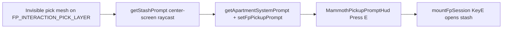
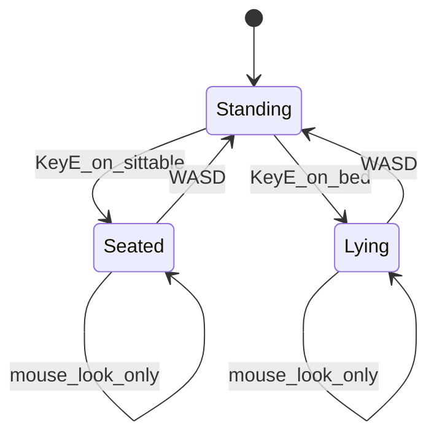

# Sittable apartment furniture (chair, sofa, toilet, bed)

## Current behavior (reuse)

Stash interactables (wardrobe, footlocker, stove) already follow a proven path:



Key files:
- Pick creation: [`fpApartmentDecorMeshes.ts`](apps/client/src/game/fpApartment/fpApartmentDecorMeshes.ts) (decor), [`fpApartmentFurniture.ts`](apps/client/src/game/fpApartment/fpApartmentFurniture.ts) (builtin bed/wardrobe/etc.)
- HUD: [`fpPickupPrompt.ts`](apps/client/src/game/fpInteraction/fpPickupPrompt.ts), [`MammothPickupPromptHud.tsx`](apps/client/src/ui/MammothPickupPromptHud.tsx)
- RAF prompts: [`fpSessionMainRafFrame.ts`](apps/client/src/game/fpSession/fpSessionMainRafFrame.ts) (~657–839)
- KeyE: [`mountFpSession.ts`](apps/client/src/game/mountFpSession.ts) (~1281–1336)

Chair / sofa / toilet are **content decor** with `itemKind: "plain"` and model paths in [`owned_apartment_builtins.json`](content/apartment/owned_apartment_builtins.json). Bed is **builtin furniture** in [`fpApartmentFurniture.ts`](apps/client/src/game/fpApartment/fpApartmentFurniture.ts) (also `itemKind: "bed"` in content). Only the viewer’s **owned claimed** unit shows these meshes ([`residentInteriorPropsVisibleForViewer`](apps/client/src/game/fpApartment/fpApartmentGameplay.ts)).

## Design

### 1. Shared sittable catalog (`packages/schemas`)

Add a small, testable module (mirroring [`ownedApartmentPlacedItemKindHasStash`](packages/schemas/src/ownedApartmentBuiltins.ts)):

| Model | Mode | HUD verb | Notes |
|-------|------|----------|--------|
| `chair.glb` | `sit` | Sit | Seated eye height ~`1.05` m |
| `sofa.glb` | `sit` | Sit | Slightly lower / deeper seat offset |
| `toilet.glb` | `sit` | Sit | Higher seat, tighter radius |
| `bed.glb` | `lie` | Lie down | **Default pitch ~`1.45` rad (ceiling)**, low eye height; align with server bed yaw ([`spawn_pose_owned_bed`](apps/server/src/apartments.rs) uses `y + 0.92` standing — lying uses surface + ~`0.35–0.45`) |

Each entry defines:
- `modelRelPath` (canonical)
- `localSeatOffset` `(x,y,z)` in decor root space (forward = local **+Z**, same convention as TV practical lights in [`apartmentPracticalLightSpecFromDecorGroup`](packages/engine/src/rendering/apartmentInteriorPracticalLights.ts))
- `bodyYawOffsetRad` (per-asset tune so the player faces the seat front, not the mesh back)
- `eyeHeightM`, `interactRadiusM`, `promptLabel`

Export:
- `apartmentSittableSpecFromModelPath(path)`
- `ownedApartmentPlacedItemKindIsSittable(kind)` → `bed` + path lookup for plain decor

**No server/schema migration in V1** — detection by model path + existing `bed` item kind avoids migrating `plain` chairs in DB.

### 2. World pose helper (`apps/client/src/game/fpApartment/fpApartmentSittablePose.ts`)

Pure functions (unit-tested):

```ts
computeApartmentSittableWorldPose(group: THREE.Object3D, spec): {
  feetX, feetY, feetZ, bodyYawRad, eyeHeightM, defaultPitchRad, mode
}
```

- Read decor/furniture group `matrixWorld`
- Transform `localSeatOffset` to world feet position
- `bodyYawRad = atan2(forward.x, forward.z)` from spec’s local +Z axis + `bodyYawOffsetRad`
- For `lie`: `defaultPitchRad` ≈ `1.45` (within existing [`PITCH_LIMIT = 1.53`](apps/client/src/game/fpSession/fpSessionConstants.ts))

### 3. Pick meshes + raycast (parallel to stash)

**Decor** — in [`fpApartmentDecorMeshes.ts`](apps/client/src/game/fpApartment/fpApartmentDecorMeshes.ts) after each group is built:
- If `apartmentSittableSpecFromModelPath(d.modelRelPath)` or `placedKind === "bed"`:
  - Add invisible pick mesh (reuse `stashPickGeometry` / material pattern)
  - `userData.mammothApartmentSittableKey` = `decorId` or `content:unitKey:id`
  - Store reference to parent decor `Group` for pose recompute on interact

**Builtin bed** — in [`fpApartmentFurniture.ts`](apps/client/src/game/fpApartment/fpApartmentFurniture.ts) `buildUnitFurnitureAsync` after bed mesh:
- Same pick + `userData` pointing at bed clone root

New API on both mounts (or a thin wrapper used by RAF):
- `getSittablePrompt(playerPos, camera): { kind: "apartment_sittable", sittableKey, label, unitKey } | null`
- Gate: `conn.identity`, ray hit, `feetInsideUnitHull` + horizontal distance ≤ `interactRadiusM` (same vertical slack as stash: `INTERACT_FEET_Y_*_SLACK_M`)

Expose a single call site via small facade `fpApartmentSittablePrompt.ts` that queries decor first, then furniture bed picks.

### 4. Prompt + HUD

Extend [`FpPickupPromptState`](apps/client/src/game/fpInteraction/fpPickupPrompt.ts):

```ts
{ kind: "apartment_sittable"; sittableKey: string; label: string; unitKey: string }
```

[`MammothPickupPromptHud.tsx`](apps/client/src/ui/MammothPickupPromptHud.tsx): same orange “Press E” frame as stash — **“Press E — Sit”** / **“Lie down”** from `label`.

**HUD priority** in [`fpSessionMainRafFrame.ts`](apps/client/src/game/fpSession/fpSessionMainRafFrame.ts): after `apartment_stash`, before plain dropped loot:

```
elevator/door → claim → stash → sittable → dropped_item
```

While already sitting/lying: `setFpPickupPrompt(null)` (no E spam).

### 5. Sit session state (`apps/client/src/game/fpApartment/fpSitSession.ts`)

Module-owned state (no React):

```ts
type FpSitSession = {
  active: true;
  sittableKey: string;
  mode: "sit" | "lie";
  anchor: { x,y,z };
  bodyYawRad: number;
  eyeHeightM: number;
};
```

API: `enterFpSit(...)`, `exitFpSit()`, `isFpSitActive()`, `getFpSitSession()`, `fpSitBlocksLocomotion()`, `fpSitConsumeWasdExit(keys)`.

**Enter (KeyE in [`mountFpSession.ts`](apps/client/src/game/mountFpSession.ts))** — after elevator/door checks, **before** stash (so stash still wins if overlapping):
1. Resolve hit group + `computeApartmentSittableWorldPose`
2. Snap local `pos` to anchor; zero `loco.velocity`
3. Set `mainRaf.bodyYaw = bodyYawRad`; `mainRaf.headLookYaw = 0`
4. Set `mainRaf.pitch` to `defaultPitchRad` (lie → ceiling; sit → keep current pitch or slight neutral)
5. `enterFpSit(...)`; `sendMoveIntent` zero-velocity snapshot so server pose doesn’t fight hard

**While active (RAF in [`fpSessionMainRafFrame.ts`](apps/client/src/game/fpSession/fpSessionMainRafFrame.ts))**:
- Treat locomotion as blocked: extend the block used at ~379 so `_input` WASD/sprint/jump are false when `fpSitBlocksLocomotion()`
- **Skip** `simulatePredictedPlayerStep` / hold `pos` at anchor (or step with zero input only)
- Override `headPivot.position.y = sit.eyeHeightM` instead of locomotion eye height
- **Look**: always apply mouse X/Y to `headLookYaw` + `pitch` (like Alt free-look, but without Alt); do **not** rotate `bodyYaw` from mouse
- Suppress head-bob; keep `headPitch` at 0 for viewmodel
- `fpLocomotionInputBlocked` unchanged for inventory (Tab still works unless you want sit to block menus — default: block only movement)

**Exit (any WASD edge)** — in RAF before input build:
1. Bake `headLookYaw` into `bodyYaw` (same as Alt release in [`mountFpSession.ts`](apps/client/src/game/mountFpSession.ts) ~985)
2. `exitFpSit()`; nudge `pos` ~`0.35 m` along baked forward so the player doesn’t immediately re-hit the pick
3. Resume normal `stepFpLocomotion` + eye height

Also exit on: `Escape`/pointer unlock optional, session dispose, unit rebuild (clear sit if `sittableKey` invalid).

### 6. Wiring checklist

| Location | Change |
|----------|--------|
| `mountFpSession` KeyE | `getSittablePrompt` → `enterFpSit` when not active |
| `fpSessionMainRafFrame` | sit prompt HUD; locomotion/camera overrides; WASD exit |
| `fpApartmentDecorMeshes` | sittable picks + `getSittablePrompt` |
| `fpApartmentFurniture` | bed pick + `getSittablePrompt` |
| `fpPickupPrompt` + HUD | new kind |
| `packages/schemas` | catalog + tests |

### 7. Tests

- `packages/schemas`: path → spec, bed kind
- `fpApartmentSittablePose.test.ts`: yaw/pitch/offset with known `Object3D` transform
- `fpSitSession.test.ts`: enter/exit, WASD consumption
- Optional: prompt priority / `same()` in `fpPickupPrompt.test.ts`

### 8. Tuning / QA (in-game)

Per-asset offsets will need a quick pass in the owned apartment:
- Chair/sofa: seat center and facing
- Toilet: height and facing
- Bed: head on pillow, **lying on back looking at ceiling** (your requirement); compare with replicated `bed_yaw` in unit

### Out of scope (V1)

- Server-replicated “player is sitting” for remote viewers (client-only pose; intents zeroed while seated)
- New `itemKind` enum values on server for chair/sofa/toilet
- Hold-to-sit or animations


