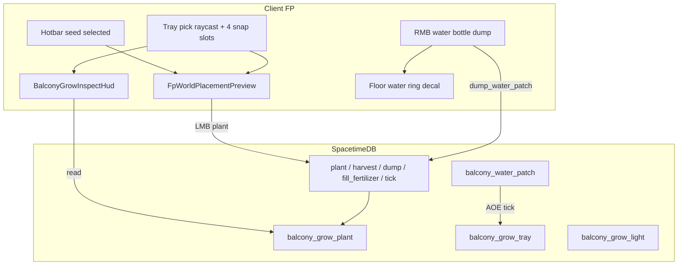

# Balcony Grow-Op Game Loop

## Current baseline

- **Content**: 8 `grow-tray.glb` + 2 `light-grow-op.glb` in [`content/apartment/owned_apartment_builtins.json`](content/apartment/owned_apartment_builtins.json); stable tray UUIDs (e.g. `8e48c06b-…`).
- **Catalog**: plant + harvest defs in [`content/items/catalog/balcony_grow_op.json`](content/items/catalog/balcony_grow_op.json) — **no** growth metadata yet.
- **Server**: footlocker starter only ([`starting_item.rs`](apps/server/src/inventory/starting_item.rs)); water tank/bottle in [`water_container.rs`](apps/server/src/water_container.rs). **No tray/plant/patch tables or reducers.**
- **Client**: trays render as `plain` decor in [`fpApartmentDecorMeshes.ts`](apps/client/src/game/fpApartment/fpApartmentDecorMeshes.ts) — no pick meshes, no FP plant/harvest/water-dump flow.
- **Design doc** ([`docs/core-game-loop.md`](docs/core-game-loop.md) ~830–874): crop table, sleep advances days — **sleep reducer does not exist yet**.

**Scope change from doc**: you want **4 equidistant snap slots per tray** (32 plant slots total), not one crop per tray.

---

## Architecture



---

## 1. Shared constants + catalog (single source of truth)

Add [`packages/schemas/src/balconyGrowOp.ts`](packages/schemas/src/balconyGrowOp.ts) (mirrored in Rust):

| Constant | Value (initial) |
|----------|-----------------|
| `BALCONY_GROW_TRAY_COUNT` | 8 |
| `BALCONY_GROW_SLOTS_PER_TRAY` | 4 |
| `BALCONY_GROW_TRAY_MAX_WATER_L` | 2.0 |
| `BALCONY_GROW_LIGHT_BONUS` | 0.15 growth speed multiplier |
| `BALCONY_GROW_FERTILIZER_BONUS` | 0.20 |
| `BALCONY_GROW_WATER_BONUS` | 0.10 per 0.5 L (cap at max) |
| `BALCONY_WATER_PATCH_RADIUS_M` | 0.55 |
| `BALCONY_WATER_PATCH_DUMP_L` | 0.35 per RMB |
| `BALCONY_GAME_DAY_SECS` | 180 (3 min = 1 game day until sleep ships) |
| Snap offsets | 2×2 grid in tray local space (±0.11 m from center, y = soil surface) |

Extend [`balcony_grow_op.json`](content/items/catalog/balcony_grow_op.json) + [`schema.rs`](apps/server/src/items_catalog/schema.rs):

```json
"balconyGrow": {
  "harvestDefId": "fresh-parsley",
  "growDaysMin": 4,
  "growDaysMax": 5,
  "stageTint": "#3d8b4a",
  "stageScale": 1.0
}
```

On **plant** resource rows only. Map crop days from design doc table (lovage 5–6, radish 2–3, etc.). Mark `balcony-grow-substrate` as `balconyGrowFertilizer: true`.

Add 4 shared stage GLBs under `apps/client/public/static/models/objects/`:
- `grow-stage-seed.glb`, `grow-stage-sapling.glb`, `grow-stage-mid.glb`, `grow-stage-mature.glb`

Wire in [`packages/assets/src/catalogGlb.ts`](packages/assets/src/catalogGlb.ts) via new `balconyGrowStageGlb(stage, cropDefId?)`.

---

## 2. Server module [`apps/server/src/balcony_grow_op.rs`](apps/server/src/balcony_grow_op.rs)

### Tables

**`balcony_grow_tray`** — PK `(unit_key, tray_id)` where `tray_id` = builtin UUID string  
- `water_liters: f32` (0..max, from patches + direct dump onto tray)  
- `fertilizer_stash_instance_id: Option<u64>` — or reuse existing stash pattern: fertilizer lives in `inventory_item` at stash key `{unit_key}#grow_tray:{tray_id}` (1 slot, def whitelist `balcony-grow-substrate`)

**`balcony_grow_plant`** — PK `(unit_key, tray_id, slot_index)` (slot 0–3)  
- `crop_def_id`, `planted_at_micros`, `mature_at_micros`  
- `phase: u8` — empty / growing / mature / wilted  
- `owner: Identity` (denormalized)

**`balcony_water_patch`** — PK `patch_id`  
- `unit_key`, `pos_x`, `pos_z`, `radius_m`, `water_liters`, `created_at_micros`, `expires_at_micros`

**`balcony_grow_light`** — PK `unit_key`  
- `lights_on: u8` (default 1; future electricity cut sets 0)

**`player_grow_journal`** (surprise) — PK `(identity, crop_def_id)` — first-harvest unlock flag

### Reducers

| Reducer | Notes |
|---------|--------|
| `plant_balcony_grow_slot(unit_key, tray_id, slot_index, seed_def_id)` | Proximity + empty slot; consume 1 seed from hotbar/inventory; set `mature_at` from catalog days × `BALCONY_GAME_DAY_SECS`; apply growth modifiers at plant time |
| `harvest_balcony_grow_slot(...)` | Mature only → grant harvest def to inventory; clear plant row |
| `dump_water_from_bottle()` | Water bottle in hotbar, RMB; sip bottle (`water_container`), spawn patch at player aim/feet; trays in AOE gain water (cap per tray) |
| `apply_tray_fertilizer_stash(...)` | Reuse stash push/pull reducers with new stash kind `grow_tray` (1 slot, `balcony-grow-substrate` only) — drag fertilizer into tray panel |
| `balcony_grow_tick_step` (scheduled, 5s) | Evaporate tray water slowly; expire patches; transition `growing → mature` when `now >= mature_at`; wilt if water=0 for N ticks without light rescue |

**Growth math** (computed at plant + stored on row):

```
base_secs = random_inclusive(growDaysMin, growDaysMax) * BALCONY_GAME_DAY_SECS
modifier = 1 + light_bonus + fert_bonus + water_bonus
mature_at = planted_at + base_secs / modifier
```

**Sleep hook** (stub now, real later): `advance_balcony_grow_for_unit(unit_key, days: u8)` called from future `sleep_in_bed`; subtract `days * BALCONY_GAME_DAY_SECS` from remaining time.

**Bootstrap** on claim/connect (like water tank): ensure 8 tray rows + light row for owned unit; map tray UUID list from sorted builtins JSON (shared constant array in schemas).

Register in [`lib.rs`](apps/server/src/lib.rs) init schedule + `on_connect` bootstrap. `pnpm client:generate` for bindings.

---

## 3. DRY FP placement preview (seeds now, decor later)

New package [`apps/client/src/game/fpPlacement/`](apps/client/src/game/fpPlacement/):

- **`fpWorldPlacementPreview.ts`** — generic ghost manager:
  - Inputs: `getTarget(): PlacementTarget | null`, `ghostUrl`, `valid: boolean`, `snapTransform`
  - Outputs: semi-transparent mesh, green/red emissive tint, dispose on mode exit
- **`fpPlacementSnap.ts`** — pure snap math: given tray hit + tray world matrix → nearest of 4 local offsets; returns slot index + world position/quaternion
- **`fpBalconyGrowPlacement.ts`** — balcony-specific adapter: validates empty slot, seed def, ownership

Mount from [`mountFpSession.ts`](apps/client/src/game/mountFpSession.ts) alongside `FpHotbarConsumableVisual`. **Seeds/cuttings/spores have no FP grip model** — only world preview when hotbar def has `balconyGrow` metadata (via catalog helper `mammothItemDefIsPlantableSeed`).

**Plant input**: LMB while seed selected + valid preview → `plantBalconyGrowSlot`. Primary click path in `mountFpSession` checks placement mode before melee/consume.

---

## 4. Tray interaction + visuals (client)

### Pick meshes + prompts

In [`fpApartmentDecorMeshes.ts`](apps/client/src/game/fpApartment/fpApartmentDecorMeshes.ts):

- For each `grow-tray.glb` group: invisible pick mesh (`fitApartmentInteractionPickToObject`), `userData.mammothGrowTrayId`, `mammothGrowTrayUnitKey`
- Child group `growSlotVisuals` — 4 stage meshes per slot, synced from `balcony_grow_plant` subscription
- Optional: **soil moisture** — darken tray material albedo when `water_liters > 0.3` (surprise polish)
- Optional: **chalk fertilizer tick** — small emissive strip on tray rim when fertilizer stash non-empty

New [`fpBalconyGrowPrompt.ts`](apps/client/src/game/fpBalconyGrow/fpBalconyGrowPrompt.ts): `getGrowTrayPrompt()` mirroring `getStashPrompt`.

Extend [`fpPickupPrompt.ts`](apps/client/src/game/fpInteraction/fpPickupPrompt.ts) + [`MammothPickupPromptHud.tsx`](apps/client/src/ui/MammothPickupPromptHud.tsx):
- `balcony_grow_harvest` — “Press **E** — Harvest {crop}”
- `balcony_grow_tray` — “Press **E** — Tray storage” (fertilizer panel)

Wire in [`fpSessionMainRafFrame.ts`](apps/client/src/game/fpSession/fpSessionMainRafFrame.ts) prompt stack (after stash, before drops). KeyE in [`mountFpSession.ts`](apps/client/src/game/mountFpSession.ts) → harvest or open tray fertilizer panel.

### RMB water dump

In `mountFpSession` pointer handler: if water bottle equipped + RMB → `dumpWaterFromBottle` reducer (reuse hotbar consume cooldown). Client spawns **floor water ring** mesh (expanding/fading circle on balcony floor) synced to `balcony_water_patch` rows — visual surprise tying dump to world.

---

## 5. Inspect overlay UI

New [`BalconyGrowInspectHud.tsx`](apps/client/src/ui/BalconyGrowInspectHud.tsx) — fixed panel when center ray hits tray with plants (or hovered slot):

- Crop name + Balkan subtitle from catalog
- Planted time (relative + absolute)
- ETA to mature (`mature_at - now`, adjusted display)
- Modifiers row: Light +15% / Fertilizer +20% / Water +X% (with cap note)
- Tray water: `1.2 / 2.0 L`
- Soil flags: fertilizer applied (stash occupied), water applied (liters > 0)
- Phase label: Seedling / Growing / **Ready to harvest**

Data from subscribed `balcony_grow_plant` + `balcony_grow_tray` + local catalog. Pure read — no new reducer.

---

## 6. Fertilizer tray inventory (1 slot)

Mirror water-tank pattern:

- Stash kind `grow_tray` in [`apartment_stash_rules.rs`](apps/server/src/apartment_stash_rules.rs) + [`apartmentStashRules.ts`](packages/schemas/src/apartmentStashRules.ts): 1 slot, def `balcony-grow-substrate` only
- Stash key: `{unit_key}#grow_tray:{tray_id}` via [`inventory_models.rs`](apps/server/src/inventory_models.rs)
- UI: extend [`MammothStashHud.tsx`](apps/client/src/inventory/MammothStashHud.tsx) with compact single-slot panel when `stashKind === grow_tray` (no tank-style fill button)
- Fertilizer **does not** auto-consume on plant — bonus applies while stash slot holds substrate (player “feeds” tray)

---

## 7. Surprise: First-harvest **Grow Journal** toast

On first `harvest_balcony_grow_slot` per crop per player:

- Insert `player_grow_journal` row
- Emit `hud_toast_event` with crop-specific Balkan recipe hint (e.g. lovage → “Libelek goes in Thursday soup — ask the engineer for the communal pot.”)
- Reuse existing [`MammothToastHud`](apps/client/src/ui/) — zero new chrome, flavorful progression hook into stove/soup loop

---

## 8. Tests

| Area | Files |
|------|--------|
| Snap slot math | `fpPlacementSnap.test.ts` |
| Growth ETA / modifiers | `balconyGrowOp.test.ts` (schemas) |
| Stash rules grow_tray | extend `apartmentStashRules.test.ts` |
| Server plant/harvest/water | `balcony_grow_op.rs` `#[cfg(test)]` |
| Catalog load | extend `items_catalog` balcony tests |

---

## Implementation phases

**Phase A — Data + server core**  
Catalog `balconyGrow`, schemas constants, `balcony_grow_op.rs` tables/reducers/tick, tray bootstrap, bindings.

**Phase B — Shared placement + plant**  
`fpWorldPlacementPreview`, tray picks, LMB plant, stage mesh sync (4 shared GLBs + tint).

**Phase C — Water + fertilizer + overlay**  
RMB dump + patches, grow_tray stash UI, `BalconyGrowInspectHud`, moisture/chalk visuals.

**Phase D — Harvest + journal + polish**  
E harvest prompt, first-harvest toasts, floor water rings, docs sync for 4-slot trays.

---

## Key files to touch

| Layer | Files |
|-------|--------|
| Schemas | `packages/schemas/src/balconyGrowOp.ts`, `apartmentStashRules.ts` |
| Content | `balcony_grow_op.json`, 4 stage GLBs, `owned_apartment_builtins` tray ID export |
| Server | `balcony_grow_op.rs`, `lib.rs`, `items_catalog/schema.rs`, `apartment_stash_rules.rs`, `inventory_models.rs` |
| Client | `fpPlacement/*`, `fpBalconyGrow/*`, `fpApartmentDecorMeshes.ts`, `mountFpSession.ts`, `fpSessionMainRafFrame.ts`, `BalconyGrowInspectHud.tsx`, `MammothStashHud.tsx`, subscriptions |

**Post-implementation**: republish SpacetimeDB module; verify starter footlocker seeds plant correctly on all 8 trays × 4 slots.
