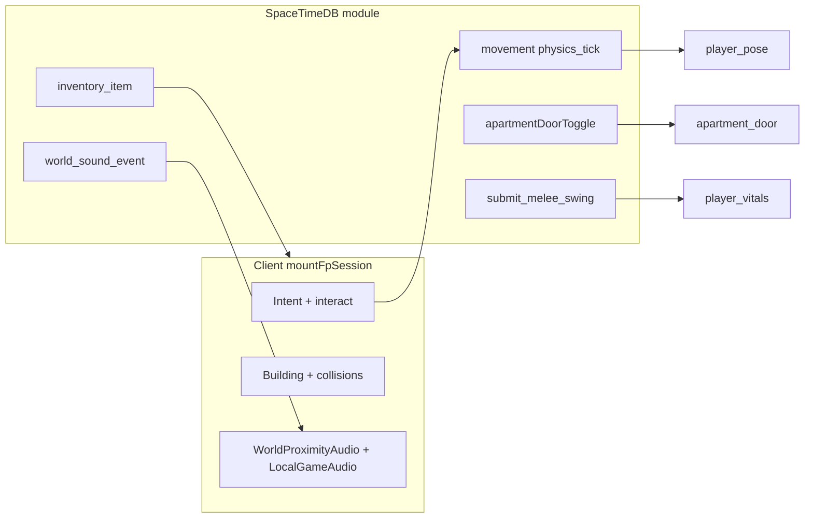

# Balkan Apartment FPS MVP (V3) — Gap Analysis and Implementation Plan

## Current core loop in this repo

The live loop centers on [`apps/client/src/game/mountFpSession.ts`](apps/client/src/game/mountFpSession.ts): WebGPU scene, replicated `player_pose` + prediction, static world from [`createFpSessionStaticWorld()` in `fpSessionWorldMount.ts`](apps/client/src/game/fpSessionWorldMount.ts)), interaction with [`mountFpApartmentDoors`](apps/client/src/game/fpApartmentDoors.ts) / elevators / pickups, HUD/hotbar, and periodic sync. Server-side authority lives in [`apps/server/src/lib.rs`](apps/server/src/lib.rs) (`on_connect` seeds pose/inventory/loadout; [`movement.rs`](apps/server/src/movement.rs), [`inventory`](apps/server/src/inventory/mod.rs), [`apartment_door`](apps/server/src/apartment_door/mod.rs), [`dropped_item`](apps/server/src/dropped_item.rs), [`world_sound`](apps/server/src/world_sound.rs), [`combat_stub`](apps/server/src/combat_stub.rs)).

New gameplay should extend this spine: **new tables/reducers/subscriptions**, then **parity in client prompts + collision/interact hooks** (mirror patterns already used for doors and pickups).

---

## Contradictions (spec vs repo) to resolve in design

| Topic | Spec | Current code | Resolution in plan |
|-------|------|--------------|-------------------|
| Crafting | Only claim + reinforce | [`ranged_weapons.json`](content/items/catalog/ranged_weapons.json) / [`tools.json`](content/items/catalog/tools.json) include `construction` recipes | Remove or hide gun/tool crafting for MVP; align tool ids with spec names (e.g. map `hammer` → existing `claw_hammer` or add `hammer` and deprecate) |
| Guest play | No login required | [`useSpacetimeConnection`](apps/client/src/spacetime/useSpacetimeConnection.ts) requires OIDC JWT; comment says **no anonymous profiles** | Add an explicit anonymous / token-based connection mode **or** treat “guest” as a separate product phase (must be chosen before coding) |

---

## Current gaps (by feature area)

### A. Account and persistence (foundation)

- **Spec:** Optional login ⇒ apartment ownership + stash.
- **Now:** Mandatory OpenAuth OIDC → display name before [`mountFpSession`](apps/client/src/App.tsx) runs. Inventory is keyed by Spacetime `Identity`; there is **no separate “offline guest”**.

### B. Spawn and respawn

- **Spec:** Guests spawn inside building (non-owned); logged-in spawn at **owned bed**.
- **Now:** Fixed spawn in [`pose.rs`](apps/server/src/pose.rs) (`PLAYER_SPAWN_*`); [`respawn_player`](apps/server/src/lib.rs) resets to the same spawn. Dead players get zero movement intent ([`movement.rs`](apps/server/src/movement.rs)); **no corpse drop reducer** wired to inventory.

### C. Apartment model (ownership, doors, breaches, reinforcement)

- **Spec:** UNCLAIMED / CLAIMED / BROKEN; owner-only toggle; breached doors stuck open.
- **Now:** [`ApartmentDoor`](apps/server/src/apartment_door/mod.rs) rows are hinge animation + collision only; **[`apartment_door_toggle`](apps/server/src/apartment_door/mod.rs) applies to any authenticated player with no ownership** (resolve_interact eligibility is proximity-only). No durability, reinforcement, breach, or visuals for “damaged unclaimed vs broken.”

### D. Claiming, chat, stash

- **Spec:** Claim while inside unit with timer, lock + screwdriver, global chat announcement, consume lock only; death drops lock.
- **Now:** [`packages/game/src/index.ts`](packages/game/src/index.ts) exports **`ApartmentClaimIntent` type only** — no reducer. **No chat table/reducer.** [`inventory_models.rs`](apps/server/src/inventory_models.rs) comment: **“no world containers yet”** → no footlocker location.

### E. Loot distribution

- **Spec:** Zone-specific tables (apartments / corridors / high-value rooms / elevator empty).
- **Now:** Starter loadout [`starting_item.rs`](apps/server/src/inventory/starting_item.rs); world items come from **player drops only** (`dropped_item`) — **no seeded static loot placements** surfaced in codebase search alongside building docs.

### F. Items, stacks, and weapons

- **Spec:** Final loot list includes cigarettes, lighter, bandage, painkillers, flashlight durability, pistol/shotgun, 9mm/shell nails with specific max stacks (e.g. nails 30, scrap 5…).
- **Now:** Materials use **large stacks** unrelated to MVP ([`materials.json`](content/items/catalog/materials.json)). Consumables differ by name (**`bandage_roll`** vs bandage). Tools are **craftable** in catalog (spec: hammer/screwdriver **not** craftable). Ranged **`pistol`/`rifle`** exist but are **presentation not wired** comments in JSON.

### G. Attention / noise system

- **Spec:** Sprint, loot, melee/gun breaches, elevators, reinforcement; vertical vs horizontal attenuation difference; claiming **silent** for noise.
- **Now:** Strong [`world_sound_event`](apps/server/src/world_sound.rs) pipeline with distance-culled playback in [`worldProximityAudio.ts`](apps/client/src/game/worldProximityAudio.ts). No dedicated **loot open** / **gunshot** / **reinforcement** kinds; attenuation axis rules not encoded (single `maxDistanceM`-style propagation).

### H. Combat and death

- **Spec:** Melee breach doors + guns; corpse persists; death full drop; guest full loss vs logged stash rules.
- **Now:** **`submit_melee_swing`** only; no ranged fire reducer. **`apply_damage`** does not trigger inventory spills or corpse entities.

---

## Asset placeholder policy (per your instructions)

Until you author replacements:

1. **`mammothItemCatalog.ts`** — For every new catalog `id`, **reuse existing `ICONS` and `WORLD_MODELS` maps** entries from the closest analogue (e.g. new pistol id → pistol icon temporarily remapped via same image as `crowbarIcon` until you swap); **do not add new bundled images** unless you explicitly request them later.
2. **First-person viewmodels / weapon attaches** — Reuse **`getMammothDroppedWorldModelUrl`** / existing FP rig attachment conventions in [`weaponPresentation*` / hooks](apps/client/src/game/) by **mapping new items to existing GLB transforms** (`knife.glb`, `crowbar.glb`, etc.).
3. **Bed / footlocker / boarded door** — Prefer **reuse or retag existing meshes** (`fpApartmentDoors`, world placeholders); author-only deltas should not block reducer-driven state.

---

## Recommended implementation phases

### Phase 0 — Decide guest identity

- Implement **guest connection** acceptable to SpaceTimeDB (anonymous JWT, dev token, or documented provider) **or** keep login mandatory and revise spec wording Product-side.
- **`App.tsx`** gate adjusts: allow `mountFpSession` when guest token + display nickname OR keep current flow — **blocked until Phase 0 call**.

### Phase 1 — Domain model: apartments and units server-side

- Add tables e.g. `apartment_unit` (or keyed by authored `floor_doc_id|template_id`) with: **`state`**, **`owner_identity`**, reinforcement flag, **`bed_spawn`**, **`footlocker_id`** (or stash row key).
- Extend or wrap `ApartmentDoor` rows with **`door_hp`**, **`breached`**, optional **`forced_open`** (mirror spec “cannot close”).
- Reducers:
  - **Start/cancel/update claim** timer (player position inside unit hull — reuse collision/walk queries parallel to [`resolve_interact_target`](apps/client/src/game/fpApartmentDoors.ts) but **server-authoritative bbox**).
  - On success: consume **`door_lock`**, stash row becomes active (`ItemLocation::Stash` or keyed container rows).
  - **`apartmentDoorToggle`** / **set**: reject if breached or unclaimed-vs-claimed rule set per spec.

### Phase 2 — Spawn and respawn routing

- On connect ([`on_connect`](apps/server/src/lib.rs)) or dedicated reducer after identity known: **`resolve_spawn_pose`** from owning unit bed vs authored guest spawn anchors (need **explicit world positions** added to authoring data or codegen from templates).
- Update [`respawn_player`](apps/server/src/lib.rs) to use owned bed vs default building spawn depending on **`user` + apartment ownership**.
- Claim-on-death: cancel claim pipeline; **`door_lock` drops** via **`dropped_item`** at corpse position ([`drop_spawn_transform`](apps/server/src/dropped_item.rs) pattern generalized).

### Phase 3 — Stash (`footlocker`)

- Extend [`ItemLocation`](apps/server/src/inventory_models.rs) with **`Stash { owner_identity, stash_id }`** (or **`container_id`**) mirroring constraints in [`inventory/mod.rs`](apps/server/src/inventory/mod.rs) move/stack rules.
- Reducers `stash_deposit`, `stash_withdraw` with distance checks; **`pickup`** from world remains anyone for dropped items — stash is **lootable by anyone** physically at footlocker (spec).

### Phase 4 — Reinforcement interaction

- **Hold** (~20 s) reducer or tick-based progress with server validation (similar to stamina/gated channels).
- Consume **10× `nails`**, **`hammer`** in inventory; emit **loud** `world_sound` event (new KIND + client decode in [`worldProximityAudio`](apps/client/src/game/worldProximityAudio.ts)).

### Phase 5 — Door breaching (melee then ranged)

- Server-side **damage per swing** toward door HP (`crowbar`/`hammer`), and **shoot** reducer decrementing ammo from shared pool (**no magazines** — track `ammo_9mm` / `ammo_shotgun` stacks and subtract on fire).
- On breach → set breached state → **desired_open** forced to **1 permanently**; visuals follow replicated state (**boards/reinforcement** optional placeholder via material swap reuse).

### Phase 6 — Catalog + economy alignment

- Add/rename **`def_id`s** per final list; set **`maxStack`** exactly as spec (**nails** 30, **scrap metal** 5, **cigarettes** 20, ammo caps); align server [`items_catalog`](apps/server/src/items_catalog/mod.rs) + client shards.
- Strip or **`#ifdef` out** contradictory **construction blocks** where spec forbids (tools/guns MVP).
- **Flashlight**: add durable float on item instance (**extension table** keyed by `instance_id`) or **`item_aux_data`** blob; drain on active tick from client-flagged reducer or authoritative “flashlight_on” heartbeat.

### Phase 7 — Static + respawning loot placements

- **Author** placement files (reuse building/floor tagging in editor or JSON lists) keyed by **`def_id`** and zone **tags** (`corridor`, `apartment_interior`, etc.).
- Server **spawn reducer** on init or heartbeat: roll loot table per authored point (elevator ⇒ **drops only**, empty static table).

### Phase 8 — Noise fidelity

- Extend `WORLD_SOUND_KIND_*` for missing actions; **`emit`** from loot open, reinforcement, firearm, sprint (if not purely cadence footsteps).
- Add **emitter metadata** (`axis_weight` × / y / z tuning) interpreted in [`worldProximityAudio.handleInsert`](apps/client/src/game/worldProximityAudio.ts) instead of spherical distance-only.

### Phase 9 — Global chat hooks

- Minimal **`chat_message`** table + reducer; client subscribe for HUD/transcript; **claim start** inserts line **“(name) is claiming apartment (unit)”** as required.

### Phase 10 — Death loop

- On `apply_damage` kill: **migrate all inventory + hotbar** to **`dropped_item`** burst (or corpse entity carrying multi-item refs if you prefer fewer rows).
- Persist **respawn loot rules** difference guest vs subscribed user (already identity-scoped stash).

---

## Key files likely touched (beyond new modules)

- Server schema and reducers: [`apps/server/src/lib.rs`](apps/server/src/lib.rs), new `apartments.rs`, `chat.rs`; extend [`inventory_models.rs`](apps/server/src/inventory_models.rs), [`inventory/mod.rs`](apps/server/src/inventory/mod.rs), [`player_vitals.rs`](apps/server/src/player_vitals.rs) (death hook), [`apartment_door/mod.rs`](apps/server/src/apartment_door/mod.rs).
- Client: [`mountFpSession.ts`](apps/client/src/game/mountFpSession.ts) (bindings + UX prompts), [`fpApartmentDoors.ts`](apps/client/src/game/fpApartmentDoors.ts) (blocked states), [`HudShell`/hotbar](/apps/client/src/ui/), [`mammothItemCatalog.ts`](apps/client/src/inventory/mammothItemCatalog.ts) (reuse-only icons/models).
- Regenerate bindings: `pnpm client:generate` after server changes ([`lib.rs` comment](apps/server/src/lib.rs)).

---

## Testing and verification stance

- **Unit tests**: Server reducers (claim timer reset on exit, reinforcement nail consumption boundary, breached door rejects close).
- **Parity tests**: Already have door parity tests — extend patterns for breach/reinforcement numbers.
- **Manual**: Multi-client spawn at bed vs hallway; corpse loot; elevator no static loot.

This plan keeps **visuals and iconography as placeholders** while making **gameplay rules authoritative and complete** for the MVP loop you specified.
