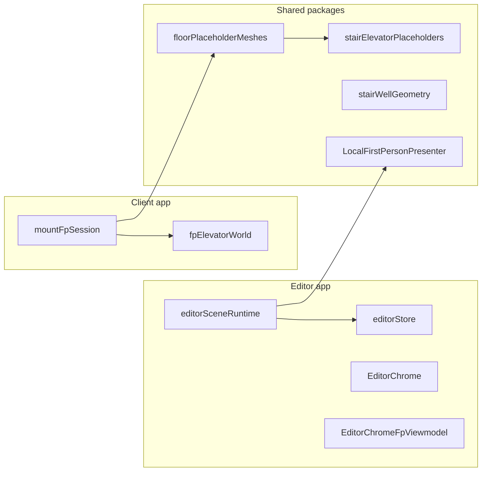

# Refactoring plan: files over 500 LOC

## Scope and inventory

Scan: [`apps/client/src`](apps/client/src), [`apps/editor/src`](apps/editor/src), [`apps/server/src`](apps/server/src), and [`packages`](packages) — TypeScript/TSX/Rust only, excluding `node_modules` / build dirs.

| Approx. lines | File | Category |
|---:|---|---|
| ~4031 | [`apps/server/src/generated_walk_surfaces.rs`](apps/server/src/generated_walk_surfaces.rs) | **Generated** (`scripts/gen-walk-aabbs.ts` per file header) — do not hand-refactor |
| ~1427 | [`apps/editor/src/editor/editorSceneRuntime.ts`](apps/editor/src/editor/editorSceneRuntime.ts) | Editor Three.js runtime — single export `mountEditorScene`, large closure |
| ~1361 | [`packages/world/src/floorPlaceholderMeshes.ts`](packages/world/src/floorPlaceholderMeshes.ts) | Procedural floor mesh assembly |
| ~845 | [`packages/world/src/stairElevatorPlaceholders.ts`](packages/world/src/stairElevatorPlaceholders.ts) | Stair/elevator placeholder geometry |
| ~751 | [`packages/world/src/stairWellGeometry.ts`](packages/world/src/stairWellGeometry.ts) | Stair well geometry |
| ~748 | [`apps/client/src/game/mountFpSession.ts`](apps/client/src/game/mountFpSession.ts) | Client FP session wiring — single export `mountFpSession` |
| ~653 | [`packages/engine/src/playerPresentation/local/LocalFirstPersonPresenter.ts`](packages/engine/src/playerPresentation/local/LocalFirstPersonPresenter.ts) | FP viewmodel + authoring + weapon mount |
| ~580 | [`apps/editor/src/state/editorStore.ts`](apps/editor/src/state/editorStore.ts) | Zustand editor state (floor/interior/FP authoring/swing) |
| ~575 | [`apps/client/src/game/fpElevatorWorld.ts`](apps/client/src/game/fpElevatorWorld.ts) | Elevator world + `mountFpElevatorWorld` |
| ~528 | [`apps/editor/src/ui/EditorChrome.tsx`](apps/editor/src/ui/EditorChrome.tsx) | Editor shell UI |
| ~501 | [`apps/editor/src/ui/EditorChromeFpViewmodel.tsx`](apps/editor/src/ui/EditorChromeFpViewmodel.tsx) | FP viewmodel tools panel |

*Line totals are from a filesystem scan (PowerShell `Get-Content | Measure-Object -Line`); IDE “total lines” can differ slightly from blank-line handling.*

---

## Guardrails (engineering-rigor aligned)

- **Behavior first**: each extraction is a move-only or thin-wrapper change; run existing Vitest/Rust tests after every slice.
- **Public API stability**: keep exported names (`mountEditorScene`, `mountFpSession`, `LocalFirstPersonPresenter`, store hook signatures) stable; new modules can stay package-private (`*.internal.ts` or unexported siblings).
- **No drive-by rewrites**: avoid renaming concepts across the whole repo in the same PR as a split.
- **Generated code**: only change [`scripts/gen-walk-aabbs.ts`](scripts/gen-walk-aabbs.ts) (or consumption in Rust) if the **compile time** or **reviewability** of the 4k-line module is the problem — e.g. split into `include!` shards generated in one pass, or emit compressed binary + loader — never “clean up” the `.rs` by hand.

---

## Phase 0 — Baseline and safety net

- Document current responsibilities (short module header comments only where a new file is created).
- Add **characterization tests** where missing before risky splits:
  - Pure helpers in [`fpElevatorWorld.ts`](apps/client/src/game/fpElevatorWorld.ts) (you already have [`fpElevatorHudCarContains.test.ts`](apps/client/src/game/fpElevatorHudCarContains.test.ts) — extend pattern).
  - Editor: snapshot or golden tests for placement keys / transform sync if extracted ([`editorSceneRuntime.ts`](apps/editor/src/editor/editorSceneRuntime.ts) helpers `placementKey`, `syncFloorTransforms`, `syncInteriorTransforms`).
  - World package: extract one pure function with fixed inputs → expected mesh counts or AABB bounds (where deterministic).

---

## Phase 1 — [`generated_walk_surfaces.rs`](apps/server/src/generated_walk_surfaces.rs) (pipeline only)

- **Goal**: keep server source reviewable without editing generated data by hand.
- **Options** (pick one when this becomes painful):
  - **A**: Generator writes multiple `walk_surfaces_part_N.rs` files + `generated_walk_surfaces.rs` `include!`s them.
  - **B**: Emit a compact binary blob + `build.rs` / single const slice initializer (smaller text, slightly more tooling).
- **Verify**: `pnpm content:gen-walk-aabbs` and `cargo test` / `cargo check` unchanged semantics.

---

## Phase 2 — [`editorSceneRuntime.ts`](apps/editor/src/editor/editorSceneRuntime.ts) (~1427 lines)

**Problem**: One `mountEditorScene` owns scene graph, materials, transforms sync, picking, FP viewmodel session, swing stroke, weapon presentation sync, and teardown.

**Exhaustive extraction map** (new files under [`apps/editor/src/editor/`](apps/editor/src/editor/)):

1. **`editorPlacementKeys.ts`** — `PLACEMENT_KEY_SEP`, `placementKey`, `resolvePlacedId` (already cohesive).
2. **`editorFloorTransformSync.ts`** — `syncFloorTransforms` + `syncInteriorTransforms` (pure-ish: inputs `root`, docs → mutate Three objects; keep signature stable).
3. **`editorSceneEnvironment.ts`** — HDRI / `RoomEnvironment` / tone mapping / shadow setup portion (group with [`disposeSubtree`](apps/editor/src/editor/disposeSubtree.ts) usage).
4. **`editorBuildingMeshMount.ts`** — `instantiateBuildingFloorStack` + `buildInteriorMeshes` wiring, story level focus, material application bridge.
5. **`editorPointerAndPick.ts`** — raycaster setup, mouse/down/move/up handlers, merge with [`resolveFpAuthorPickId`](apps/editor/src/editor/fpAuthorPickResolve.ts) call sites.
6. **`editorFpAuthoringLoop.ts`** — registration of [`FpViewmodelEditorSession`](apps/editor/src/editor/fpViewmodelEditorSession.ts), [`registerFpViewmodelAuthoringBridge`](apps/editor/src/editor/fpViewmodelAuthoringBridge.ts), swing stroke hooks already partially in [`fpSwingViewportStroke.ts`](apps/editor/src/editor/fpSwingViewportStroke.ts) / [`editorSwingStrokeReviewBridge.ts`](apps/editor/src/editor/editorSwingStrokeReviewBridge.ts) — **thin** orchestration only in runtime.
7. **Leave in `editorSceneRuntime.ts`**: `mountEditorScene` composes the above and wires `useEditorStore.subscribe`.

**Order**: (1)→(2) first (no Three scene timing), then (3)–(5), then (6) last (most interaction).

---

## Phase 3 — [`mountFpSession.ts`](apps/client/src/game/mountFpSession.ts) (~748 lines)

**Problem**: Single async `mountFpSession` composes DB, world meshes, locomotion, hotbar, elevators, pickups, audio.

**Exhaustive extraction map** (under [`apps/client/src/game/`](apps/client/src/game/)):

1. **`fpSessionContentLoad.ts`** — `floorPayloadByDocId`, glob import boundary, `parse*` calls for building/cell/floor.
2. **`fpSessionSpacetimeMount.ts`** — connection, table subscriptions, reducer wiring, `poseSeqAsBigint` / `feedRemote` cluster.
3. **`fpSessionWorldMount.ts`** — `instantiateBuildingFloorStack`, walk surfaces, cell meshes, ground sampling helpers used only here.
4. **`fpSessionInputLoop.ts`** — animation frame / input sampling → `stepFpLocomotion` / intent publish cadence (comment already ties to server movement).
5. **Keep**: `mountFpSession` as orchestrator calling `mountFpElevatorWorld`, `mountDroppedItemsWorld`, etc. (already good boundaries — extend that pattern).

**Order**: (1) content, (2) network, (3) world, (4) loop — each returns structured teardown handles composed into one disposer.

---

## Phase 4 — [`LocalFirstPersonPresenter.ts`](packages/engine/src/playerPresentation/local/LocalFirstPersonPresenter.ts) (~653 lines)

**Class already clusters methods** (layout, rig, authoring picks, weapon framing, `update`, `dispose`).

**Exhaustive extraction options** (choose **delegates** over deep inheritance):

1. **`localFirstPersonWeaponMount.ts`** — `frameWeaponMountIntoGameplayCamera`, `syncFpWeaponMountBaselineFromRoot`, `computeWeaponGripMount` (pure/Three math → easier tests).
2. **`localFirstPersonAuthoringPicks.ts`** — `getAuthoringPickList`, `getFpViewmodelAuthoringRoot`, `getAuthoringOrbitTargetWorld`, `setFpSwingAuthoringOverlay` glue.
3. **`localFirstPersonRigRest.ts`** — `refreshRigRestFromDefinition`, `applyRigRestToRightHandRig`, `applyFpHandMeshVisibility`, constants `FP_SHOULDER_REST` / defaults.
4. **Thin class** keeps public methods and forwards to collaborators constructed in `constructor`.

**Tests**: colocate small Three-free tests for math-heavy helpers if extracted.

---

## Phase 5 — [`editorStore.ts`](apps/editor/src/state/editorStore.ts) (~580 lines)

**Problem**: One store holds floor/interior/building selection, transform UI, **and** long FP authoring + swing draft state.

**Exhaustive Zustand slice plan**:

- **`editorDocumentSlice.ts`** — `floorDocs`, `interiorDocs`, `building`, `activeFloorDocId`, history (`cloneHistorySlice`), dirty flags.
- **`editorFpAuthorSlice.ts`** — `fpAuthorCamera`, `fpAuthorTargetId`, `fpAuthorPitchRad`, `fpAuthorPickList`, weapon id, toasts, live tick.
- **`editorFpSwingSlice.ts`** — `fpSwingPreviewPhase01`, `fpSwingKeyframesDraft`, `fpSwingPlayActive`, stroke-capture flags (lines ~93+ in current file).
- **`editorUiSlice.ts`** — `mode`, `transformMode`, `gridSnapM`, shadows, HDRI.
- **`editorStore.ts`** — `create` + `combine` or manual merge of slices (avoid `zustand/middleware` bloat unless you already use it).

**Order**: extract types first (`editorStoreTypes.ts`), then slices, wire `useEditorStore` export unchanged.

---

## Phase 6 — [`fpElevatorWorld.ts`](apps/client/src/game/fpElevatorWorld.ts) (~575 lines)

**Natural seams** (grep already shows helpers vs `mountFpElevatorWorld`):

1. **`fpElevatorLabels.ts`** — `floorButtonLabel`, `canvasElevFloorLabel`, door axis helper.
2. **`fpElevatorPickMeshes.ts`** — userData types, mesh creation for floor picks (if separable).
3. **`fpElevatorMount.ts`** — `mountFpElevatorWorld` + subscription/reducer glue only.
4. Reuse / extend tests next to [`fpElevatorHudCarContains.test.ts`](apps/client/src/game/fpElevatorHudCarContains.test.ts).

---

## Phase 7 — [`packages/world`](packages/world/src) large mesh modules

### [`floorPlaceholderMeshes.ts`](packages/world/src/floorPlaceholderMeshes.ts) (~1361)

- Split by **construction stage** (imports at top already hint domains):
  - **Materials** — shared `mat` object + disposal.
  - **Corridor / unit prefab routing** — `classifyPrefab` + branch builders.
  - **Shaft / slab integration** — holes merging, `mergeElevatorShaftSlabHolesFromFloorDocs` call sites.
  - **Public API** — single `buildInteriorMeshes` or equivalent re-export barrel [`packages/world/src/index.ts`](packages/world/src/index.ts) unchanged.

### [`stairElevatorPlaceholders.ts`](packages/world/src/stairElevatorPlaceholders.ts) (~845)

- Split **`elevator*` vs `stair*`** placeholder builders; shared types to `stairElevatorTypes.ts`.

### [`stairWellGeometry.ts`](packages/world/src/stairWellGeometry.ts) (~751)

- Split **tread/landing generation** vs **outer shell / stringers** if the file has distinct sections; shared geometry utils to `stairWellGeometryUtils.ts`.

**Order**: `stairWellGeometry` → `stairElevatorPlaceholders` → `floorPlaceholderMeshes` (dependency direction).

---

## Phase 8 — Editor UI: [`EditorChrome.tsx`](apps/editor/src/ui/EditorChrome.tsx) + [`EditorChromeFpViewmodel.tsx`](apps/editor/src/ui/EditorChromeFpViewmodel.tsx)

- Extract **presentational** subcomponents: toolbar, mode switcher, floor list, property panel shells.
- Extract **hooks**: `useEditorChromeLayout`, `useFpAuthorPanelState` reading `useEditorStore` so TSX is mostly JSX.
- Align with [`ui-theme-consistency`](.cursor/rules/ui-theme-consistency.mdc) when touching styles.

---

## Phase 9 — Optional enforcement

- Add **ESLint** `max-lines` / `max-lines-per-function` (warn-only, high threshold ~400) for `apps/**/src` and `packages/**/src` after refactors land — prevents regression without blocking legitimate data tables.

---

## Suggested PR sequencing (minimal merge pain)

1. World package splits (fewer cross-app imports).
2. Engine `LocalFirstPersonPresenter` delegates.
3. Client `mountFpSession` + `fpElevatorWorld`.
4. Editor store slices.
5. Editor scene runtime + Chrome UI last (highest coupling to store + engine).

Each PR: move code + re-export or zero API change + tests green.
