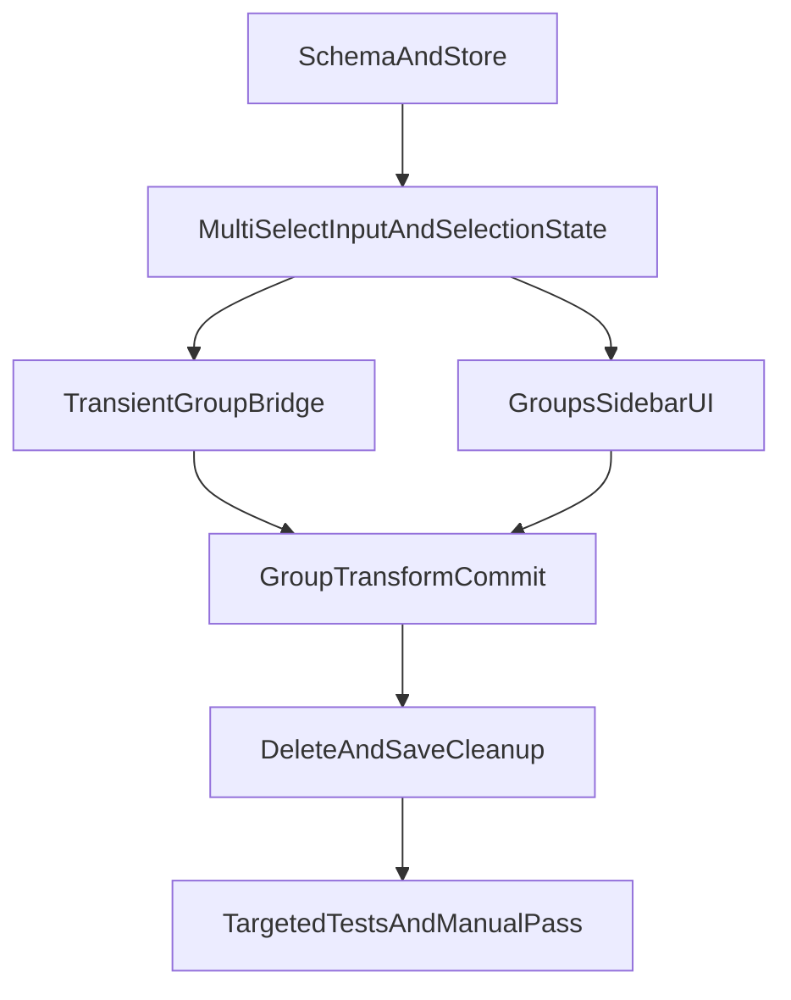

# Apartment Editor Grouping Plan

## Scope
Implement v1 only in apartment authoring mode: [`c:\WebProjects\the-mammoth\apps\editor\src\ui\EditorChromeMyApartment.tsx`](c:\WebProjects\the-mammoth\apps\editor\src\ui\EditorChromeMyApartment.tsx) and the `my_apartment_layout` runtime. Persist groups inside [`c:\WebProjects\the-mammoth\packages\schemas\src\ownedApartmentBuiltins.ts`](c:\WebProjects\the-mammoth\packages\schemas\src\ownedApartmentBuiltins.ts), which already owns decor and wall authoring state and is already saved by [`c:\WebProjects\the-mammoth\apps\editor\src\ui\hooks\useEditorChromeDiskPersistence.ts`](c:\WebProjects\the-mammoth\apps\editor\src\ui\hooks\useEditorChromeDiskPersistence.ts).

Assumption for v1: groups apply to authored apartment decor and wall slabs, not the four special built-in furniture roots (`bed`, `wardrobe`, `footlocker`, `stove`). That keeps the first pass aligned with the user story and avoids mixing two different persistence shapes.

## Design
Store group membership using the same opaque apartment selection ids already used by the editor, from [`c:\WebProjects\the-mammoth\apps\editor\src\editor\myApartment\editorMyApartmentSelection.ts`](c:\WebProjects\the-mammoth\apps\editor\src\editor\myApartment\editorMyApartmentSelection.ts). That avoids inventing a second identifier system and lets groups reference either decor or wall items uniformly.

Use a hybrid selection model in the editor store:
- Keep existing `selectedId` as the primary/last-clicked item for compatibility.
- Add `selectedIds` for Ctrl-multiselect.
- Add `selectedApartmentGroupId` for when the user selects a saved group from the list.

Use a synthetic selected id for active groups, e.g. `mammoth_editor_my_apartment_group:<groupId>`, and extend the existing group bridge in [`c:\WebProjects\the-mammoth\apps\editor\src\editor\myApartment\editorMyApartmentPieceGroupBridge.ts`](c:\WebProjects\the-mammoth\apps\editor\src\editor\myApartment\editorMyApartmentPieceGroupBridge.ts) so transform controls can attach to a transient `THREE.Group` that contains all current members.

## Workstreams
### 1. Schema and store state
Extend [`c:\WebProjects\the-mammoth\packages\schemas\src\ownedApartmentBuiltins.ts`](c:\WebProjects\the-mammoth\packages\schemas\src\ownedApartmentBuiltins.ts) with an `objectGroups` array, likely shaped like:

```ts
{
  id: string;
  name: string;
  memberSelectedIds: string[];
}
```

Include validation and migration defaults so existing apartment files still parse cleanly.

Then extend [`c:\WebProjects\the-mammoth\apps\editor\src\state\editorStoreTypes.ts`](c:\WebProjects\the-mammoth\apps\editor\src\state\editorStoreTypes.ts) and the store implementation with:
- multiselect state and helpers
- group-select / clear-select actions
- group CRUD actions that patch `ownedApartmentBuiltins`
- history snapshots so undo/redo includes group membership, rename, delete, and multiselect changes where appropriate

### 2. Multiselect input and visual feedback
Update pointer selection in [`c:\WebProjects\the-mammoth\apps\editor\src\editor\editorScene\editorSceneCanvasPointer.ts`](c:\WebProjects\the-mammoth\apps\editor\src\editor\editorScene\editorSceneCanvasPointer.ts) so Ctrl-click toggles apartment decor/wall items into `selectedIds` instead of replacing selection. Plain click should keep today’s single-select behavior.

Add multi-outline rendering for all selected apartment members. The editor already has selection-outline infrastructure, so the plan is to extend the apartment authoring render path to draw an outline/AABB for every selected member rather than only the primary selection.

Also mirror Ctrl-click multiselect in the apartment sidebar list in [`c:\WebProjects\the-mammoth\apps\editor\src\ui\EditorChromeMyApartment.tsx`](c:\WebProjects\the-mammoth\apps\editor\src\ui\EditorChromeMyApartment.tsx) so canvas and list stay consistent.

### 3. Saved groups UI
Add a new `Groups` section to [`c:\WebProjects\the-mammoth\apps\editor\src\ui\EditorChromeMyApartment.tsx`](c:\WebProjects\the-mammoth\apps\editor\src\ui\EditorChromeMyApartment.tsx):
- `Save group from selection` when `selectedIds.length >= 2`
- a renameable list of saved groups
- `Select group` to activate it for gizmo transforms
- `Delete group` / `Ungroup` to remove the saved group definition without deleting member objects

Use shared theme tokens and existing chrome row/button patterns rather than introducing a one-off visual system.

### 4. Group transform attachment and commit
The core implementation is to reuse the existing transform-controls pipeline instead of building a parallel manipulation path.

- Extend the apartment mesh/group bridge in [`c:\WebProjects\the-mammoth\apps\editor\src\editor\myApartment\editorMyApartmentPieceGroupBridge.ts`](c:\WebProjects\the-mammoth\apps\editor\src\editor\myApartment\editorMyApartmentPieceGroupBridge.ts) to register transient `THREE.Group` roots for saved groups.
- Update selection framing / transform attachment so selecting a saved group attaches the gizmo to that synthetic group root.
- In [`c:\WebProjects\the-mammoth\apps\editor\src\editor\scene\editorSceneCommitAttachedTransform.ts`](c:\WebProjects\the-mammoth\apps\editor\src\editor\scene\editorSceneCommitAttachedTransform.ts), add a `my_apartment_layout` group branch that:
  1. detects an attached group root via `userData.groupId`
  2. computes the group delta from drag start to current pose
  3. applies that delta to each member’s authored transform
  4. reuses the existing per-member clamp/snap rules for decor and wall items

This should happen inside the existing transaction lifecycle so one drag remains one undo step.

### 5. Save/load and cleanup rules
No new save endpoint should be needed. Because groups live inside `OwnedApartmentBuiltinsDoc`, [`c:\WebProjects\the-mammoth\apps\editor\src\ui\hooks\useEditorChromeDiskPersistence.ts`](c:\WebProjects\the-mammoth\apps\editor\src\ui\hooks\useEditorChromeDiskPersistence.ts) should persist them automatically once schema/store serialization are updated.

Add cleanup rules when member objects are deleted:
- remove deleted member ids from any saved groups
- auto-delete empty or single-member groups, or at minimum mark them invalid and filter them from the UI
- keep selection stable if the currently active group becomes invalid

## Execution Order


## Verification
Add focused tests where the logic is most fragile:
- schema parse/migration for `objectGroups`
- group cleanup when a decor or wall item is deleted
- group transform delta application in the apartment commit path

Manual verification pass in the editor:
- Ctrl-click multiple items and see all members highlighted
- save a group, rename it, reload editor, confirm it persists
- translate / rotate / scale group and verify every member updates together
- ungroup and verify objects remain in place but no longer move together
- save to disk and confirm `content/apartment/owned_apartment_builtins.json` remains valid