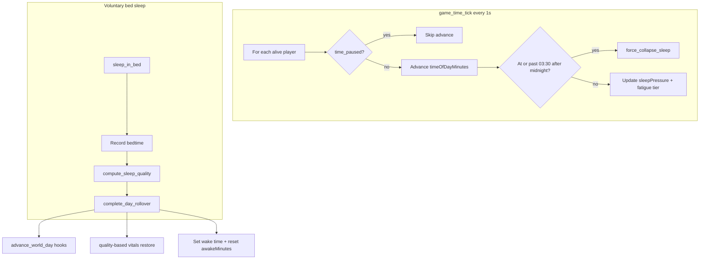

# Stardew-like day/time progression (minimal extension)

## Current baseline (what we keep)

| System | Today | Keep |
|--------|-------|------|
| Day counter | [`PlayerWorldProgress.sleeps_count`](apps/server/src/world_day.rs) — discrete nights | **Reuse** as `dayNumber - 1`; display `Day {sleeps_count + 1}` |
| Sleep | [`sleep_in_bed`](apps/server/src/world_day.rs) → [`advance_world_day_for_player`](apps/server/src/world_day.rs) | **Extend** with bedtime + quality |
| Overnight sim | grow trays, fish filter, water tank refill in `advance_world_day_for_player` | **Keep calling**; wrap in one hook |
| Vitals | health / hunger / hydration only ([`player_vitals.rs`](apps/server/src/player_vitals.rs)) | **No stamina bar**; sprint never disabled; slow sprint hunger/thirst cost |
| Sprint | Unlimited shift-sprint ([`fpLocomotion.ts`](packages/engine/src/fpLocomotion.ts) 7.5 m/s); server `BIT_SPRINT` adds 1.35× vitals drain | **Keep unlimited**; tune slow incremental drain; fatigue **reduces sprint speed** |
| Caffeine gum | catalog item, no `consumeOnUse` ([`consumables.json`](content/items/catalog/consumables.json)) | **Full consumable item** — hotbar V, tooltip stats, stimulant effects |
| HUD | [`MammothWorldDayHud`](apps/client/src/ui/MammothWorldDayHud.tsx) shows NIGHTS | **Adapt** to Day + clock |
| Persistence | SpacetimeDB tables (not local save files) | **Extend** `player_world_progress` columns with `#[default(...)]` |

There is **no** real-time clock, fatigue, or collapse today. Grow trays already advance **per sleep**, not wall-clock — that stays true.



---

## 1. Shared constants (TS + Rust)

Add [`packages/schemas/src/gameTime.ts`](packages/schemas/src/gameTime.ts) (export from [`packages/schemas/src/index.ts`](packages/schemas/src/index.ts)):

| Constant | Value | Notes |
|----------|-------|-------|
| `WAKE_TIME_MINUTES` | 360 (06:00) | Default morning |
| `SOFT_FATIGUE_START_MINUTES` | 1260 (21:00) | |
| `SEVERE_FATIGUE_START_MINUTES` | 0 (midnight) | After-midnight zone: `minutes < WAKE_TIME` |
| `NORMAL_COLLAPSE_PRESSURE_MINUTES` | 120 (02:00) | Escalating warnings |
| `HARD_COLLAPSE_TIME_MINUTES` | 210 (03:30) | **Absolute cap** |
| `REAL_SECS_PER_GAME_SECS` | 1/30 | 1 real sec = 30 game sec → **2 real min = 1 game hour** |
| `GAME_TIME_TICK_INTERVAL_SECS` | 1 | Server scheduler cadence |

Mirror in new [`apps/server/src/game_time.rs`](apps/server/src/game_time.rs) with unit tests for:
- `minutes_to_hhmm` / display helpers
- `is_after_midnight(minutes)` → `minutes < WAKE_TIME`
- `clamp_time_advance(current, delta)` — never pass 03:30 while awake; returns `HardCapReached`
- `compute_sleep_quality(bedtime_minutes, stimulant_abuse)` → enum + wake offset + recovery profile
- `compute_fatigue_tier(minutes, sleep_pressure, stimulant_load)` → `None | Soft | Severe | CollapsePressure`

---

## 2. Extend `PlayerWorldProgress` (persistence / save-load)

Extend table in [`world_day.rs`](apps/server/src/world_day.rs) (or re-export from `game_time.rs`):

```rust
pub struct PlayerWorldProgress {
    pub identity: Identity,
    pub sleeps_count: u32,              // existing
    #[default(360u16)]
    pub time_of_day_minutes: u16,       // minutes since 00:00
    #[default(0u32)]
    pub awake_minutes: u32,
    #[default(0f32)]
    pub sleep_pressure: f32,            // internal 0..1+
    #[default(0u16)]
    pub last_bed_time_minutes: u16,
    #[default(0u8)]
    pub last_sleep_quality: u8,         // 0=Good 1=Normal 2=Bad 3=Collapse
    #[default(0f32)]
    pub stimulant_load: f32,            // decays over time; delays fatigue visuals
    #[default(0f32)]
    pub fatigue_debt: f32,              // next-day grogginess from caffeine abuse
    #[default(false)]
    pub time_paused: bool,              // client-driven menu freeze
}
```

- **`ensure_player_world_progress`**: new rows start at **Day 1, 06:00** (`sleeps_count=0`, `time_of_day_minutes=360`).
- Existing rows get defaults via SpacetimeDB `#[default]` on publish.
- After module publish: run `pnpm client:generate` for bindings ([`player_world_progress_table.ts`](apps/client/src/module_bindings/player_world_progress_table.ts)).

---

## 3. Server time tick + hard 03:30 cap

New scheduled reducer in `game_time.rs`:

- Register in [`init`](apps/server/src/lib.rs) via `game_time::start_game_time_schedule(ctx)` (same pattern as [`player_vitals_tick_step`](apps/server/src/player_vitals.rs)).
- Each tick (1 real sec): add `30/60 = 0.5` game minutes per player who is:
  - registered / gameplay unlocked
  - alive (`health > 0`)
  - **not** `time_paused`
- Increment `awake_minutes` and `sleep_pressure` (faster after 21:00 / midnight tiers).
- **Hard cap**: if player is in after-midnight window and `time_of_day_minutes >= 210`, call `force_collapse_sleep` immediately — **do not** advance past 03:30.
- Defensive clamp on every advance: if next minute would exceed 210 in after-midnight zone → collapse instead of write.

---

## 4. Refactor day rollover (sleep + collapse + death)

Extract **`complete_day_rollover(ctx, owner, unit_key, bedtime_minutes, kind)`** in `world_day.rs`:

1. Record `last_bed_time_minutes`, compute `last_sleep_quality`.
2. `sleeps_count += 1` (unchanged semantics for grow trays).
3. Set wake time from quality (06:00 / 07:00 / 08:00–10:00 late).
4. Reset `awake_minutes`, decay `stimulant_load`, apply `fatigue_debt` from prior abuse.
5. **Replace** unconditional [`restore_player_vitals_full`](apps/server/src/player_vitals.rs) with new **`restore_player_vitals_after_sleep(profile)`**:

| Quality | Wake | Energy proxy | HP | Hunger/thirst |
|---------|------|--------------|-----|---------------|
| Good (bed before ~23:00) | ~06:00 | high restore (~95–100) | +small if needs OK | small overnight drain |
| Normal (23:00–01:00) | ~07:00 | decent (~75–85) | less HP | moderate drain |
| Bad (01:00–03:30) | 08:00–10:00 scaled | low (~50–65) | none/minimal | larger drain + `fatigue_debt` |
| Collapse (forced 03:30 or away-from-bed) | ~09:00 | low | HP penalty | large drain |

Since there is no stamina stat, “energy” maps to **starting hunger/hydration floor + fatigue_debt** — no new HUD bar. Sprint is **never gated off**; tired players move slower and burn needs faster instead.

6. Call existing overnight hooks (unchanged):
   - [`refill_apartment_water_tank_on_sleep`](apps/server/src/water_container.rs)
   - [`balcony_grow::advance_world_day_for_unit`](apps/server/src/balcony_grow/day_advance.rs)
   - [`fish_tank_filter::advance_fish_tank_filters_for_unit`](apps/server/src/fish_tank_filter.rs)
7. Add **`run_overnight_placeholder_hooks`** with TODO stubs for spoilage, NPC schedules, building decay (no invented sim).
8. [`emit_hud_notice`](apps/server/src/crafting.rs) with quality-specific morning message.

**Voluntary sleep** — update [`sleep_in_bed_impl`](apps/server/src/world_day.rs):
- Pass current `time_of_day_minutes` as bedtime into `complete_day_rollover(..., Voluntary)`.

**Forced collapse** — new `force_collapse_sleep`:
- If [`player_pose_near_unit_bed`](apps/server/src/apartments.rs): collapse at home (inventory kept).
- Else: reuse [`scatter_carrier_inventory_at_death`](apps/server/src/dropped_item.rs) for carried loot, teleport to bed via [`spawn_pose_owned_bed`](apps/server/src/apartments.rs), collapse quality.
- Does **not** route through death overlay (`health` stays > 0).

**Death respawn** — minimal touch in [`respawn_player`](apps/server/src/lib.rs):
- Keep advancing day (existing “skipped night” behavior).
- Remove duplicate full restore; use **Bad/Collapse-tier** profile instead of double `restore_player_vitals_full`.

---

## 5. Sprint + fatigue (no stamina bar, sprint never stops)

**Design intent:** Shift-sprint stays **always available** — no exhaustion meter that blocks sprint. Cost shows up as **slow hunger/thirst drain while sprinting** and **slower movement when fatigued**, not a hard stop.

### 5a. Sprint vitals drain (server)

Today [`player_vitals.rs`](apps/server/src/player_vitals.rs) applies `SPRINT_DRAIN_MULTIPLIER = 1.35` whenever `BIT_SPRINT` is set on the 2 s tick — a flat boost on top of base drain (~120 min hunger / ~90 min hydration at 1×).

**Change (tune, don’t rewrite):**
- Refactor `step_vitals_once` to accept separate multipliers:
  - `base_drain_mul` — fatigue tier (1.0 → ~1.15 soft → ~1.35 severe → ~1.5 collapse pressure)
  - `sprint_drain_mul` — **small extra** cost only while sprinting (target ~1.12–1.18 on top of base, not 1.35)
- Net effect: walking all day barely moves bars; **sustained sprinting** nibbles hunger/thirst over a full session (~15–25 min real-time sprinting to notice a meaningful dip, tunable in constants).
- Walking drain unchanged at 1× base; sprint adds incremental cost only when shift-held.

Add shared constants in [`packages/schemas/src/gameTime.ts`](packages/schemas/src/gameTime.ts) (`SPRINT_VITALS_DRAIN_MUL`, `FATIGUE_VITALS_DRAIN_MUL_*`) mirrored in Rust.

### 5b. Fatigue reduces sprint speed (client)

Fatigue tier from replicated `player_world_progress` → [`packages/game/src/player/fatigueTier.ts`](packages/game/src/player/fatigueTier.ts).

Apply **`fatigueSprintSpeedMul(tier)`** in FP locomotion wiring ([`fpSessionMainRafFrame.ts`](apps/client/src/game/fpSession/fpSessionMainRafFrame.ts) or [`fpSessionLocomotionPredictionWiring.ts`](apps/client/src/game/fpSession/fpSessionLocomotionPredictionWiring.ts)):
- Fresh morning: 1.0 → full 7.5 m/s sprint
- Soft (after 21:00): ~0.95
- Severe (after midnight): ~0.88
- Collapse pressure (02:00–03:30): ~0.80

Solo client-authoritative locomotion — server does not clamp speed; tier is replicated so prediction stays honest. **Sprint input is never blocked.**

Caffeine `stimulant_load` **softens** effective fatigue tier for both drain and speed (temporary bump) but **does not** affect the 03:30 hard cap.

### 5c. Feedback hooks (minimal v1)

- [`fpFatigueFeedback.ts`](apps/client/src/game/fpSession/fpFatigueFeedback.ts) — vignette / warning string near collapse; stub comments for breathing/audio.
- Near collapse: one toast via existing notice path.

---

## 6. Caffeine gum — real consumable item

Make `caffeine-gum` a **first-class hotbar item**, not a silent server special-case.

### Catalog + UX

Update [`content/items/catalog/consumables.json`](content/items/catalog/consumables.json):

```json
{
  "id": "caffeine-gum",
  "displayName": "Caffeine gum",
  "description": "Bitter chew. Sharpens you for a while; sleep hits harder if you overdo it.",
  "category": "consumable",
  "maxStack": 40,
  "hotbarConsumeSound": "eat",
  "consumeOnUse": { "hungerDelta": 2 }
}
```

- `consumeOnUse` enables standard hotbar **V** flow ([`fpHotbarConsume.ts`](apps/client/src/game/fpHotbar/fpHotbarConsume.ts) → `consumeHotbarItem`).
- Extend [`mammothItemTooltipContent.ts`](apps/client/src/inventory/mammothItemTooltipContent.ts) with a small **stimulant stat block** for known stimulant ids (or optional catalog field later): e.g. “Alertness +15 min”, “Sleep quality − if abused”.

### Server stimulant handler

In [`consume_hotbar_item`](apps/server/src/inventory/mod.rs), after applying catalog vitals deltas, call `game_time::apply_stimulant_consume(ctx, owner, "caffeine-gum")`:

| Effect | Value (tunable) |
|--------|-----------------|
| `stimulant_load` | +0.35, cap 1.0 |
| `sleep_pressure` | −0.15 immediate relief |
| Fatigue tier | treated one step lower while load > 0 |
| Abuse tracking | increment counter; **worsens next sleep quality** if ≥3 chews same day |
| Decay | `stimulant_load` decays on game-time tick (~0.08/min game time) |

**Hard rule unchanged:** caffeine never pushes playable time past **03:30** — only delays fatigue *feel* (drain mul + sprint speed).

Optional: add `stimulant_chews_today: u8` on `PlayerWorldProgress`, reset on day rollover.

---

## 7. Time pause (menus / sleep confirm / loading)

New reducer **`set_time_paused(paused: bool)`** in `game_time.rs`:
- Updates `PlayerWorldProgress.time_paused` for sender.
- Client bridge [`apps/client/src/game/fpSession/fpGameTimePause.ts`](apps/client/src/game/fpSession/fpGameTimePause.ts):
  - Pause when [`getFpPlayerMenuHudOpen`](apps/client/src/game/fpInteraction/fpPlayerMenuHudOpen.ts) (inventory/crafting), sleep confirm open, or before FP session hydrated.
  - Resume on close / after sleep reducer completes.
- Dead players: tick already skips via `is_player_dead`.

---

## 8. HUD

Adapt [`MammothWorldDayHud.tsx`](apps/client/src/ui/MammothWorldDayHud.tsx) (already in top-right [`MammothFpsHud`](apps/client/src/ui/MammothFpsHud.tsx) panel):

```
Day 7
08:40
```

- Subscribe to `player_world_progress`.
- Client interpolation in [`gameTimeDisplay.ts`](apps/client/src/game/fpSession/gameTimeDisplay.ts): between server updates, add local delta at `REAL_SECS_PER_GAME_SECS` unless paused.
- Add comment: `{/* DEBUG: in-game clock — may remove later */}`.
- Update [`MammothSleepConfirmHud.tsx`](apps/client/src/ui/MammothSleepConfirmHud.tsx) copy: recovery depends on current time, not “always full restore”.

---

## 9. Tests

| Layer | File | Cases |
|-------|------|-------|
| Rust | `apps/server/src/game_time.rs` `#[cfg(test)]` | time advance cap at 03:30, sleep quality buckets, wake offsets, collapse trigger |
| Rust | `apps/server/src/player_vitals.rs` tests | sprint-only drain is slow; fatigue multiplies base drain |
| Rust | `apps/server/src/world_day.rs` tests | rollover increments sleeps_count, calls grow hook |
| TS | `packages/game/src/player/fatigueTier.test.ts` | sprint speed mul per tier |
| TS | `packages/schemas/src/gameTime.test.ts` | HH:MM formatting, constant sync |
| TS | `apps/client/src/game/fpSession/gameTimeDisplay.test.ts` | interpolation + pause |

---

## 10. Publish / verify checklist

1. `spacetime publish` server module (schema migration via defaults).
2. `pnpm client:generate`.
3. Manual acceptance:
   - New connect → clock at 06:00, Day 1; time advances in gameplay.
   - Bed before midnight → next day ~06:00, good recovery; grow tray advances.
   - Bed after 01:00 → late wake, worse bars.
   - Stay awake until 03:30 → forced collapse message, bad recovery; inventory loss if away from bed.
   - Sprint held for several minutes → hunger/thirst dip slowly (session-viable).
   - Late night / fatigue → sprint speed noticeably lower but shift-sprint still works.
   - Caffeine gum (hotbar V) → tooltip + stimulant effect; delays fatigue feel; still collapses at 03:30; abused chews worsen sleep.
   - Inventory open → clock pauses (server `time_paused`).
   - Reconnect → day/time restored from DB row.

---

## Files touched (focused diff)

| Area | Files |
|------|-------|
| Schema/constants | `packages/schemas/src/gameTime.ts`, `index.ts` |
| Server core | `apps/server/src/game_time.rs` **(new)**, `world_day.rs`, `player_vitals.rs`, `inventory/mod.rs`, `lib.rs` |
| Client locomotion | `fpSessionMainRafFrame.ts` or `fpSessionLocomotionPredictionWiring.ts` — fatigue sprint speed mul |
| Client HUD/time | `MammothWorldDayHud.tsx`, `MammothSleepConfirmHud.tsx`, `fpGameTimePause.ts`, `gameTimeDisplay.ts`, `fpFatigueFeedback.ts` |
| Client inventory | `mammothItemTooltipContent.ts` — caffeine stimulant stats |
| Shared game | `packages/game/src/player/fatigueTier.ts` |
| Content | `consumables.json` |
| Generated | `apps/client/src/module_bindings/*` (via generate) |

**Explicitly not rewriting:** locomotion, combat, NPC schedule, inventory model, guest save slots, balcony grow day logic internals, full spoilage/NPC/decay sim (placeholders only).
