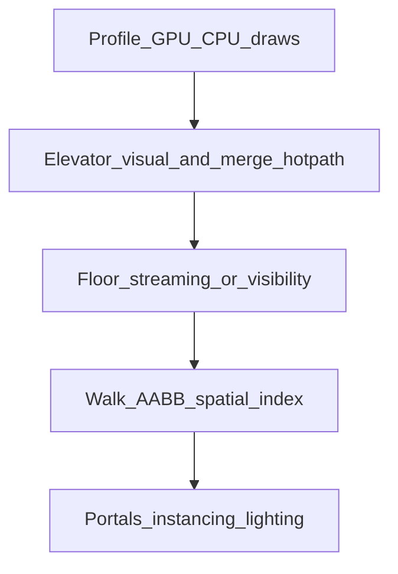

# Elevator lag, building scale, and culling

## What the code is doing today

**Whole building in memory and in the scene**

- [`mountFpSession.ts`](apps/client/src/game/mountFpSession.ts) calls [`instantiateBuildingFloorStack`](packages/world/src/index.ts) for all 19 `floorRefs` from [`mammoth.json`](content/building/mammoth.json) and adds one `buildingRoot` to the scene. There is **no** floor streaming, portal graph, or manual visibility layer beyond Three.js default per-mesh frustum culling.

**Walk / collision sampling (CPU scales with building size)**

- `walkSurfaceAABBsForBuilding` builds a flat list of AABBs for the **entire** building once at session start ([`mountFpSession.ts`](apps/client/src/game/mountFpSession.ts) ~145–149).
- [`sampleWalkGroundTopY`](packages/world/src/walkSurfaceAABBs.ts) does a **linear scan** of that list every call.
- [`stepFpLocomotion`](packages/engine/src/fpLocomotion.ts) runs up to **50 substeps** per frame when walk sampling is enabled, and calls `sampleWalkGroundTopY` **twice per substep** (`w0` and `w1`). That is up to **100 full-array scans per frame**, each plus [`mergeWalkTop`](apps/client/src/game/fpElevatorWorld.ts) over all shafts in `latest`.

**Elevator-specific client cost**

- [`mountFpElevatorWorld`](apps/client/src/game/fpElevatorWorld.ts) mounts one [`ShaftVisual`](apps/client/src/game/fpElevatorWorld.ts) per hoistway from [`listElevatorShaftLayouts`](packages/world/src/elevatorShaftLayout.ts) (currently **5** shafts per [`MAMUTH_ELEVATOR_SPECS`](apps/server/src/elevator_layout.rs)).
- Each shaft’s in-car panel: **one mesh + one `CanvasTexture` + one `MeshStandardMaterial` per floor** (`buildCarFloorPickPad` loops `level = 1..maxLevel` with `maxLevel` 19) → **95** small textured quads, **95 unique materials**, each canvas uploaded as a texture.
- Every frame, `tick` calls `updateFromServer` for **all** shafts and `updateFloorPickHighlight` for **all** pick meshes (sets `emissive` / `emissiveIntensity` on up to 95 materials) even when the player is nowhere near most cars.
- `mergeWalkTop` adds a small loop over all elevator rows on **every** walk sample (when not in the jump skip path in [`sampleWalkTop`](apps/client/src/game/mountFpSession.ts)).

**What is *not* the main suspect**

- HUD: [`setFpElevatorHudView`](apps/client/src/game/fpElevatorHud.ts) no-ops when unchanged, so React is not re-rendering every frame from that path.
- FP session lighting in [`attachFpSessionEnvironment`](apps/client/src/game/fpSessionEnvironment.ts): directional light does not enable shadows in this file; editor toggles shadows separately. Indoor “shadow death” is less likely here unless you later enable shadow maps without tightening them.

**Server**

- [`tick_all_elevators`](apps/server/src/elevator.rs) runs at physics tick (~20 Hz) from [`physics_tick_step`](apps/server/src/movement.rs). That is reasonable; client lag is unlikely to be *primarily* from reducer frequency unless profiling shows SpacetimeDB callback overload.

---

## Recommended order (matches your pasted stack, adapted to this repo)

### 1. Measure first (short, decisive)

- In a dev build with the mammoth building: record **FPS**, **CPU** (Performance panel: `stepFpLocomotion`, `sampleWalkGroundTopY`, `mergeWalkTop`, `ShaftVisual.tick` / `updateFloorPickHighlight`), and **GPU** (draw calls / triangles via `renderer.info` or three.js r181+ debug if available).
- Compare: **lobby idle**, **walking corridors**, **inside elevator moving**, **top floor**. That tells you whether to bias toward **walk CPU** vs **draw/material** vs **both**.

### 2. Elevator-specific fixes (high ROI, localized to [`fpElevatorWorld.ts`](apps/client/src/game/fpElevatorWorld.ts) + small call sites)

- **Stop 95 unique canvas materials**: replace per-level buttons with either:
  - **One** shared atlas texture + **one** material and UV offsets / `InstancedMesh` for buttons, or
  - **DOM/HTML** overlay for floor selection when inside car (zero extra textured meshes), keeping raycast only if you want world consistency.
- **Visibility**: set `floorPickRoot.visible = false` when the player is not in that car **or** doors are nearly closed; only the active shaft near the player needs pick meshes in the raycast list for [`tryRaycastFloorPick`](apps/client/src/game/fpElevatorWorld.ts).
- **Highlight updates**: call `updateFloorPickHighlight` only when `currentLevel` **changes** for that shaft (track last value), not every frame; and only for shafts that are **visible** or **player inside**.
- **`mergeWalkTop`**: reuse one `nowMs` per call; **early-exclude** shafts by XZ bounds before `getCabY`; optionally skip shafts whose **interpolated cab** is far below `probeTopY` so rising/falling in open air does less work.
- **Tests**: extend [`fpElevatorHudCarContains.test.ts`](apps/client/src/game/fpElevatorHudCarContains.test.ts) or add tests for “highlight only updates on level change” / merge early-out if you extract pure helpers.

### 3. Floor streaming / visibility (biggest structural win for a 19-story shell)

- **Goal**: only **current floor ± 1** (or ± 0 if you want stricter) have `visible = true` on their plate groups under `buildingRoot`; others `false` or detached. Align with the ChatGPT advice: *do not keep every floor’s placeholder furniture meshes live*.
- **Implementation sketch**: in [`mountFpSession.ts`](apps/client/src/game/mountFpSession.ts), tag each plate when building (already named like `` `${plate.name}:L${ref.levelIndex}` `` in [`instantiateBuildingFloorStack`](packages/world/src/index.ts)) or add `userData.levelIndex` in world package if you prefer a stable API.
- **Each frame or throttled** (e.g. every 200 ms): derive storey from `pos.y` (you already have [`estimateStorey`](apps/client/src/game/fpElevatorWorld.ts)-style logic; consider a shared helper in `@the-mammoth/world` to avoid drift) and toggle `visible` on floor groups.
- **Elevator ride**: while `cab` Y spans floors, either widen active range (e.g. all floors between min/max of current cab Y and target) **or** treat the shaft as a special case (always show floors that contain open hoistway **or** only car interior + landing—product decision).
- **Important**: walk sampling uses **AABBs**, not meshes—visibility changes **do not** fix walk CPU unless you also subset AABBs (next step) or build a spatial index.

### 4. Accelerate walk sampling (pairs with floor streaming)

- Add a **uniform grid** or **sorted-Y slab** index over `walkAABBs` keyed by XZ (and optionally Y bands) so `sampleWalkGroundTopY` only tests boxes in the **neighborhood** of `(x,z)` instead of all building boxes. Keep the same public signature or wrap in a small `WalkSurfaceIndex` type in [`packages/world/src/walkSurfaceAABBs.ts`](packages/world/src/walkSurfaceAABBs.ts) (or adjacent module) with unit tests for correctness vs brute force on a fixture slice.
- Optionally maintain **per-floor AABB lists** and only merge lists for active floors ± 1 when floor visibility is enabled—simpler than a full grid but already a large win.

### 5. Later / optional (after the above is profiled again)

- **Portal / room visibility**: requires authored cells + graph; not present in FP today beyond placeholder corridor meshes in [`buildFloorMeshes`](packages/world/src/floorPlaceholderMeshes.ts). Defer until floor streaming proves insufficient.
- **Instancing / merging** repeated corridor modules in `buildFloorMeshes`—larger content-pipeline change.
- **Baked lighting / fewer dynamic lights** if you add real interior lights later.
- **`three-mesh-bvh`**: useful for ray-heavy FPS; your bottleneck today is more likely AABB walk scan + draw count unless profiling says otherwise.

### 6. Network alignment (only if replication shows up in profiles)

- If `elevator_car` subscription traffic matters at scale, consider **client-side interpolation** from sparse snapshots or row filters; not required for five shafts unless profiling says otherwise.

---

## Success criteria

- Profile: measurable drop in **time in `sampleWalkGroundTopY` + `mergeWalkTop`** per frame after indexing / floor AABB subsetting.
- Profile: lower **draw calls / textures** when outside elevators after material/visibility changes.
- Gameplay: no regression on **standing on cab**, **hail**, **floor pick**, **door timing** vs server ([`elevator.rs`](apps/server/src/elevator.rs)).
