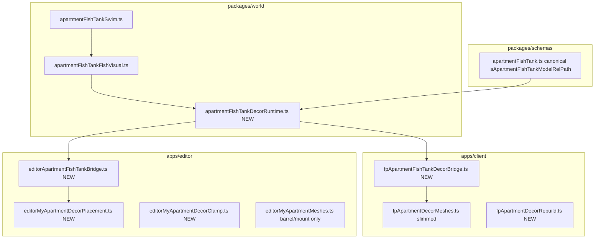

# Fish Tank Architecture Refactor

## Target architecture



---

## 1. Consolidate world layer (`packages/world`)

### New: [`packages/world/src/apartmentFishTankDecorRuntime.ts`](packages/world/src/apartmentFishTankDecorRuntime.ts)

Single entry for mount + template deps (no Three.js loading — callers supply template):

- **`apartmentFishTankDecorTemplateDeps(placedModelRelPaths: readonly string[]): string[]`** — returns `[APARTMENT_FISH_TANK_SWIMMER_MODEL_REL_PATH]` when any path matches `isApartmentFishTankModelRelPath`. Replaces editor-only logic in [`editorOwnedApartmentSceneLayout.ts`](apps/editor/src/editor/myApartment/editorOwnedApartmentSceneLayout.ts).
- **`mountApartmentFishTankSchool(opts)`** — thin wrapper around `createApartmentFishTankFishSchool` that:
  - normalizes tank model path via shared predicate
  - builds `stableKey` from caller-supplied parts
  - accepts `fishTemplateRoot` + `decorateSwimmerMesh`
  - returns `null` when model is not main fish tank (not castle/sand)

Export from [`packages/world/src/index.ts`](packages/world/src/index.ts).

### Optimize clones in [`packages/world/src/apartmentFishTankFishVisual.ts`](packages/world/src/apartmentFishTankFishVisual.ts)

Replace per-fish deep geometry clone with shared prototype:

1. **`buildNormalizedFishPrototype(templateRoot)`** — center + scale once; returns `THREE.Group` (existing `wrapNormalizedFishClone` logic).
2. **`spawnFishInstanceFromPrototype(prototype)`** — `prototype.clone(true)` **without** geometry/material clone (shared GPU buffers).
3. School loop: build prototype once when `fishTemplateRoot` present; instances 0–5 call `spawnFishInstanceFromPrototype`.
4. Capsule fallback unchanged (dev-only path); add `console.warn` once when `fishTemplateRoot` missing.

Add tests in **`apartmentFishTankFishVisual.test.ts`**: prototype built once, 6 instances share geometry reference, yaw-only rotation (pitch/roll stay 0 after update).

---

## 2. Deduplicate `isApartmentFishTankModel*`

**Canonical:** [`packages/schemas/src/apartmentFishTank.ts`](packages/schemas/src/apartmentFishTank.ts) — keep `isApartmentFishTankModelRelPath`.

**Remove duplicate** from [`packages/world/src/apartmentFishTankVisual.ts`](packages/world/src/apartmentFishTankVisual.ts) (`isApartmentFishTankModelPath`).

**Update imports:**
- [`apartmentFishTankVisual.test.ts`](packages/world/src/apartmentFishTankVisual.test.ts) — import predicate from `@the-mammoth/schemas` (or test only dimension constants from world file).
- All client/editor call sites already use schemas import; no behavior change.

Optional: add `normalizeApartmentDecorModelRelPath`-aware helper in runtime module so editor and client both normalize before tank check (fixes path-prefix inconsistency noted in review).

---

## 3. Client fish-tank bridge

### New: [`apps/client/src/game/fpApartment/fpApartmentFishTankDecorBridge.ts`](apps/client/src/game/fpApartment/fpApartmentFishTankDecorBridge.ts)

Mirror [`fpBalconyGrowDecorBridge.ts`](apps/client/src/game/fpBalconyGrow/fpBalconyGrowDecorBridge.ts) shape:

```ts
export type FpApartmentFishTankDecorBridge = {
  clear: () => void;
  hasActiveSchools: () => boolean;
  tick: (dt: number) => void;
  tryMountOnTankVisual: (opts: {
    tankModelRelPath: string;
    tankVisualRoot: THREE.Object3D;
    stableKey: string;
    loadFishTemplate: () => Promise<THREE.Object3D | undefined>;
    decorateSwimmerMesh: (mesh: THREE.Mesh) => void;
  }) => Promise<void>;
};
```

- Internal: `schools: FishTankFishSwimUpdater[]`, cached normalized fish template loader (replaces `__fish_school_tpl:` hack in [`fpApartmentDecorMeshes.ts`](apps/client/src/game/fpApartment/fpApartmentDecorMeshes.ts)).
- `tryMountOnTankVisual` calls `mountApartmentFishTankSchool` from world runtime.
- `clear()` on decor rebuild; `tick()` caps dt same as today.

### Wire into [`fpApartmentDecorMeshes.ts`](apps/client/src/game/fpApartment/fpApartmentDecorMeshes.ts)

- Replace `fishTankFishSchools` array + inline 30-line block with `createFpApartmentFishTankDecorBridge()`.
- `MountFpApartmentDecorMeshesResult.updateFishTankFish` delegates to `fishTankBridge.tick`.
- `clearAll()` calls `fishTankBridge.clear()`.

---

## 4. Editor fish-tank bridge + RAF fix

### New: [`apps/editor/src/editor/myApartment/editorApartmentFishTankBridge.ts`](apps/editor/src/editor/myApartment/editorApartmentFishTankBridge.ts)

Same registry pattern as client:

```ts
export type EditorApartmentFishTankBridge = {
  clear: () => void;
  hasActiveSchools: () => boolean;
  tick: (dt: number) => void;
  tryMountOnTankVisual: (opts: {
    decorModelRelPath: string;
    tankVisualRoot: THREE.Object3D;
    decorId: string;
    fishTemplateRoot?: THREE.Object3D;
    decorateSwimmerMesh: (mesh: THREE.Mesh) => void;
  }) => void;
};
```

### Delete userData callback pattern from [`editorMyApartmentMeshes.ts`](apps/editor/src/editor/myApartment/editorMyApartmentMeshes.ts)

Remove:
- `EDITOR_MY_APARTMENT_FISH_TANK_SWIM_UD`
- `updateEditorMyApartmentFishTankFish`
- All `delete group.userData[...]` cleanup sites

`placeDecorGroup` takes `fishTankBridge: EditorApartmentFishTankBridge` instead of full `decorTemplates` map; calls `tryMountOnTankVisual` with `fishTemplateRoot` resolved upstream once per sync.

### Bridge ownership + registration

- [`editorSceneMyApartmentLifecycle.ts`](apps/editor/src/editor/myApartment/editorSceneMyApartmentLifecycle.ts): create one `EditorApartmentFishTankBridge` per furniture mount session; pass into `mountEditorMyApartmentFurnitureUnder` / `syncEditorMyApartmentDecorOnMount`; call `clear()` on teardown/rebuild.
- [`editorMyApartmentPieceGroupBridge.ts`](apps/editor/src/editor/myApartment/editorMyApartmentPieceGroupBridge.ts): add `registerEditorFishTankBridge` / `getEditorFishTankBridge` (same pattern as decor shadow resync).

### Fix editor RAF in [`editorSceneRenderLoop.ts`](apps/editor/src/editor/editorScene/editorSceneRenderLoop.ts)

Replace:

```ts
st.mode === "my_apartment_layout"  // blanket keepAnimating
```

With:

```ts
const fishBridge = getEditorFishTankBridge();
if (fishBridge?.hasActiveSchools()) {
  fishBridge.tick(dt);
  keepAnimating = true;
}
```

Remove import of `updateEditorMyApartmentFishTankFish`. My Apartment layout no longer forces infinite RAF when no tanks exist.

Call `demandEditorSceneRender()` when first school mounts (inside bridge) so fish start moving immediately after rebuild.

---

## 5. Template dependency loading (editor)

Update [`editorOwnedApartmentSceneLayout.ts`](apps/editor/src/editor/myApartment/editorOwnedApartmentSceneLayout.ts):

```ts
export function listMyApartmentDecorTemplateRelPathsWithDeps(doc) {
  return [...new Set([
    ...listMyApartmentPlacedItemModelRelPaths(doc),
    ...apartmentFishTankDecorTemplateDeps(doc.placedItems.map(p => p.modelRelPath)),
  ])];
}
```

Move test from [`editorDecorTemplates.test.ts`](apps/editor/src/editor/myApartment/editorDecorTemplates.test.ts) to world runtime test (or keep one integration test in editor).

---

## 6. File split (get both monoliths under ~1k lines)

### Editor split — extract from [`editorMyApartmentMeshes.ts`](apps/editor/src/editor/myApartment/editorMyApartmentMeshes.ts) (~1538 → ~3 files under 800 each)

| New file | Contents moved |
|---|---|
| [`editorMyApartmentDecorClamp.ts`](apps/editor/src/editor/myApartment/editorMyApartmentDecorClamp.ts) | Constants (lines ~84–137), clamp/snap/pose helpers (`clampMyApartmentDecorEulerLimits`, `centerDecorVisualBoundsOnRoot`, wall/mirror constrain helpers through ~725) |
| [`editorMyApartmentDecorPlacement.ts`](apps/editor/src/editor/myApartment/editorMyApartmentDecorPlacement.ts) | `placeDecorGroup`, `applyDecorGroupPoseFromDoc`, `cloneProp`, decor sync (`syncEditorMyApartmentDecorOnMount`), template loaders |
| [`editorMyApartmentWallMirrorPlacement.ts`](apps/editor/src/editor/myApartment/editorMyApartmentWallMirrorPlacement.ts) | `placeWallGroup`, `placeMirrorGroup`, wall opening sync, wall/mirror mount sync functions |

Keep [`editorMyApartmentMeshes.ts`](apps/editor/src/editor/myApartment/editorMyApartmentMeshes.ts) as **mount entry + re-exports** (`mountEditorMyApartmentFurnitureUnder`, `EditorMyApartmentFurnitureMount`, `previewWorldFromNormalizedPlacement`, etc.) so existing test imports keep working via barrel re-exports (minimal churn in 6+ test files).

### Client split — extract from [`fpApartmentDecorMeshes.ts`](apps/client/src/game/fpApartment/fpApartmentDecorMeshes.ts) (~1499 → ~900 + ~500)

| New file | Contents moved |
|---|---|
| [`fpApartmentDecorRebuild.ts`](apps/client/src/game/fpApartment/fpApartmentDecorRebuild.ts) | `runFullRebuild`, `visibleDecorPlacements` helpers, decor row loop body (walls + decor GLB mount), `loadDecorTemplate` |

[`fpApartmentDecorMeshes.ts`](apps/client/src/game/fpApartment/fpApartmentDecorMeshes.ts) retains: mount setup, bridge wiring (grow + fish), visibility/sync, stash prompts, public `MountFpApartmentDecorMeshesResult` API.

---

## 7. Tests and verification

| Area | Action |
|---|---|
| `packages/world` | New tests: template deps, fish prototype sharing, upright yaw |
| `apps/editor` | Bridge registry test; update decor template test for world deps |
| `apps/client` | Smoke: fish tank in FP session still swims, stays in bounds |
| `apps/editor` | Smoke: fish in My Apartment layout; RAF idle when no tank; animates when tank present |

Run:

```powershell
pnpm exec tsc --noEmit -p packages/world
pnpm exec tsc --noEmit -p apps/client
pnpm exec tsc --noEmit -p apps/editor
cd packages/world; pnpm test
cd apps/editor; pnpm test
```

---

## Implementation order

Work in dependency order to avoid broken intermediate states:

1. World runtime + clone optimization + schema dedupe
2. Client fish bridge + client rebuild extract
3. Editor fish bridge + delete userData + RAF fix
4. Editor file split (clamp → placement → wall/mirror → slim barrel)
5. Tests + manual smoke

---

## Non-goals (this pass)

- Full rewrite of all decor mount logic beyond fish tank + structural split
- InstancedMesh GPU path (shared prototype shallow-clone is sufficient for 6× fish × N tanks)
- Server-side fish tank changes (unchanged)
