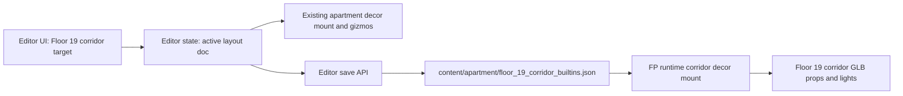

# Floor 19 Corridor Authoring

## Approach
Reuse the existing apartment layout authoring stack instead of creating a new editor. Add a second authoring target, `floor19_corridor`, that swaps the active editor document from the player apartment layout to a new hallway layout document.

The new document will live at `content/apartment/floor_19_corridor_builtins.json` and use the same `OwnedApartmentBuiltinsDoc` schema as apartment units. Seed it with the existing 13 `light-ceiling-2.glb` fixtures, so the fixtures immediately become selectable/movable with the existing gizmos.

## Key Changes
- Add editor state for the corridor document and dirty flag in `apps/editor/src/state/editorStoreTypes.ts` and `apps/editor/src/state/editorStore.ts`.
- Add content loading/saving for `content/apartment/floor_19_corridor_builtins.json` through `apps/editor/src/editor/bootstrap/editorBootstrap.ts`, `apps/editor/src/ui/editorChromeNetwork.ts`, `apps/editor/src/vite/editorDevMiddleware.ts`, and disk persistence hooks.
- Add an authoring-target toggle in `apps/editor/src/ui/EditorChromeMyApartment.tsx`: current unit layout vs `Floor 19 corridor`.
- Generalize the existing apartment placement mapping so the same `fx/fz/dy` document format can map either to a unit footprint or to the floor-19 corridor footprint from `floor_mamutica_typical.json` object `corridor_main`.
- Update the editor mount lifecycle in `apps/editor/src/editor/myApartment/editorSceneMyApartmentLifecycle.ts` and `editorMyApartmentDecorPlacement.ts` to use the active authoring surface mapping. The existing selection IDs, gizmo commits, imports, cloning, deletion, groups, and practical-light preview stay intact.
- Replace `apps/client/src/game/fpSession/fpSessionCorridorCeilingLights.ts` hardcoded positions with a loader for the authored corridor doc. Runtime will mount all corridor `placedItems` on level 19 using the same GLB loading, centering, lens glow, and practical-light behavior.
- Add focused tests for corridor placement mapping, editor state routing, save validation, and runtime authored-doc placement.

## Data Flow

## Notes
- I will keep this floor-19 only. Other floors can reuse the same surface later by parameterizing the level/doc path.
- I will not put hallway props into apartment-unit profiles or SpaceTime rows; this should remain static world authoring content.