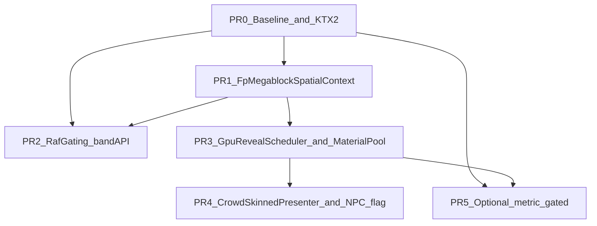

# FP performance pipeline (UE lessons → Mammoth)

## Thermo-nuclear review of this plan (applied)

This section records a strict maintainability review **of the plan itself**. Findings drove the restructure below.

### Blockers in the original plan

1. **Three spatial indexes, one concept** — apartment unit containment, drop HUD cells, and per-floor walk subsets were separate todos. That spreads the same “quantize XZ + invalidate on subscription” pattern three times. **Judo:** one [`FpMegablockSpatialContext`](apps/client/src/game/fpSession/fpMegablockSpatialContext.ts) (new) built at session mount, owned by [`fpSessionWorldMount.ts`](apps/client/src/game/fpSession/fpSessionWorldMount.ts), queried by gameplay/HUD/walk — mirror existing [`buildWalkSurfaceSpatialIndex`](packages/world/src/walkSurfaceSpatialIndex.ts) / [`buildCollisionSpatialIndex`](packages/world/src/collisionSpatialIndex.ts) naming.

2. **Three GPU-reveal mechanisms** — `visibilityCompileBudget`, `registerFpLoadingWarmup`, and “late PBR queue” are all “show at most N new GPU states per frame.” **Judo:** one **`GpuRevealScheduler`** with scopes (`loading` | `steady` | `asyncMaterial`); decor warm-up becomes the first consumer, not a one-off extract + two more registries.

3. **Mount file as integration dumping ground** — [`mountFpSession.ts`](apps/client/src/game/mountFpSession.ts) is already ~2.5k lines. Original plan added KTX2, NPC flag, warmup registry, and spatial index wiring inline. **Presumptive blocker:** any PR that grows `mountFpSession.ts` by >~50 lines without extracting a factory (`createFpMegablockSpatialContext`, `createFpSessionGpuRevealScheduler`) should not ship.

4. **“Mirror remote LOD” duplicates a solved problem** — copying [`RemotePlayerPresenter`](packages/engine/src/playerPresentation/remote/RemotePlayerPresenter.ts) into babushka creates two crowd paths. **Judo:** extract **`CrowdSkinnedPresenter`** (high/low branch, shared materials, freeze/resume mixer) in `packages/engine`; remote players and babushka both compose it.

5. **Rigid phase waterfall hid parallel work** — Phase 0→4 forced GPU material pools before CPU elevator sleep, though they are independent. **Judo:** PR order by **measured ROI** (PR0 baseline → spatial context → RAF gating → GPU scheduler → NPC flag).

6. **Vague / optional items invite spaghetti** — “1.6 throttle or index”, “optional spike warning”, “combat sim warmup optional” are flags without owners. **Cut or bind:** 1.6 folds into PR1 unit index; spike warning deferred; warmup is a `GpuRevealScheduler` scope, not a separate registry.

7. **NPC flag vs readiness doc tension** — [`fp-world-npc-readiness.md`](docs/architecture/fp-world-npc-readiness.md) gates live spawn on subscribe scoping + server AI. **Tightened gate:** Mamutica `?fpnpc=1` PR **must** include client row filter (prefix/AOI) and document server caps; flag does not imply “production NPCs on.”

8. **Decor instancing pilot in main path too early** — high interaction risk (pick rays, `placedObjectId`). **Demote to PR5** — metric-gated after PR0 baselines; behind `?fpDecorInstancing=1` if attempted.

9. **Verification only at end** — **Move acceptance criteria into every PR** using existing [`fpSessionPerfStore`](apps/client/src/game/fpSession/fpSessionPerfStore.ts) fields (`elevatorMs`, `presentMs`, `drawCalls`, `sceneGraphVisibleTriangles`).

10. **Broken path in original plan** — `packages/engine/src/engine/src/playerPresentation/...` was a typo; fixed to [`remoteCrowdLod.ts`](packages/engine/src/playerPresentation/remoteCrowdLod.ts).

### What we kept

- Profiler-first culture and existing baselines ([`fp-apartment-interior-performance.md`](docs/architecture/fp-apartment-interior-performance.md)).
- KTX2 wire-up (real doc/code gap).
- Elevator shaft sleep + door gating (localized, high ROI).
- Mamutica NPC flag (user choice) with stricter readiness coupling.
- Non-goals unchanged (no full streaming, no decor KTX2 re-export this pass).

---

## Context

UE-thread lessons for Mammoth: **keep the RAF path thin**, **don’t submit work that shouldn’t reach the GPU**, **compile/warm pipelines once**, **profile before feature flags**. Existing wins: floor visibility, walk spatial index, decor visibility budgets, instanced drops/doors, elevator atlas ([completed plan](.cursor/plans/completed/elevator_lag_and_culling_8fbf4d4a.plan.md)).

**Non-goals:** full geometry streaming/unload, server megablock NPC AI, decor KTX2 content re-export, JS multithreaded simulation.

---

## PR0 — Baseline + contract + KTX2 (small, ship first)

### Deliverables

- [`docs/architecture/fp-performance-pipeline.md`](docs/architecture/fp-performance-pipeline.md): thread model, profiler buckets, **subsystem checklist** (RAF? instancing? LOD? material key? reveal budget?), links to existing architecture docs.
- Fix drift in [`fp-apartment-interior-performance.md`](docs/architecture/fp-apartment-interior-performance.md) (`STEADY_MAX_SHOWS_PER_FRAME = 8`).
- **Capture baselines** (document numbers in perf doc): lobby idle, `unit_e_003` wall + 180° turn, elevator ride, dense drops AOI — record `elevatorMs`, `presentMs`, `renderThreeMs`, `drawCalls`, `sceneGraphVisibleTriangles` via `?fpdebug=1` ([`fpSessionPerfDebug.ts`](apps/client/src/game/fpSession/fpSessionPerfDebug.ts)).
- After `renderer.init()` in session mount path (extracted helper, not inline sprawl): `await ensurePbrKtx2Support(renderer)`.
- [`ownedApartmentWallSurfaceMaterial.ts`](packages/world/src/ownedApartmentWallSurfaceMaterial.ts) → [`loadTextureFromSpec`](packages/world/src/pbrTextureSystem.ts).

### PR0 acceptance

- KTX2 candidates not stripped when basis transcoder present.
- Baseline table committed in perf doc (even if “TBD on hardware X” with capture date).

---

## PR1 — `FpMegablockSpatialContext` (code judo for CPU scans)

**New module:** [`apps/client/src/game/fpSession/fpMegablockSpatialContext.ts`](apps/client/src/game/fpSession/fpMegablockSpatialContext.ts) (or `packages/world` if reused by editor later).

| Responsibility | Replaces |
|----------------|----------|
| `unitAtFeet(x,y,z, slack?)` | Linear `apartment_unit` scans in [`fpApartmentGameplay.ts`](apps/client/src/game/fpApartment/fpApartmentGameplay.ts) |
| `dropsNearFeet(x,z, radius)` | Full-table [`findNearestDroppedPickupsHud`](apps/client/src/game/worldRuntime/droppedItemWorldRuntime.ts) on miss |
| `walkSampleBand()` | Feeds [`walkSurfaceSpatialIndex`](packages/world/src/walkSurfaceSpatialIndex.ts) subset from floor-vis band + elevator/stair exceptions |

**Construction:** built in [`fpSessionWorldMount.ts`](apps/client/src/game/fpSession/fpSessionWorldMount.ts) / session factory; invalidated on SpacetimeDB subscription deltas for `apartment_unit` and `dropped_item`.

**Wire sites (thin):** [`mountFpSession.ts`](apps/client/src/game/mountFpSession.ts) passes context into RAF deps — **no index logic in mount body**.

**Tests:** port cases from [`fpApartmentGameplay.test.ts`](apps/client/src/game/fpApartment/fpApartmentGameplay.test.ts); walk band edge cases (elevator cab, stair landing).

**Defer:** `getApartmentSystemPrompt` multi-table walks — only touch if PR0 `presentMs` implicates it; otherwise separate small PR.

### PR1 acceptance

- Floor-vis containing-unit path does not iterate `conn.db.apartment_unit` per frame.
- Moving player HUD drop query touches O(local cells) only.

---

## PR2 — RAF gating via shared floor-vis band API

**Problem:** elevator ticks all shafts × landings; doors tick globally ([`fpApartmentDoors.ts`](apps/client/src/game/fpApartment/fpApartmentDoors.ts)).

**Judo:** export **`getActiveFloorVisBand()`** (or similar) from [`fpSessionFloorPlateVisibility.ts`](apps/client/src/game/fpSession/fpSessionFloorPlateVisibility.ts) — single source for “which storeys/plates matter this frame.” Consumers:

- [`fpElevatorWorldMount.ts`](apps/client/src/game/fpElevator/fpElevatorWorldMount.ts): shaft sleep outside band; full tick for cab-active shaft.
- [`fpApartmentDoors.ts`](apps/client/src/game/fpApartment/fpApartmentDoors.ts): animate only doors on active plates; snap off-band to rest.

**Tests:** distant shaft skips `updateFloorPickMaterials` when sig unchanged; off-band door does not lerp.

### PR2 acceptance

- `elevatorMs` down vs PR0 baseline in lobby/corridor (document % or ms in PR notes).
- No behavior change when player inside cab (manual checklist item).

---

## PR3 — `GpuRevealScheduler` + `MaterialPool`

### GpuRevealScheduler

Extract semantics from [`fpApartmentInteriorPropVisibility.ts`](apps/client/src/game/fpApartment/fpApartmentInteriorPropVisibility.ts) into [`packages/engine/src/rendering/gpuRevealScheduler.ts`](packages/engine/src/rendering/gpuRevealScheduler.ts):

- `scheduleReveal(scope, keys, { warmupMax, steadyMax, warmedSet })`
- Decor refactor = behavior unchanged ([`fpApartmentInteriorPropVisibility.test.ts`](apps/client/src/game/fpApartment/fpApartmentInteriorPropVisibility.test.ts) green).
- Async PBR first draw → `asyncMaterial` scope (1–2/frame), hooked from [`elevatorVisualMaterialUtils.ts`](packages/world/src/elevatorVisualMaterialUtils.ts) / wall loader.
- Loading splash: `loading` scope batches reveals + existing bootstrap renders in [`mountFpSession.ts`](apps/client/src/game/mountFpSession.ts) via **one** `prepareFpSessionLoadingGpuWarmup(scheduler, deps)` helper.

**Do not add** a separate `registerFpLoadingWarmup` registry unless scheduler cannot express loading vs steady (prefer one API).

### MaterialPool

Single helper in `packages/engine` or `packages/world`:

- `getOrCreateMaterial(cache, key, factory)` — used by decor mood grade, fixture glow, NPC archetype (PR4).

Pattern reference: [`DecalManager`](apps/client/src/rendering/decals/DecalManager.ts) cache keys.

### Debug

- [`fpDebugRenderIsolation.ts`](apps/client/src/game/fpDebugRenderIsolation.ts): add `npcs` flag.

### PR3 acceptance

- Unit entry still meets [`fp-apartment-interior-performance.md`](docs/architecture/fp-apartment-interior-performance.md) turn/wall criteria.
- No >50ms single-frame hitch on owned-unit entry (manual).

---

## PR4 — Crowd presentation + NPC flag (combat sim first)

### CrowdSkinnedPresenter (extract, don’t duplicate)

- New: `packages/engine/src/playerPresentation/crowd/CrowdSkinnedPresenter.ts`
- Migrate remote high/low branches from [`RemotePlayerPresenter.ts`](packages/engine/src/playerPresentation/remote/RemotePlayerPresenter.ts) with **no visual regression** (tests / snapshot manual).
- [`babushkaNpcBody.ts`](packages/engine/src/npc/archetypes/babushka/babushkaNpcBody.ts) composes same abstraction.

### NPC session + flag

- Flag helper alongside [`fpSessionPerfDebug.ts`](apps/client/src/game/fpSession/fpSessionPerfDebug.ts): `mammothFpWorldNpcs` / `?fpnpc=1`.
- [`mountFpSession.ts`](apps/client/src/game/mountFpSession.ts): `createFpNpcSession` when combat sim **or** flag; pass [`createFpNpcRenderPvsGate`](apps/client/src/game/npc/fpNpcRenderPvs.ts).
- [`fpNpcSession.ts`](apps/client/src/game/npc/fpNpcSession.ts): **client row filter** before presenters (prefix/AOI) — required for Mamutica flag PR.
- `bindNpcOutdoorReadableEnv`: only on env texture change.
- Update [`fp-world-npc-readiness.md`](docs/architecture/fp-world-npc-readiness.md) checklist: flag PR checks off client filter + perf capture, not server AI.

### PR4 acceptance

- Combat sim: LOD swap + PVS hides off-floor NPCs (test).
- Flag off: zero NPC presenters in Mamutica.
- Flag on: bounded `presentMs` / draw calls at documented test population.

---

## PR5 — Optional wins (metric-gated only)

Attempt only if PR0 baselines show:

| Item | Gate |
|------|------|
| Decor cross-placement instancing pilot | `drawCalls` or decor prop count on furnished unit; behind `?fpDecorInstancing=1` |
| Fish `InstancedMesh` per tank | Profiling shows fish as top bucket |
| Drop triangle LOD | `droppedItem` scene-graph tris dominate |

**Skip PR5** if PR1–PR4 meet acceptance — avoids interaction-ray risk and scope creep.

---

## Per-PR verification (not a separate “Phase 4”)

Every PR includes:

- Targeted unit tests (named above).
- `pnpm test` on touched packages.
- PR description: before/after perf field from `fpSessionPerfStore` vs PR0 table.
- Manual row from checklist in perf doc when behavior-visible.

**Deferred:** rolling-median spike warning in HUD (vague; add only if captures show need).

---

## Risk notes (unchanged intent, sharper ownership)

| Risk | Mitigation |
|------|------------|
| Decor instancing breaks picks | PR5 only + flag; keep non-instanced pick roots |
| NPC flag without server subscribe | Client filter required; doc server follow-up |
| Walk band excludes cab/stair | PR1 tests + elevator/stair AABB always in band |
| `mountFpSession` sprawl | Factory modules only; review line-count delta |

---

## Original 11-todo mapping (for traceability)

| Old todo | New home |
|----------|----------|
| foundation-doc-ktx2 | PR0 |
| visibility-budget-module | PR3 GpuRevealScheduler |
| cpu-unit-index | PR1 spatial context |
| cpu-elevator-doors | PR2 |
| cpu-drop-hud-walk | PR1 |
| gpu-material-pools | PR3 MaterialPool + PR4 NPC |
| gpu-decor-instancing-pilot | PR5 optional |
| loading-warmup-registry | PR3 scheduler `loading` scope |
| drops-triangle-lod | PR5 optional |
| npc-lod-flag | PR4 |
| verify-capture | Every PR + PR0 baselines |
