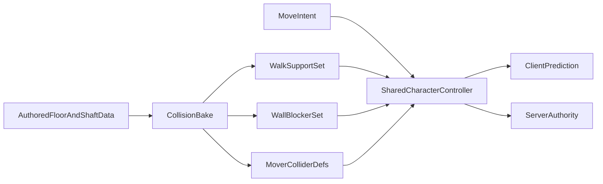

# Replace FPS Collision Core

## Why The Current System Fails

The current controller is structurally biased toward snagging and correction pops:

- `[apps/client/src/game/fpPlayerCollision.ts](c:\WebProjects\the-mammoth\apps\client\src\game\fpPlayerCollision.ts)` resolves horizontal collision by axis and falls back to hard XZ rewind when overlaps remain.
- `[packages/world/src/collisionScene.ts](c:\WebProjects\the-mammoth\packages\world\src\collisionScene.ts)` harvests visible `BoxGeometry` meshes as collision and then duplicates `solids` into `walkables`, so ground support and blocking walls come from the same box soup.
- `[apps/client/src/game/fpElevatorWorldCollision.ts](c:\WebProjects\the-mammoth\apps\client\src\game\fpElevatorWorldCollision.ts)` builds door/elevator collision out of many dynamic slabs and 4-segment swing-door AABBs, which is exactly the kind of seam-heavy geometry that causes jitter in tight FPS spaces.
- `[apps/client/src/game/mountFpSession.ts](c:\WebProjects\the-mammoth\apps\client\src\game\mountFpSession.ts)` and `[apps/server/src/movement.rs](c:\WebProjects\the-mammoth\apps\server\src\movement.rs)` mirror this logic on both client and server, so every flaw gets predicted, replayed, and corrected.

This is the opposite of what Source/Quake/Unreal-style FPS movement does well. Professional shooters typically use a dedicated character controller with sweep tests, plane-based sliding, step-up/step-down logic, explicit ground handling, and simplified gameplay collision separate from render meshes.

## Target Architecture

### 1. Replace the collision representation

Build a dedicated FPS collision bake instead of harvesting every visible box mesh.

- Keep `walk support` thin and explicit, using the analytical floor/stair path already present in `[packages/world/src/walkSurfaceAABBs.ts](c:\WebProjects\the-mammoth\packages\world\src\walkSurfaceAABBs.ts)` rather than copying all solids into walkables.
- Build a separate `wall blocker` set from authored building/floor/shaft data. Prefer merged corridor/lobby/shaft boundary volumes or extruded 2D outlines over per-mesh AABBs.
- Treat doors and elevator cabs as a small number of analytic kinematic colliders, not segmented approximation slabs.

### 2. Replace the movement solver

Implement a real FPS controller with the same overall behavior professional shooters use.

- Player shape: vertical capsule, or a cylinder-with-rounded-ends equivalent if capsule sweeps are easier to implement analytically.
- Core move loop: `sweep -> clamp to hit -> clip remaining velocity along contact plane -> iterate 2-4 times`.
- Step handling: `blocked forward move -> try step-up -> retry forward -> sweep/snap down`.
- Grounding: downward sweep/probe with slope limit and hysteresis so stairs and tiny seams do not flicker grounded state.
- Movers: apply elevator/platform delta explicitly when attached instead of letting overlap resolution fake it.

### 3. Make parity professional-grade

Do what professional networked shooters do: keep one movement contract for client prediction and server authority.at the server uses natively 

- Best target: move the controller core into a shared Rust kernel thand the client consumes through wasm bindings.

- Acceptable fallback: mirrored TS/Rust implementations with identical fixtures and replay tests, but only if the wasm route is impractical.
- Remove duplicated “keep in sync” constants where possible; today `[apps/server/src/movement.rs](c:\WebProjects\the-mammoth\apps\server\src\movement.rs)` manually mirrors client locomotion values.

## Execution Plan

### Phase 1. Instrument and lock down failures

Use the existing bad cases as regression fixtures before replacing anything.

- Add deterministic repro tests for corridor seam snagging, door-edge catch, elevator cab wall push-out, landing transition jitter, and server reconciliation pop.
- Add debug drawing for player sweep, contact normals, step-up attempts, ground probe, and mover attachment state.
- Measure where corrections originate: world seam, mover seam, or client/server divergence.

### Phase 2. Split support surfaces from blockers

Change the baked world representation first.

- Replace `[packages/world/src/collisionScene.ts](c:\WebProjects\the-mammoth\packages\world\src\collisionScene.ts)` as the gameplay collision source for FPS movement.
- Wire `[packages/world/src/walkSurfaceAABBs.ts](c:\WebProjects\the-mammoth\packages\world\src\walkSurfaceAABBs.ts)` into the actual walk-surface generation path so floors/stairs are authored as support surfaces, not thick wall volumes.
- Introduce a new blocker-bake module under `packages/world/src/` that outputs merged corridor walls, shaft walls, door jambs, and simple room boundaries.
- Regenerate server/client collision artifacts from the new bake instead of the mesh-harvest pass.

### Phase 3. Build the shared character controller

Introduce a new controller module instead of patching `[apps/client/src/game/fpPlayerCollision.ts](c:\WebProjects\the-mammoth\apps\client\src\game\fpPlayerCollision.ts)`.

- New responsibilities: shape sweep, slide-plane accumulation, step-up/down, ceiling handling, grounding, and depenetration only as a rare recovery path.
- Keep the hot path numeric and deterministic.
- Leave locomotion acceleration and input shaping in the existing locomotion layer; only replace collision resolution and support sampling semantics.

### Phase 4. Rebuild elevator and door interaction

Replace the current dynamic AABB generator in `[apps/client/src/game/fpElevatorWorldCollision.ts](c:\WebProjects\the-mammoth\apps\client\src\game\fpElevatorWorldCollision.ts)` and the matching server generated collision path.

- Elevator cab: one mover volume for the cab interior bounds plus explicit wall/door planes where needed.
- Door leaves: one analytic collider per leaf with continuous pose evaluation, not 4 stitched AABBs.
- Rider behavior: explicit attachment/platform velocity, then controller solve, then post-solve validation.

### Phase 5. Parity, rollout, and deletion

Switch systems over safely.

- Replay the same move-intent traces through client and server and assert close pose parity across corridor and elevator stress cases.
- Gate the new controller behind a runtime flag until parity and feel are stable.
- Delete the old axis-separated depenetration path once the new controller passes both local feel tests and replay parity tests.

## Most Important Files To Change

- `[packages/world/src/collisionScene.ts](c:\WebProjects\the-mammoth\packages\world\src\collisionScene.ts)`
- `[packages/world/src/walkSurfaceAABBs.ts](c:\WebProjects\the-mammoth\packages\world\src\walkSurfaceAABBs.ts)`
- `[scripts/gen-walk-aabbs.ts](c:\WebProjects\the-mammoth\scripts\gen-walk-aabbs.ts)`
- `[apps/client/src/game/fpPlayerCollision.ts](c:\WebProjects\the-mammoth\apps\client\src\game\fpPlayerCollision.ts)`
- `[apps/client/src/game/mountFpSession.ts](c:\WebProjects\the-mammoth\apps\client\src\game\mountFpSession.ts)`
- `[apps/client/src/game/fpElevatorWorldCollision.ts](c:\WebProjects\the-mammoth\apps\client\src\game\fpElevatorWorldCollision.ts)`
- `[apps/server/src/movement.rs](c:\WebProjects\the-mammoth\apps\server\src\movement.rs)`
- `apps/server/src/elevator/generated_player_collision.rs`

## Default Recommendation

Do not adopt a generic rigid-body physics stack for player movement. The professional answer for tight corridor FPS feel is a custom character controller on top of simplified world queries. In this repo, the highest-confidence version of that is: `shared controller kernel + separate walk/blocker datasets + analytic mover collision`.