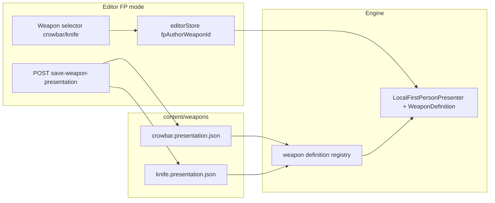

# Generic melee weapon presentation (crowbar + knife)

## Why the current shape is “crowbar-only”

- [`LocalFirstPersonPresenter`](packages/engine/src/playerPresentation/local/LocalFirstPersonPresenter.ts) imports and reads [`crowbarWeaponDefinition`](packages/engine/src/weapons/sampleDefinitions.ts) everywhere (`resolveCrowbarFpViewmodelLayout`, `equipCrowbar`, `reloadCrowbarLayoutFromDefinition`, swing keyframes).
- Editor/client sync is named and pathed to a single file: [`crowbarPresentationDiskSave.ts`](apps/editor/src/editor/crowbarPresentationDiskSave.ts), [`crowbarPresentationEditorSync.ts`](apps/editor/src/editor/crowbarPresentationEditorSync.ts), [`/__editor/save-crowbar-presentation`](apps/editor/src/vite/editorDevMiddleware.ts), fetch of `/content/weapons/crowbar.presentation.json` in [`editorSceneRuntime.ts`](apps/editor/src/editor/editorSceneRuntime.ts).
- [`RemotePlayerPresenter`](packages/engine/src/playerPresentation/remote/RemotePlayerPresenter.ts) always instantiates the crowbar GLB/definition when not unarmed (ignores `equippedPrimary` except for unarmed vs “something”).

The **on-disk JSON shape** is already generic ([`WeaponPrimitivePresentationDoc`](packages/engine/src/weapons/weaponPrimitiveAuthoring.ts)); the gap is **routing** (which weapon id + which file + which `WeaponDefinition`) and **naming**.

## 1) Rename APIs and files (behavior-preserving)

- **Validate/save**: Rename [`crowbarPresentationSaveValidate.ts`](apps/editor/src/vite/crowbarPresentationSaveValidate.ts) → `weaponPresentationSaveValidate.ts` (or keep file and re-export from new name if you prefer smaller git rename noise). Export `assertValidWeaponPresentationJson` (same Zod-ish logic as today).
- **Disk save module**: [`crowbarPresentationDiskSave.ts`](apps/editor/src/editor/crowbarPresentationDiskSave.ts) → `weaponPresentationDiskSave.ts`; `saveWeaponPresentationFromEditor(weaponId: WeaponDefinition["id"])`.
- **Editor sync**: [`crowbarPresentationEditorSync.ts`](apps/editor/src/editor/crowbarPresentationEditorSync.ts) → `weaponPresentationEditorSync.ts`; track last text **per weapon id** (small `Map<string, string>` or keyed by id), `applyWeaponPresentationFileTextToPresenter(presenter, weaponId, text)`, `registerWeaponPresentationPostSaveApply`.
- **Middleware**: Replace `/__editor/save-crowbar-presentation` with `/__editor/save-weapon-presentation` accepting `{ weaponId: "crowbar" | "knife", json: string }`, validate, then write `content/weapons/${weaponId}.presentation.json` with the existing `safeContentFile` guard. Reject ids not in an allowlist for authoring (start with `crowbar`, `knife`).
- **Engine exports**: Replace `applyCrowbarPrimitivePresentationDoc` with `applyWeaponPrimitivePresentationDoc(weaponId, doc)` in [`sampleDefinitions.ts`](packages/engine/src/weapons/sampleDefinitions.ts) (implementation: lookup definition in a small registry map and assign `primitivePresentation`). Update [`packages/engine/src/index.ts`](packages/engine/src/index.ts) / [`weapons/index.ts`](packages/engine/src/weapons/index.ts) exports accordingly.

Update all imports (editor, client dev overlay, tests).

## 2) JSON field: `crowbarVisualScale` → `weaponVisualScale` (compat)

- In [`FpViewmodelAuthoringDoc`](packages/engine/src/weapons/weaponPrimitiveAuthoring.ts): rename property to `weaponVisualScale` in the TypeScript type.
- In `parseOptionalFpViewmodel`: accept **`weaponVisualScale` OR legacy `crowbarVisualScale`** (prefer explicit `weaponVisualScale` if both present).
- In [`fpAuthoringExport.ts`](apps/editor/src/editor/fpAuthoringExport.ts) and [`fpViewmodelAuthoringOverlay.ts`](apps/client/src/game/fpViewmodelAuthoringOverlay.ts): emit `weaponVisualScale`.
- Rewrite committed [`content/weapons/crowbar.presentation.json`](content/weapons/crowbar.presentation.json) key once (and new knife file uses `weaponVisualScale`).

## 3) Bind FP presenter to a `WeaponDefinition` (composable core)

- Extend [`LocalFirstPersonPresenterOptions`](packages/engine/src/playerPresentation/local/LocalFirstPersonPresenter.ts) with **`weaponDefinition: WeaponDefinition`** (required for clarity; callers pass the active definition).
- Replace internal `crowbarWeaponDefinition` reads with **`this.weaponDefinition`** (store field set in ctor, updated by a new `setWeaponDefinition(def, opts?: { reloadLayout: boolean })` used when editor switches weapon).
- Rename methods for honesty: `equipCrowbar` → `equipWeaponFromDefinition`, `reloadCrowbarLayoutFromDefinition` → `reloadMeleeLayoutFromDefinition` (or `reloadWeaponPresentationLayout`).
- **Authoring pick labels**: derive from `weaponDefinition.displayName` (“Knife mount …”) instead of hardcoded “Crowbar …”.
- **Normalize constant**: keep using [`FP_CROWBAR_GLTF_MAX_EDGE_M`](packages/engine/src/playerPresentation/viewModelNormalize.ts) for both until meshes diverge; optional follow-up is adding `fpViewmodelMaxEdgeM` on `WeaponDefinition` (not required for this milestone).

## 4) `PlayerPresentationManager` + gameplay preload

- [`PlayerPresentationManager.create`](packages/engine/src/playerPresentation/PlayerPresentationManager.ts): preload **hand + every `WeaponDefinition` you need in-session** (at minimum `crowbar` + `knife` model refs). Construct `LocalFirstPersonPresenter` with initial definition from a helper `getWeaponDefinitionOrThrow(initialEquipped)` (default `crowbar` to match current behavior).
- On each `update`, if `localState.equippedPrimary` changes between supported weapon ids, call `local.setWeaponDefinition(...)` and ensure weapon subtree is rebuilt (same path as editor switch, but driven by gameplay state). If unsupported id, fall back to crowbar or unarmed policy (document choice; simplest: map unknown → crowbar until server sends richer data).
- Rename `reloadLocalCrowbarPresentationLayout` → `reloadLocalWeaponPresentationLayout(weaponId)` or reload **current** definition only.

## 5) Remote third-person: respect `equippedPrimary`

- Update [`RemotePlayerPresenter.syncWeapon`](packages/engine/src/playerPresentation/remote/RemotePlayerPresenter.ts): when equipped changes, **dispose and recreate** `WeaponPresenter` from `getWeaponDefinition(equipped)` (skip `unarmed`). Today it early-returns after first weapon; that must go.

## 6) Knife as second selectable item (your chosen proof)

- Add [`content/weapons/knife.presentation.json`](content/weapons/knife.presentation.json): start as a **copy** of `crowbar.presentation.json` (valid doc), then you can diverge mount/texture in editor.
- In [`sampleDefinitions.ts`](packages/engine/src/weapons/sampleDefinitions.ts):
  - Import `knife.presentation.json` like crowbar.
  - Set `knifeWeaponDefinition.primitivePresentation` from parsed doc.
  - Temporarily point `knifeWeaponDefinition.modelRef.uri` to **`/static/models/weapons/crowbar.glb`** (only file present under [`apps/client/public/static/models/weapons`](apps/client/public/static/models/weapons)); keep `key: "weapons/knife"` so the registry stays distinct if you later split assets.

## 7) Editor: weapon selector drives load/save/session

- [`editorStore.ts`](apps/editor/src/state/editorStore.ts): add `fpAuthorWeaponId: "crowbar" | "knife"` (+ setter). Default `crowbar`.
- [`EditorChromeFpViewmodel.tsx`](apps/editor/src/ui/EditorChromeFpViewmodel.tsx): small **Weapon** `<select>` bound to store; changing it:
  - Updates store, bumps live counter as needed.
  - [`editorSceneRuntime.ts`](apps/editor/src/editor/editorSceneRuntime.ts) / [`FpViewmodelEditorSession`](apps/editor/src/editor/fpViewmodelEditorSession.ts): either **recreate** the FP session when id changes (simplest, matches preload list), or add `FpViewmodelEditorSession.recreateForWeapon(id)` that disposes presenter, preloads new `modelRef`, constructs presenter with new definition.
- Initial fetch + post-save hooks: use `/content/weapons/${id}.presentation.json` and `applyWeaponPrimitivePresentationDoc` + presenter reload for **that id** only.
- Copy strings in the FP panel from “crowbar…” to neutral “weapon / mount / presentation JSON”.

## 8) Client dev hot-reload

- Generalize [`crowbarPresentationDevHotReload.ts`](apps/client/src/game/crowbarPresentationDevHotReload.ts) to poll or HMR both presentation files for **crowbar + knife**, applying to the correct definition and calling `reloadLocalWeaponPresentationLayout` / equivalent. If only one weapon is currently equipped, still safe to update definitions in memory.

## 9) Tests

- Move/rename [`crowbarPresentationSaveValidate.test.ts`](apps/editor/src/vite/crowbarPresentationSaveValidate.test.ts) to match new module name; keep test against `crowbar.presentation.json`; add a second test that **`knife.presentation.json`** parses/validates.
- Adjust [`fpAuthoringExport.test.ts`](apps/editor/src/editor/fpAuthoringExport.test.ts) if it references old field names.

## Non-goals (this pass)

- New GLB for knife (explicitly deferred; URI points at crowbar mesh).
- Renaming on-disk `crowbar.presentation.json` filename (not needed; id already matches).
- Broad audio rename (`LocalGameAudio` crowbar swing buffers) — optional later pass when melee sounds are data-driven by weapon id.
