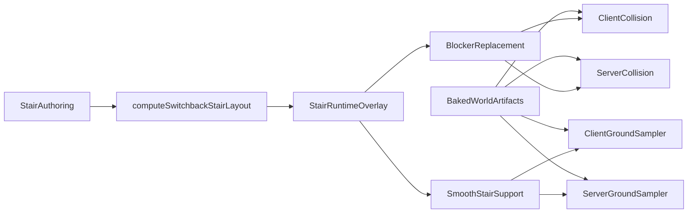

# Live Stair Overlay And Smooth Support

## Goal
Stop treating **stairwell interior geometry** as fully baked world collision while keeping the rest of the building on the current artifact pipeline. For phase 1, shared stairwell authoring in [packages/world/src/stairElevatorPlaceholders.ts](packages/world/src/stairElevatorPlaceholders.ts) and `content/elevator/stairwell.json` should update stair collision/support live; floor/building placement changes can stay on the existing bake flow.

## Existing Leverage
- The current blocker-only overlay pattern already exists in [packages/world/src/floorPlaceholderMeshes.ts](packages/world/src/floorPlaceholderMeshes.ts) via `buildStairOpeningCollisionOverlayForBuilding()` and in [apps/server/src/stair_opening_collision.rs](apps/server/src/stair_opening_collision.rs).
- The stairwell layout math already exists in [packages/world/src/stairWellGeometry.ts](packages/world/src/stairWellGeometry.ts) via `computeSwitchbackStairLayout()`.
- The current grounded sampler bottleneck is centralized in [packages/world/src/walkSurfaceSpatialIndex.ts](packages/world/src/walkSurfaceSpatialIndex.ts), [packages/engine/src/fpLocomotion.ts](packages/engine/src/fpLocomotion.ts), and [apps/server/src/movement.rs](apps/server/src/movement.rs).

## Architecture

## Plan
### 1. Introduce a shared live stair runtime overlay
Add a new world-level module, likely beside [packages/world/src/floorPlaceholderMeshes.ts](packages/world/src/floorPlaceholderMeshes.ts), that derives stair-specific runtime data from:
- [packages/world/src/stairWellGeometry.ts](packages/world/src/stairWellGeometry.ts)
- [packages/world/src/buildingStairShafts.ts](packages/world/src/buildingStairShafts.ts)
- [packages/world/src/stairElevatorPlaceholders.ts](packages/world/src/stairElevatorPlaceholders.ts)

It should emit two things:
- `replacementBlockers` plus `suppressMasks` for stairwell-interior blockers
- `runtimeStairSupportSurfaces` for landings and flights

Important constraint: use the **layout math** as the source of truth for support, not scraped rendered meshes.

### 2. Carve stairwell interior data out of baked artifacts
Update the bake path so [scripts/gen-walk-aabbs.ts](scripts/gen-walk-aabbs.ts) and the world builders stop being authoritative for stairwell interior treads/landings/walls.

Bounded phase-1 behavior:
- Keep baked world collision for rooms, slabs, corridors, elevator shafts, and building footprint.
- Remove or mask stairwell-interior walk/blocker artifacts so they are replaced by the runtime stair overlay instead of competing with it.
- Keep shaft placement and scale from floor/building docs baked for now.

### 3. Add smooth stair support surfaces
Replace tread-top-only support for stairs with explicit support primitives evaluated identically on client and server.

Recommended support model:
- `flat` landing surfaces
- `slope` flight surfaces parameterized by local run direction, across-run width, and start/end height

Implement the evaluator next to [packages/world/src/walkSurfaceSpatialIndex.ts](packages/world/src/walkSurfaceSpatialIndex.ts) or in a sibling index module, then mirror the same math on the server next to [apps/server/src/movement.rs](apps/server/src/movement.rs).

Do not use a fake tilted AABB. The evaluator must return height-at-`(x,z)` so stair travel is smoother while preserving the current `probeTopY`, `footRadiusXZ`, and `stepUpMargin` semantics.

### 4. Wire the hybrid baked-plus-live model into gameplay
Client side:
- In [apps/client/src/game/fpSessionWorldMount.ts](apps/client/src/game/fpSessionWorldMount.ts), build the new stair runtime overlay together with the existing stair opening overlay.
- Apply stair blocker replacement before building `staticCollisionIndex`.
- Merge baked `sampleWalkTopBase` with the new runtime stair support sampler used by [packages/engine/src/fpLocomotion.ts](packages/engine/src/fpLocomotion.ts).

Server side:
- Split or extend [apps/server/src/stair_opening_collision.rs](apps/server/src/stair_opening_collision.rs) into a broader stair runtime collision/support module.
- Make [apps/server/src/character_controller.rs](apps/server/src/character_controller.rs) use stair suppress/replacement blockers.
- Make [apps/server/src/movement.rs](apps/server/src/movement.rs) merge baked walk surfaces with runtime stair support before grounded snap.

### 5. Fix editor iteration semantics
Update [scripts/worldCollisionArtifacts.ts](scripts/worldCollisionArtifacts.ts) and any editor collision-status wiring so shared stairwell geometry edits no longer demand `pnpm content:gen-walk-aabbs` when the change is handled by the live stair overlay.

Phase-1 default:
- `stairwell.json` geometry/support-affecting edits become live.
- Floor placement/scale edits still require regeneration.

### 6. Lock parity and regressions with focused tests
Add or update tests in:
- [packages/world/src/fpCharacterController.test.ts](packages/world/src/fpCharacterController.test.ts)
- [packages/world/src/fpCharacterController.parity.test.ts](packages/world/src/fpCharacterController.parity.test.ts)
- [apps/client/src/game/fpPlayerCollision.test.ts](apps/client/src/game/fpPlayerCollision.test.ts)
- stair/world tests near [packages/world/src/stairWellPreview.test.ts](packages/world/src/stairWellPreview.test.ts) and [packages/world/src/floorPlaceholderMeshes.test.ts](packages/world/src/floorPlaceholderMeshes.test.ts)

Cover at least:
- descend onto a landing without head clipping
- smooth support across a stair flight
- client/server parity for the same stair support query
- shared stairwell authoring tweak updates runtime stair blocker/support without artifact regeneration

## Most Important Files
- [packages/world/src/stairWellGeometry.ts](packages/world/src/stairWellGeometry.ts)
- [packages/world/src/floorPlaceholderMeshes.ts](packages/world/src/floorPlaceholderMeshes.ts)
- [packages/world/src/walkSurfaceSpatialIndex.ts](packages/world/src/walkSurfaceSpatialIndex.ts)
- [apps/client/src/game/fpSessionWorldMount.ts](apps/client/src/game/fpSessionWorldMount.ts)
- [packages/engine/src/fpLocomotion.ts](packages/engine/src/fpLocomotion.ts)
- [apps/server/src/stair_opening_collision.rs](apps/server/src/stair_opening_collision.rs)
- [apps/server/src/character_controller.rs](apps/server/src/character_controller.rs)
- [apps/server/src/movement.rs](apps/server/src/movement.rs)
- [scripts/gen-walk-aabbs.ts](scripts/gen-walk-aabbs.ts)
- [scripts/worldCollisionArtifacts.ts](scripts/worldCollisionArtifacts.ts)

## Risks To Handle
- Do not let baked stair blockers and live stair blockers coexist; that will recreate the current clipping/snapping conflicts.
- Do not make client-only stair smoothing; support evaluation must remain mirrored with server authority.
- Keep the live scope intentionally narrow to stairwell interior geometry so this stays shippable.