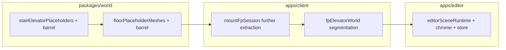

# Refactor plan: codebase size + engineering rigor (<1000 LOC hand-authored)

## North star

| Priority | Requirement |
|---------|--------------|
| **Size** | Every **hand-authored** TypeScript/React file stays **under 1000 lines** (budget line; aim smaller when a natural seam exists). |
| **Quality** | All changes satisfy [`.cursor/rules/engineering-rigor.mdc`](.cursor/rules/engineering-rigor.mdc): clear boundaries, DRY without ceremony, dependency injection where it simplifies tests and reuse, intentional mutation only on hot paths, safe retries, observable failures. |
| **Behavior** | No intentional gameplay, network, or visual regressions—especially preserve **allocation-free** patterns in FP tick paths (`_walkOpts`, `_replayStepOpts`, `_mainStepOpts`, pools). |
| **API stability** | `packages/world/src/index.ts` and existing import sites keep working via thin **barrel** files (`stairElevatorPlaceholders.ts`, `floorPlaceholderMeshes.ts`, etc.) until migrations are deliberate. |

**Generated / emitted code:** [`packages/world/src/generatedCollisionArtifacts.ts`](packages/world/src/generatedCollisionArtifacts.ts) (~19k lines, produced by [`scripts/gen-walk-aabbs.ts`](scripts/gen-walk-aabbs.ts)) is **out of scope** for a “split this file” refactor; only the generator/script needs human readability. Same policy for similar future generated blobs unless we switch to chunked output or lazy loading by design.

---

## Current snapshot (sizes are approximate LOC; re-scan before executing)

Rough ordering by **pain × size** among files **>1000 LOC** today:

| File | ~LOC | Notes |
|------|------|--------|
| [`apps/client/src/game/mountFpSession.ts`](apps/client/src/game/mountFpSession.ts) | ~3067 | Main FP session orchestrator—still mega; **partial extraction already exists** (`createFpSessionStaticWorld`, etc., from [`fpSessionWorldMount.ts`](apps/client/src/game/fpSessionWorldMount.ts) ~459 LOC). Continued extraction toward constants / dev APIs / reconcile / physics step remains the plan. |
| [`packages/world/src/floorPlaceholderMeshes.ts`](packages/world/src/floorPlaceholderMeshes.ts) | ~2391 | Corridor/punch/sign/hollow-shell/build-floor/stair-overlay—still matches prior split axes. |
| [`packages/world/src/stairElevatorPlaceholders.ts`](packages/world/src/stairElevatorPlaceholders.ts) | ~2180 | Shaft shell + preview/editor + door resolve + assembly—same structural plan as original doc. |
| [`apps/editor/src/editor/editorSceneRuntime.ts`](apps/editor/src/editor/editorSceneRuntime.ts) | ~1977 | Editor lifecycle + scene—not in original three-file plan but blocks the `<1000` goal for `apps/editor`. |
| [`apps/client/src/game/fpElevatorWorld.ts`](apps/client/src/game/fpElevatorWorld.ts) | ~1917 | Elevator client world—not in original plan; deserves its own phased split. |
| [`apps/editor/src/ui/EditorChrome.tsx`](apps/editor/src/ui/EditorChrome.tsx) | ~1069 | UI chrome shell — split composition vs panels/hooks per existing component patterns in `apps/editor`. |
| [`apps/editor/src/state/editorStore.ts`](apps/editor/src/state/editorStore.ts) | ~1050 | Global editor state — extract slices/feature modules when touching for size. |

**Near the limit (~900–1000 LOC):** e.g. [`elevatorCabPreview.ts`](packages/world/src/elevatorCabPreview.ts) (~952)—watch when editing.

---

## Workstreams (reuse prior technical plans where unchanged)

### 1. [`stairElevatorPlaceholders.ts`](packages/world/src/stairElevatorPlaceholders.ts)

The **original module decomposition table** remains valid:constants / editor IDs / materials → `shaftShell` → elevator placeholder → ground-door resolution → preview root → `addStairWellPlaceholder` orchestration—with [`stairElevatorPlaceholders.ts`](packages/world/src/stairElevatorPlaceholders.ts) as barrel.

**Dependency order:** constants → materials → `shaftShell` → elevator + placeholder → preview.

**Verification:** [`stairElevatorPlaceholders.test.ts`](packages/world/src/stairElevatorPlaceholders.test.ts), [`stairWellPreview.test.ts`](packages/world/src/stairWellPreview.test.ts), [`stairDoorThresholdCollision.test.ts`](packages/world/src/stairDoorThresholdCollision.test.ts) after each slice.

---

### 2. [`floorPlaceholderMeshes.ts`](packages/world/src/floorPlaceholderMeshes.ts)

Same as before:

| Target module | Responsibility |
|---------------|----------------|
| Prefab/kind helpers | `PlaceholderKind`, `classifyPrefab`, `matsFor` |
| Corridor / shaft punches + signs | Stair/elev punches, merges, corridor signage |
| `hollowRoomShell.ts` | `addHollowRoomShell` (+ tightly coupled helpers) |
| `buildFloorMeshes` orchestration | Iteration over floor doc, punches, wiring |
| `stairOpeningCollisionOverlay` | Stair opening collision overlay + collectors |

Prefer completing **§1 barrel** stable before wholesale floor-placeholder edits to avoid symbol churn.

---

### 3. [`mountFpSession.ts`](apps/client/src/game/mountFpSession.ts)

**Already delegated:** static world/content paths live alongside [`fpSessionWorldMount`](apps/client/src/game/fpSessionWorldMount.ts), [`fpSessionEnvironment`](apps/client/src/game/fpSessionEnvironment.ts), remote pose feed, pose seq, content load, etc.

**Still to extract (same strategy as before):**

1. **`fpSessionConstants.ts`** — top-level timing, AOI, damping, storage keys.
2. **`fpSessionDevTools.ts`** (or small focused files) — `__mmDoorDebug`, `__mmElevDebug`, `__mmWallProbe` as narrow `createXxxApi(deps)` factories; avoid closing over entire session.
3. **`fpSessionPrediction.ts`** — pending intents, `reconcileLocalPredictionToServer`, compact queue.
4. **`fpSessionPhysicsStep.ts`** — `simulatePredictedPlayerStep` with explicit options; optional door-debug callback.

**Leave in mount:** WebGPU/renderer init, subscription wiring, RAF loop, teardown.

**Risk:** No new per-frame allocations in extracted paths; pools stay single-owner or `FpSessionRuntime`-style object.

---

### 4. [`fpElevatorWorld.ts`](apps/client/src/game/fpElevatorWorld.ts) (new workstream)

Not covered by the 2024 three-file note. Before cutting:

- Map **public** exports vs **internal** helpers used only from `mountFpSession` or tests.
- Split along **mount/teardown** vs **per-tick sync** vs **collision/debug** if dependency graph allows.
- Keep [`fpElevatorWorldCollision.ts`](apps/client/src/game/fpElevatorWorldCollision.ts) / tests as the boundary for physics-adjacent code.

---

### 5. Editor mega-files (new workstream)

- **`editorSceneRuntime.ts`:** separate scene graph operations, asset binding, and frame/tick hooks into composable modules; keep a thin facade.
- **`EditorChrome.tsx` / `editorStore.ts`:** align with existing `EditorChrome*` components under `apps/editor/src/ui/`—route new UI through shared patterns; avoid duplicating state that already has a home in `editorStoreTypes` or feature hooks.

---

## Suggested execution order

1. **World:** Split stair/elevator first (unblocks floor work and keeps barrels predictable).  
2. **World:** Split floor placeholders; run world + any editor consumption checks.  
3. **Client:** Continue `mountFpSession` extraction.  
4. **Client:** Segment `fpElevatorWorld`.  
5. **Editor:** Tackle `editorSceneRuntime` / `EditorChrome` / `editorStore` as a focused pass (can partially parallelize with (4) if teams differ).

---

## Verification

- **Tests:** `pnpm` test (or repo standard) for `packages/world` after each world chunk; client/editor tests for touched packages.
- **Smoke:** FP session boots, walk, elevators, apartment doors, hotbar; dev probes (`__mmDoorDebug`, `__mmWallProbe`) if used.
- **LOC policy:** Optionally add CI or ESLint helper to **fail or warn** when a tracked hand-authored file exceeds **1000 lines**, with an **allowlist** for `generatedCollisionArtifacts.ts` (and similar generated paths).

