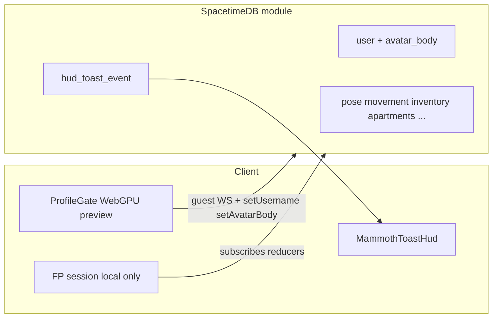

# Fully single-player Mammoth (SpacetimeDB backend)

## Goals

- **Gameplay**: One human per DB session — no other-player meshes, interpolation, collision proxies, or chat UI.
- **Backend**: Same Rust module + schedules; trim **PvP-oriented replication surface** only where it is clearly “other humans” (client-first; optional small server simplifications).
- **Product framing**: Solo **Balkan apartment complex simulator** — update gate/HUD copy accordingly.
- **Auth**: **Guest by default**; **OpenAuth/OIDC code stays** but UI is hidden unless [`apps/client`](apps/client) reads `VITE_ENABLE_ACCOUNT_AUTH === "true"` (document in [`apps/client/.env.example`](apps/client/.env.example)).
- **New profile gate**: Single screen — **display name**, **avatar body** (male/female), **WebGPU preview** using `/static/models/players/male.glb` and `/static/models/players/female.glb` (fallback to male if female asset missing). **Drag horizontally on the canvas** to yaw the character (orbit-style).

## Architecture after change

## 1. Server (Rust module)

**[`apps/server/src/accounts.rs`](apps/server/src/accounts.rs)**

- Add `avatar_body: u8` to `User` (`0` = male, `1` = female). Rely on SpacetimeDB’s additive schema behavior when publishing (document that devs republish / reset local DB if needed).

**New reducer** (same module pattern as [`set_username`](apps/server/src/lib.rs)):

- e.g. `set_avatar_body(body: u8)` — reject unless `body` is `0` or `1`, update row for `ctx.sender()`.

**[`apps/server/src/lib.rs`](apps/server/src/lib.rs) `on_connect`**

- After ensuring `User`, set default `avatar_body` if you need explicit initialization (often unnecessary if default `0` in insert paths).

**Remove multiplayer chat**

- Delete [`apps/server/src/chat.rs`](apps/server/src/chat.rs), remove `mod chat`, delete `send_chat` reducer surface.
- Migrate the **only** callers (`chat::post_system_message` in [`apps/server/src/apartments.rs`](apps/server/src/apartments.rs)) to **HUD toasts** so players still see claim progress strings.

**HUD toast “notice” kind (no new columns)**

- In [`apps/server/src/crafting.rs`](apps/server/src/crafting.rs), add e.g. `HUD_TOAST_KIND_NOTICE: u8 = 2`.
- Add helper `emit_hud_notice(ctx, recipient, message: String)` implemented as `emit_hud_toast(..., NOTICE, message, 0)` — reuse `def_id` as UTF-8 notice text (already a `String`; no schema migration).
- [`apps/client/src/ui/MammothToastHud.tsx`](apps/client/src/ui/MammothToastHud.tsx): handle kind `2` by displaying `defId` as plain text (skip item catalog formatting).

**Optional cleanup (nice-to-have, not required for correctness)**

- [`apps/server/src/hitscan.rs`](apps/server/src/hitscan.rs) / [`combat_stub`](apps/server/src/combat_stub.rs): skip “damage other identities” aggregation when only one player exists — low priority since a solo DB has no other pose rows.

## 2. Client bindings and subscriptions

- Run `pnpm client:generate` after Rust changes so [`apps/client/src/module_bindings`](apps/client/src/module_bindings) drops `chat_message` / `sendChat` and picks up `User.avatar_body` + new reducer.

**[`apps/client/src/spacetime/chunkedInitialSpacetimeSubscriptions.ts`](apps/client/src/spacetime/chunkedInitialSpacetimeSubscriptions.ts)**

- Remove `chat_message` query from baseline batches.
- Drop the **second full-table `user` snapshot** if it exists only for remote display-name resolution ([comment references multiplayer lookups](apps/client/src/spacetime/chunkedInitialSpacetimeSubscriptions.ts)); replace with **self-scoped `user` only** if nothing else needs global `user` iteration on the client (verify grep for `conn.db.user` iterations expecting peers).

## 3. Remove remote-player client pipeline

**Strip replication → presenter path**

- [`apps/client/src/game/fpSession/fpSessionMainRafFrame.ts`](apps/client/src/game/fpSession/fpSessionMainRafFrame.ts): delete `_remoteSnapshots` population loop over `conn.db.player_pose` for non-self identities; remove imports tied only to remote snapshots.
- [`apps/client/src/game/mountFpSession.ts`](apps/client/src/game/mountFpSession.ts): remove `feedRemotePoseSample` / remote interpolation bookkeeping for others; stop passing remote snapshots into [`PlayerPresentationManager`](packages/engine/src/playerPresentation/PlayerPresentationManager.ts).
- [`packages/engine/src/playerPresentation/PlayerPresentationManager.ts`](packages/engine/src/playerPresentation/PlayerPresentationManager.ts): remove `remoteSnapshots` parameter and `remotes` map lifecycle (or no-op `syncRemotes` if you prefer a thinner API without deleting presenter class yet — prefer **deleting dead branches** to satisfy “remove multiplayer aspects”).
- Related deletes/simplifications: [`fpRemote/remotePlayerCollisionAabbs.ts`](apps/client/src/game/fpRemote/remotePlayerCollisionAabbs.ts) visitor wiring from [`fpSessionLocalPrediction.ts`](apps/client/src/game/fpSession/fpSessionLocalPrediction.ts) / [`fpSessionLocomotionPredictionWiring.ts`](apps/client/src/game/fpSession/fpSessionLocomotionPredictionWiring.ts), [`remotePlayerVisibility.ts`](apps/client/src/game/fpRemote/remotePlayerVisibility.ts) usage, [`fpSessionUserDisplayNameCache.ts`](apps/client/src/game/fpSession/fpSessionUserDisplayNameCache.ts) if only used for remote labels, [`preloadRemotePlayerBody`](packages/engine/src/playerPresentation/remote/RemotePlayerPresenter.ts) from preload paths, debug HUD toggle for remote collision in [`MammothDebugMenuHud.tsx`](apps/client/src/ui/MammothDebugMenuHud.tsx) / [`fpSessionCollisionDebug.ts`](apps/client/src/game/fpSession/fpSessionCollisionDebug.ts).
- Remove obsolete [`fpRemote/mockRemoteSnapshots.ts`](apps/client/src/game/fpRemote/mockRemoteSnapshots.ts) if nothing imports it.

**Packages**

- [`packages/net`](packages/net) `replicatedPlayerSnapshotFromPlainPose` — delete if no callers remain, or keep exported only if tests/engine still need it for future NPCs (default: **remove from client mount**, trim exports if unused).

## 4. UI: chat off, copy, HUD

- Remove [`MammothChatHud.tsx`](apps/client/src/ui/MammothChatHud.tsx) usage from [`HudShell.tsx`](apps/client/src/ui/HudShell.tsx); delete file if unused.
- Update [`HudShell.tsx`](apps/client/src/ui/HudShell.tsx) keyboard hint line — remove **Enter chat**.
- Rewrite [`LoginGate.tsx`](apps/client/src/ui/LoginGate.tsx) subtitle/microcopy for **solo simulator**; when `VITE_ENABLE_ACCOUNT_AUTH` is true, keep existing sign-in / guest buttons; when false, **omit account CTAs**.

## 5. Guest-default connection + feature-flagged OIDC

**[`apps/client/src/spacetime/useSpacetimeConnection.ts`](apps/client/src/spacetime/useSpacetimeConnection.ts)**

- Add `readEnableAccountAuth()` (parse env boolean consistently with other flags).
- When auth is disabled and there is **no** OIDC JWT and **no** persisted guest token: auto-run the same state transitions as `startGuestPlay()` once on mount (equivalent to today’s “Sneak in as a guest” but immediate).
- When auth is **enabled**, preserve current `needs_auth` gate.
- Extend session API for profile submission: e.g. `submitProfile({ name, avatarBody })` calling `setUsername` then `setAvatarBody` (or a single server reducer if you prefer one round-trip — two reducers is fine).

**Phase logic**

- Keep using “username unset” as gate (`needs_name`), but UI becomes the **profile** screen (name + avatar). Optionally rename phase to `needs_profile` internally for clarity — purely cosmetic.

## 6. Profile gate + WebGPU character preview

- New component(s) under [`apps/client/src/ui/`](apps/client/src/ui/) e.g. `ProfileGate.tsx` + `profileCharacterPreviewMount.ts` (mirror pattern of [`mountMammothAuthBackdrop.ts`](apps/client/src/ui/mountMammothAuthBackdrop.ts)): **WebGPURenderer**, orbit yaw from pointer drag delta, load GLTF via existing loader patterns from engine/backdrop code.
- **Female asset**: try fetch `/static/models/players/female.glb`; on failure, fall back to male and optionally show subtle UI “Female outfit loading…” only if you want — simplest is silent fallback until asset lands.
- Wire selected body to preview mesh swap before submit.
- On submit: validate name length client-side (same rules as today), call `submitProfile`, wait for `user` row update via existing subscriptions.

## 7. Use `avatar_body` in-game (minimal first slice)

- Thread identity’s `avatar_body` into wherever **third-person / mirror** body mesh is chosen (likely [`PlayerPresentationManager`](packages/engine/src/playerPresentation/PlayerPresentationManager.ts) / local presenter paths). If first-person only uses arms weapons today, **preview + persisted row** still matters for mirrors/reflections later — implement **one** clear consumption site now (even if mirror still uses male until female FP assets exist).

## 8. Verification

- `pnpm check-types`, targeted tests touching renamed/deleted modules (`remotePlayerVisibility.test.ts`, `fpSessionUserDisplayNameCache.test.ts`, etc. — update or remove).
- Manual smoke: local `spacetime start`, publish module, load client with auth disabled → lands on profile gate → enter game → **no** remote proxies; apartment claim shows **toast**, not chat.

## Out of scope (per your note)

- Electron/Steam packaging, per-save DB naming — unchanged this milestone.
