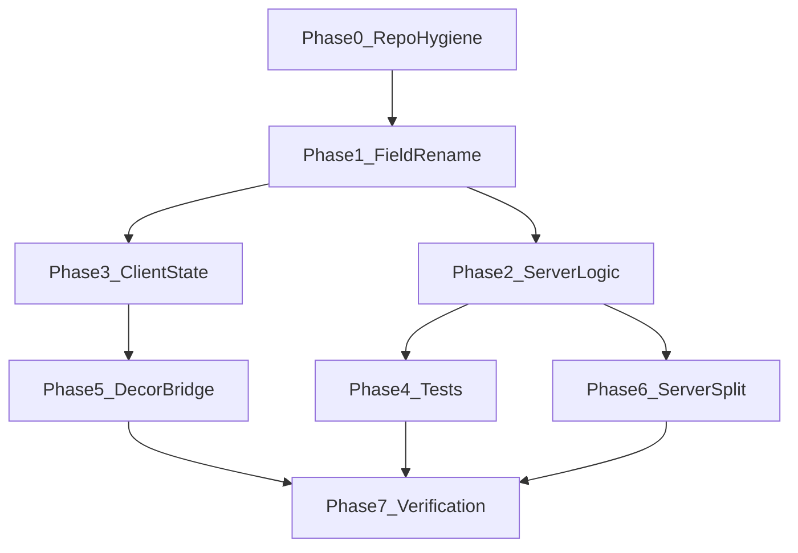

# Thermo-Nuclear Review Remediation Plan

**Baseline:** `main` @ `de97fbc6` (balcony grow sleep-feed refactor landed; repo has ~20,823 tracked files under `apps/server/target/`).

**Goal:** Preserve current gameplay behavior while eliminating structural debt flagged in the review. Work is split into 7 phases; phases 0–4 are required before calling the balcony grow work "done"; phases 5–6 are structural follow-through.



---

## Phase 0 — Repo hygiene (presumptive blocker)

**Problem:** [`apps/server/target/`](apps/server/target/) is tracked (~20,823 files). [`.gitignore`](.gitignore) has no Rust `target/` entry. Commit `de97fbc6` added more build artifacts.

**Actions:**

1. Add to [`.gitignore`](.gitignore):
   ```
   # Rust / SpacetimeDB module build output
   apps/server/target/
   ```
   (Use repo-relative path; do not ignore unrelated `target/` dirs elsewhere unless confirmed.)

2. Remove cached artifacts without deleting local build cache:
   ```powershell
   git rm -r --cached apps/server/target
   ```

3. Single focused commit: `"Stop tracking Rust target build artifacts"`.

4. Optional hardening: add a CI/pre-commit check that fails if `git ls-files apps/server/target | Select-Object -First 1` is non-empty.

**Acceptance:** `git ls-files apps/server/target` returns 0 paths; local `cargo`/`spacetime build` still works; clone size stops growing on every build.

---

## Phase 1 — Rename `fertilized_at_plant` → `substrate_fed_overnight`

**Problem:** Field semantics changed (sleep-feed, all slots) but persisted name still says "at plant". Misleading across DB, harvest logic, bindings, UI, and tests.

### 1A — SpacetimeDB schema (Rust)

**File:** [`apps/server/src/balcony_grow_op.rs`](apps/server/src/balcony_grow_op.rs)

- Rename struct field on `BalconyGrowPlant`:
  ```rust
  /// Substrate fed to the tray before sleep — speeds maturity and improves harvest rolls.
  pub substrate_fed_overnight: u8,
  ```
- Update all references (currently ~12 sites): filters in `apply_tray_substrate_on_sleep`, plant/harvest reducers, tests.

**Migration strategy:**

1. Run `pnpm server:build` after rename and inspect SpacetimeDB automatic migration output ([Automatic Migrations](https://spacetimedb.com/databases/automatic-migrations)).
2. **If auto-migrate succeeds** (same type `u8`, column rename): ship as-is.
3. **If auto-migrate fails or renames are unsupported:** two-column pattern:
   - Add `substrate_fed_overnight` with `#[default(0u8)]`
   - Backfill in [`ensure_balcony_grow_for_unit`](apps/server/src/balcony_grow_op.rs) (same pattern as [`maybe_backfill_plant_day_fields`](apps/server/src/balcony_grow_op.rs) / [`water_container::backfill_water_bottle_fill_rows`](apps/server/src/water_container.rs))
   - Remove old column only after backfill confirmed

### 1B — Harvest care context rename

**Same file + harvest helpers:**

- Rename `HarvestCareContext.fertilized_at_plant` → `substrate_fed_overnight: bool`
- Rename `harvest_care_context(..., fertilized_at_plant: bool)` param accordingly
- Update `harvest_bonus_count` condition and test fixture at line ~1265

### 1C — Regenerate TypeScript bindings

```bash
pnpm client:generate
```

**Files auto-updated:**

- [`apps/client/src/module_bindings/balcony_grow_plant_table.ts`](apps/client/src/module_bindings/balcony_grow_plant_table.ts)
- [`apps/client/src/module_bindings/types.ts`](apps/client/src/module_bindings/types.ts)

### 1D — Client source updates (manual, post-generate)

| File | Change |
|------|--------|
| [`apps/client/src/ui/BalconyGrowInspectHud.tsx`](apps/client/src/ui/BalconyGrowInspectHud.tsx) | `plant.substrateFedOvernight` instead of `fertilizedAtPlant`; remove inline inventory scan (Phase 3) |
| [`apps/client/src/game/fpBalconyGrow/fpBalconyGrowPrompt.test.ts`](apps/client/src/game/fpBalconyGrow/fpBalconyGrowPrompt.test.ts) | Fixture field rename |
| [`apps/client/src/game/fpBalconyGrow/fpBalconyGrowTrayAim.test.ts`](apps/client/src/game/fpBalconyGrow/fpBalconyGrowTrayAim.test.ts) | Fixture field rename |
| [`apps/client/src/game/fpBalconyGrow/fpBalconyGrowInspectSync.test.ts`](apps/client/src/game/fpBalconyGrow/fpBalconyGrowInspectSync.test.ts) | Fixture field rename |

**Acceptance:** Zero grep hits for `fertilized_at_plant` / `fertilizedAtPlant` outside migration comments or git history.

---

## Phase 2 — Server logic simplification

### 2A — Remove dead `fertilizer_at_plant` parameter from `compute_target_days`

**File:** [`apps/server/src/balcony_grow_op.rs`](apps/server/src/balcony_grow_op.rs)

- Change signature from `compute_target_days(ctx, unit_key, tray_id, spec, fertilizer_at_plant: bool)` to `compute_target_days(ctx, unit_key, tray_id, spec)`
- Always call `grow_speed_modifier(..., false, water)` inside — substrate is never applied at plant time anymore
- Update sole call site in `plant_balcony_grow_slot_impl` (currently passes `false`)

### 2B — Single-pass `apply_tray_substrate_on_sleep`

**Current problem:** Triple scan of `balcony_grow_plant` — collect tray IDs, then per-tray filter+collect again.

**Refactor:**

```rust
// Pseudocode — one iter, group by tray_id
let mut by_tray: HashMap<String, Vec<BalconyGrowPlant>> = ...;
for plant in plant_table.iter().filter(growing && !substrate_fed) {
    by_tray.entry(plant.tray_id.clone()).or_default().push(plant);
}
for (tray_id, plants) in by_tray {
    if !fertilizer_present(...) || !try_consume_tray_substrate(...) { continue; }
    let without_fert = ...; let with_fert = ...;
    for mut plant in plants { /* adjust target_days, set flag, maybe mature */ update }
}
```

**Preserve invariants documented in code comment:**

- Substrate runs **before** grow-day credit in [`advance_world_day_for_unit`](apps/server/src/balcony_grow_op.rs) (order: substrate → day credit → patch delete → tray water evap at 0.65×)
- Water level for modifier is **pre-evaporation** tray water (current behavior)

### 2C — Extract testable pure helper for sleep-feed batch (supports Phase 4)

Extract from loop body:

```rust
pub(crate) fn apply_substrate_to_plants(
    plants: &mut [BalconyGrowPlant],
    without_fert: f32,
    with_fert: f32,
) { ... }
```

Keeps DB I/O in `apply_tray_substrate_on_sleep`; logic testable without `ReducerContext`.

**Acceptance:** `cargo test --manifest-path apps/server/Cargo.toml` green; no behavioral change to existing unit tests.

---

## Phase 3 — Client state and substrate presence indexing

**Problem:** Three separate O(inventory) scans:

1. [`stashHasFertilizer`](apps/client/src/game/fpBalconyGrow/fpBalconyGrowSession.ts) — per tray, every frame
2. [`BalconyGrowInspectHud`](apps/client/src/ui/BalconyGrowInspectHud.tsx) lines 94–99 — inline scan
3. Server canonical logic in [`fertilizer_present`](apps/server/src/balcony_grow_op.rs) — not reused on client

### 3A — Extend `BalconyGrowOpUnitState`

**File:** [`apps/client/src/inventory/balconyGrowOpState.ts`](apps/client/src/inventory/balconyGrowOpState.ts)

```typescript
export type BalconyGrowOpUnitState = {
  trays: BalconyGrowTray[];
  plants: BalconyGrowPlant[];
  light: BalconyGrowLight | null;
  patches: BalconyWaterPatch[];
  /** trayId → true when stash slot 0 holds balcony-grow-substrate */
  traysWithSubstrate: ReadonlySet<string>;
};
```

Add helper `collectGrowTraySubstrateTrayIds(conn, unitKey): Set<string>`:

- One pass over `conn.db.inventory_item`
- Filter `location.tag === "Stash"`
- Parse with [`parseBalconyGrowTrayStashKey`](packages/schemas/src/balconyGrowOp.ts) from `@the-mammoth/schemas`
- Match `defId === BALCONY_GROW_FERTILIZER_DEF_ID` and slot index `BALCONY_GROW_FERTILIZER_STASH_SLOT` (mirror server [`find_item_in_stash_slot`](apps/server/src/balcony_grow_op.rs) at slot 0)

### 3B — Wire consumers

| Consumer | Change |
|----------|--------|
| [`fpBalconyGrowSession.ts`](apps/client/src/game/fpBalconyGrow/fpBalconyGrowSession.ts) | Delete `stashHasFertilizer`; pass `(trayId) => growState.traysWithSubstrate.has(trayId)` to `syncBalconyGrowSlotVisuals` |
| [`BalconyGrowInspectHud.tsx`](apps/client/src/ui/BalconyGrowInspectHud.tsx) | `state.traysWithSubstrate.has(target.trayId)` |
| [`useBalconyGrowOpState.ts`](apps/client/src/inventory/useBalconyGrowOpState.ts) | Update empty-state default to include `traysWithSubstrate: new Set()` |

### 3C — Subscription for HUD reactivity

**File:** [`balconyGrowOpState.ts`](apps/client/src/inventory/balconyGrowOpState.ts)

Extend `subscribeBalconyGrowOpTables` to also subscribe `inventory_item` onInsert/onUpdate/onDelete so substrate stash changes re-render HUD without waiting for grow-table bumps.

**Acceptance:** One inventory pass per `readBalconyGrowOpUnitState` call; no per-tray loops; HUD updates when substrate dropped into tray stash.

---

## Phase 4 — Single raycast per frame (client perf)

**Problem:** Duplicate raycasts in hot path:

```124:132:apps/client/src/game/fpBalconyGrow/fpBalconyGrowSession.ts
const hits = [...decor.raycastBalconyGrowTrayHits(feet, camera)];
cachedGrowTrayPrompt = decor.getBalconyGrowTrayPrompt(...); // raycasts again internally
```

[`resolveBalconyGrowTrayPrompt`](apps/client/src/game/fpBalconyGrow/fpBalconyGrowPrompt.ts) **already accepts `hits`** — the waste is the decor wrapper re-raycasting.

### 4A — Change decor API

**File:** [`fpApartmentDecorMeshes.ts`](apps/client/src/game/fpApartment/fpApartmentDecorMeshes.ts)

Update `MountFpApartmentDecorMeshesResult`:

```typescript
getBalconyGrowTrayPrompt: (
  playerPos: THREE.Vector3,
  camera: THREE.PerspectiveCamera,
  conn: DbConnection,
  identity: Identity,
  growState: BalconyGrowOpUnitState,
  hits: readonly THREE.Intersection[],  // NEW — required precomputed hits
) => BalconyGrowTrayPrompt | null;
```

Implementation: remove internal `raycastBalconyGrowTrayHits` call; pass `hits` straight to `resolveBalconyGrowTrayPrompt`.

### 4B — Update all call sites

| File | Change |
|------|--------|
| [`fpBalconyGrowSession.ts`](apps/client/src/game/fpBalconyGrow/fpBalconyGrowSession.ts) `updateFrame` | Raycast once; pass `hits` to prompt + placement + inspect |
| [`fpBalconyGrowSession.ts`](apps/client/src/game/fpBalconyGrow/fpBalconyGrowSession.ts) `tryPrimaryPointerDown` | Reuse `cachedPlacement` hits or raycast once and share |
| [`fpBalconyGrowSession.ts`](apps/client/src/game/fpBalconyGrow/fpBalconyGrowSession.ts) `balconyGrowPromptFromDecorRaycast` | Raycast once, pass hits |
| [`fpApartmentDecorMeshes.ts`](apps/client/src/game/fpApartment/fpApartmentDecorMeshes.ts) line ~1375 | Any internal prompt resolution — pass hits if available |

### 4C — Optional: cache hits on session

Add `getCachedGrowTrayHits(): readonly THREE.Intersection[]` on `FpBalconyGrowSession` so `mountFpSession` pointer handlers don't re-raycast when frame cache is fresh.

**Acceptance:** One `raycastBalconyGrowTrayHits` + one `collectOwnedBalconyGrowPickMeshes` per frame in steady-state gameplay.

---

## Phase 5 — Extract grow decor bridge + fix stash pick tangling

**Problem:** [`fpApartmentDecorMeshes.ts`](apps/client/src/game/fpApartment/fpApartmentDecorMeshes.ts) is **1,517 lines** (past 1k threshold). Balcony grow adds 6+ API methods, 4 mesh arrays, and grow/stash pick merging with Set dedup hack.

### 5A — New module: `fpBalconyGrowDecorBridge.ts`

**Location:** [`apps/client/src/game/fpBalconyGrow/fpBalconyGrowDecorBridge.ts`](apps/client/src/game/fpBalconyGrow/fpBalconyGrowDecorBridge.ts) (new)

**Owns:**

- `growTrayPickMeshes`, `growTrayCenterPickMeshes`, `growSlotPickMeshes`, `growPlantPickMeshes`
- `growSlotVisualsByTrayId: Map<string, THREE.Group>`
- `visibleGrowPickMeshes` scratch
- `raycastHits(playerPos, camera, conn, identity, stashRayOcclusion, raycaster, screenNdc)`
- `resolvePrompt(hits, ...)` → delegates to `resolveBalconyGrowTrayPrompt`
- `syncSlotVisuals(plants, trays, traysWithSubstrate)`
- `syncVisibility(feet, unitKey)` → delegates to `syncBalconyGrowTrayDecorVisibility`
- `collectPickMeshesForPlayer(...)`
- `mountOnGrowTrayDecorGroup(...)` → wraps [`mountGrowTrayDecorOnGroup`](apps/client/src/game/fpBalconyGrow/fpBalconyGrowTrayDecor.ts)

**Factory:**

```typescript
export function createFpBalconyGrowDecorBridge(opts: {
  conn: DbConnection;
  stashRayOcclusion: FpApartmentStashRayOcclusion;
  pickGeometry: THREE.BufferGeometry;
  pickMaterial: THREE.Material;
  raycaster: THREE.Raycaster;
  screenCenterNdc: THREE.Vector2;
}): FpBalconyGrowDecorBridge;
```

### 5B — Slim down decor mount

**File:** [`fpApartmentDecorMeshes.ts`](apps/client/src/game/fpApartment/fpApartmentDecorMeshes.ts)

- Replace grow-specific arrays/methods with `growBridge: FpBalconyGrowDecorBridge`
- Public API becomes thin delegates (or re-export bridge subset on `MountFpApartmentDecorMeshesResult`)
- **Remove grow picks from `stashPickMeshes`** (lines 1139–1143):

  ```typescript
  // DELETE: stashPickMeshes.push(...mount.growTrayPickMeshes, ...);
  ```

- **Simplify `collectVisibleStashPickMeshes`:** remove `growPickSet` dedup hack (lines 607–617); grow picks collected only via bridge

### 5C — Stash interaction parity

Verify grow-tray stash still reachable via:

- Center pick → prompt → KeyE ([`handleBalconyGrowKeyE`](apps/client/src/game/fpBalconyGrow/fpBalconyGrowSession.ts))
- General stash raycast if grow picks were previously in `stashPickMeshes` for cross-feature hits — audit [`getStashPrompt`](apps/client/src/game/fpApartment/fpApartmentDecorMeshes.ts) / wardrobe flows after decoupling

**Target line count:** `fpApartmentDecorMeshes.ts` drops by ~120–180 lines; bridge file ~200–250 lines.

**Acceptance:** No grow meshes in `stashPickMeshes`; no Set dedup; grow feature fully testable via bridge unit tests (optional: raycast mock test).

---

## Phase 6 — Split `balcony_grow_op.rs` (~1,293 lines)

**Problem:** Monolith contains tables, tray resolution, substrate, planting, harvest, water patches, tick step, sleep hook, proximity, and tests.

### Proposed module layout

```
apps/server/src/balcony_grow/
  mod.rs              # pub use re-exports, reducer wrappers, schedule init
  tables.rs           # BalconyGrow* structs, row key helpers, constants
  tray.rs             # placement resolve, proximity, fertilizer_present, try_consume
  harvest.rs          # HarvestCareContext, bonus rolls, harvest impl helpers
  day_advance.rs      # apply_tray_substrate_on_sleep, advance_world_day_for_unit,
                      # target_days_after_fertilizer, apply_grow_day_credit
  tick.rs             # balcony_grow_tick_step, water evap, wilt
  water_patch.rs      # dump_water_from_bottle, apply_patch_water_to_trays
  reducers.rs         # #[spacetimedb::reducer] plant/harvest public entrypoints
  tests.rs            # #[cfg(test)] mod tests (or inline per submodule)
```

**Migration steps:**

1. Create `balcony_grow/mod.rs`; move code in slices (tables first, then pure helpers, then reducers)
2. Change [`lib.rs`](apps/server/src/lib.rs) `mod balcony_grow_op` → `mod balcony_grow` (or `mod balcony_grow; pub use balcony_grow::*` for stable `crate::balcony_grow_op` alias during transition)
3. Update imports in [`world_day.rs`](apps/server/src/world_day.rs), [`apartments.rs`](apps/server/src/apartments.rs), [`lib.rs`](apps/server/src/lib.rs)
4. Keep `pub(crate)` surface identical to avoid ripple beyond server crate

**Acceptance:** No single file over 600 lines in `balcony_grow/`; `cargo test` + `pnpm server:build` green.

---

## Phase 7 — Test coverage (server + client)

### 7A — Rust unit tests (extend existing `mod tests` in harvest/day modules)

| Test | Asserts |
|------|---------|
| `target_days_shrink_when_substrate_applied_overnight` | Already exists — keep |
| `apply_substrate_to_plants_all_slots` | 4 plants same tray → all get flag + shrunk target_days |
| `apply_substrate_to_plants_partial_tray` | 2 of 4 slots growing → one consume, 2 updated |
| `apply_substrate_skips_when_no_substrate` | `fertilizer_present` false → no plant mutation |
| `apply_substrate_skips_already_fed` | `substrate_fed_overnight == 1` → skipped |
| `compute_target_days_ignores_substrate` | After Phase 2 param removal, verify modifier uses `false` |
| `single_tray_single_consume` | Pure planner: two trays with substrate → two consumes worth of logic (mock consume counter) |

Prefer pure-function tests over full `ReducerContext` integration unless SpacetimeDB test harness exists in repo (currently **none** — all tests are `#[test]` unit tests in-module).

### 7B — Client tests

| File | Add/update |
|------|------------|
| [`packages/schemas/src/balconyGrowOp.test.ts`](packages/schemas/src/balconyGrowOp.test.ts) | No change expected |
| New [`balconyGrowOpState.test.ts`](apps/client/src/inventory/balconyGrowOpState.test.ts) | `collectGrowTraySubstrateTrayIds` parses stash keys, respects slot 0 + def id |
| Existing fpBalconyGrow `*.test.ts` | Update fixtures for renamed field |

### 7C — Verification commands (final gate)

```powershell
pnpm server:build
cargo test --manifest-path apps/server/Cargo.toml
pnpm client:generate   # if schema touched
pnpm test
pnpm check-types
git ls-files apps/server/target   # must be empty
```

---

## Phase 8 — Long-term decomposition (deferrable, tracked debt)

Not required for balcony grow correctness, but flagged in review — schedule after Phases 0–7:

| File | Lines | Recommendation |
|------|-------|----------------|
| [`fpApartmentDecorMeshes.ts`](apps/client/src/game/fpApartment/fpApartmentDecorMeshes.ts) | ~1,517 | After grow bridge: extract sittable mount, notebook mount, stash pick mount, practical lights into focused modules (same pattern as Phase 5) |
| [`fpApartmentGameplay.ts`](apps/client/src/game/fpApartment/fpApartmentGameplay.ts) | ~923 | Split interaction routing vs apartment session lifecycle before next feature |
| [`apartments.rs`](apps/server/src/apartments.rs) | ~2,279 | Extract grow-tray stash routing (~lines 1784–1786) into `balcony_grow/stash.rs`; broader apartments split is separate initiative |

---

## What the review credited (preserve, do not regress)

- Sleep-feed model: one substrate per tray per sleep, all growing slots benefit
- [`fpBalconyGrow/`](apps/client/src/game/fpBalconyGrow/) client module decomposition (20 files)
- [`fpBalconyGrowTrayDecor.ts`](apps/client/src/game/fpBalconyGrow/fpBalconyGrowTrayDecor.ts) — clean visual mount/sync (329 lines)
- [`target_days_after_fertilizer`](apps/server/src/balcony_grow_op.rs) pure helper + test
- Shared constants in [`packages/schemas/src/balconyGrowOp.ts`](packages/schemas/src/balconyGrowOp.ts)

---

## Suggested PR slicing (review-friendly)

1. **PR1:** Phase 0 only (gitignore + untrack target) — merge immediately
2. **PR2:** Phases 1–2 + 4 (schema rename, server simplify, raycast dedup, bindings)
3. **PR3:** Phases 3 + 5 (substrate index, decor bridge, stash decoupling)
4. **PR4:** Phases 6–7 (server split + expanded tests)

Each PR should pass Phase 7C verification gate independently where possible.

---

## Approval checklist (from thermo-nuclear bar)

- [ ] No tracked `apps/server/target/` artifacts
- [ ] No `fertilized_at_plant` / `fertilizedAtPlant` in source
- [ ] No dead `compute_target_days` fertilizer parameter
- [ ] Single grow raycast per frame
- [ ] Substrate presence indexed once per state read
- [ ] Grow picks decoupled from stash pick array
- [ ] `balcony_grow_op.rs` split OR explicitly scheduled with issue
- [ ] Sleep-feed behavior covered by tests beyond math-only
- [ ] `pnpm test` + `cargo test` + `pnpm server:build` green
