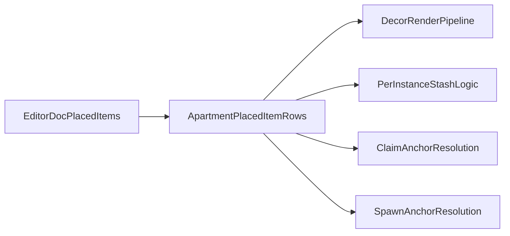

# Unify Apartment Built-ins And Decor

## Goal
Use a single placed-item system for apartment objects. A wardrobe, footlocker, stove, bed, or future fridge should be just another apartment item instance with:
- a unique instance id
- shared placement/serialization rules
- optional gameplay capabilities like `stash`, `claimAnchor`, or `spawnAnchor`

That removes the current split where built-ins live in `ApartmentUnit` / `OwnedApartmentBuiltinsDoc` singleton fields while decor lives in instance arrays and `ApartmentUnitDecor` rows.

## Current Split To Remove
- Server singleton built-ins live on [`apps/server/src/apartments.rs`](apps/server/src/apartments.rs) inside `ApartmentUnit` (`bed_x`, `wardrobe_x`, `foot_x`, `stove_x`, etc.) and are updated by `set_owned_apartment_piece_pose(...)`.
- Server instance decor already lives in [`apps/server/src/apartments.rs`](apps/server/src/apartments.rs) as `ApartmentUnitDecor` with `decor_id` and full transform data.
- Client stash keys are still derived from `unitKey#kind` in [`apps/client/src/game/fpApartment/fpApartmentStashKey.ts`](apps/client/src/game/fpApartment/fpApartmentStashKey.ts), which prevents multiple wardrobes/footlockers/stoves from having separate inventories.
- Editor authoring keeps built-ins separate from decor in [`packages/schemas/src/ownedApartmentBuiltins.ts`](packages/schemas/src/ownedApartmentBuiltins.ts), [`apps/editor/src/ui/EditorChromeMyApartment.tsx`](apps/editor/src/ui/EditorChromeMyApartment.tsx), and [`apps/editor/src/editor/myApartment/editorMyApartmentMeshes.ts`](apps/editor/src/editor/myApartment/editorMyApartmentMeshes.ts).

## Proposed Design
Create one shared apartment placed-item model used by editor JSON, server rows, and client runtime. Each item instance should contain:
- identity: stable item id / instance id
- asset reference: model path or decor definition id
- transform: position / rotation / scale or fraction-based editor authoring data
- behavior metadata: item type or capability set, e.g. `plain`, `wardrobe`, `footlocker`, `stove`, `bed`, `fridge`

Recommended capability model:
- `stash`: item owns a unique stash/inventory namespace
- `claimAnchor`: item may be used for apartment claim interactions
- `spawnAnchor`: item may be used for spawn/join placement

This keeps the placement pipeline generic while allowing behavior-specific systems to query instances by capability.

## File-Level Plan
### 1. Shared schema and editor doc
Update [`packages/schemas/src/ownedApartmentBuiltins.ts`](packages/schemas/src/ownedApartmentBuiltins.ts) so the apartment authoring doc no longer treats bed / wardrobe / footlocker / stove as separate singleton fields.

Instead:
- replace the builtin singleton fields with an item array that can include both ordinary decor and special items
- preserve current transform constraints and model validation
- add a legacy migration path so old JSON with `bedFx`, `wardrobeFx`, `footFx`, `stoveFx`, etc. is converted into placed items on load

This should make the editor disk format a single source of truth instead of `builtins + decorItems + wallItems`.

### 2. Editor UX and transforms
Refactor the apartment editor to treat these items as ordinary instances:
- [`apps/editor/src/ui/EditorChromeMyApartment.tsx`](apps/editor/src/ui/EditorChromeMyApartment.tsx)
- [`apps/editor/src/editor/myApartment/editorMyApartmentMeshes.ts`](apps/editor/src/editor/myApartment/editorMyApartmentMeshes.ts)
- [`apps/editor/src/editor/scene/editorSceneCommitAttachedTransform.ts`](apps/editor/src/editor/scene/editorSceneCommitAttachedTransform.ts)
- [`apps/editor/src/editor/myApartment/editorMyApartmentSelection.ts`](apps/editor/src/editor/myApartment/editorMyApartmentSelection.ts)
- [`apps/editor/src/state/editorStoreTypes.ts`](apps/editor/src/state/editorStoreTypes.ts)

Key changes:
- remove the builtin-only piece selector / selection ids
- expose special items through the same import/add/clone flow as decor
- load built-in models from predefined catalog entries instead of hardcoded singleton groups
- keep existing transform limits where they are semantically needed, but attach them by item type/capability rather than by special-case piece code

### 3. Server data model and reducers
Refactor [`apps/server/src/apartments.rs`](apps/server/src/apartments.rs) so gameplay runs on placed-item instances.

Planned direction:
- extend or replace `ApartmentUnitDecor` with a richer placed-item row that includes item type/capabilities
- stop using `ApartmentUnit` as the source of truth for bed/wardrobe/footlocker/stove transforms
- replace `set_owned_apartment_piece_pose(...)` with the same add/update/delete instance reducers used for decor
- keep a temporary compatibility read-path so existing units / old content still work during migration

For inventory ownership:
- replace `unitKey#kind` stash keys with per-instance stash identity, preferably based on the unique placed item id
- update [`apps/server/src/inventory_models.rs`](apps/server/src/inventory_models.rs) and the stash helpers in [`apps/server/src/apartments.rs`](apps/server/src/apartments.rs) to key storage by item instance, not by one stash kind per apartment

This gives every placed wardrobe/footlocker/stove/fridge its own inventory namespace automatically.

### 4. Client runtime and interaction resolution
Update client runtime systems to read behavior-bearing items from the unified instance pipeline:
- [`apps/client/src/game/fpApartment/fpApartmentFurniture.ts`](apps/client/src/game/fpApartment/fpApartmentFurniture.ts)
- [`apps/client/src/game/fpApartment/fpApartmentGameplay.ts`](apps/client/src/game/fpApartment/fpApartmentGameplay.ts)
- [`apps/client/src/game/fpApartment/fpApartmentDecorMeshes.ts`](apps/client/src/game/fpApartment/fpApartmentDecorMeshes.ts)
- [`apps/client/src/game/fpApartment/fpOwnedApartmentBuiltinsFromContent.ts`](apps/client/src/game/fpApartment/fpOwnedApartmentBuiltinsFromContent.ts)
- [`apps/client/src/game/fpApartment/fpApartmentStashKey.ts`](apps/client/src/game/fpApartment/fpApartmentStashKey.ts)

Behavior resolution rules:
- `stash`: every qualifying placed item gets its own prompt key and inventory
- `claimAnchor`: any qualifying wardrobe-like item can satisfy claim interaction, rather than a hidden singleton wardrobe slot
- `spawnAnchor`: until there is a direct “choose bed” interaction, resolve deterministically from placed bed instances for the owned apartment, e.g. stable lowest id

That last rule keeps the system generic and extensible without forcing a second singleton path back into the architecture.

### 5. Compatibility and migration
Use a staged migration so there is only one long-term system, but old data keeps loading:
- legacy editor JSON fields migrate into placed items at parse time
- legacy runtime builtin positions remain readable during rollout, but new writes should go through instance reducers only
- legacy stash keys should remain readable where feasible long enough to preserve existing footlocker inventories, then converge on per-instance keys
- regenerate Spacetime bindings after schema changes and update any affected client types/reducers

## Verification
Add focused tests around the new seams instead of broad snapshots:
- schema migration from legacy builtin JSON to placed-item arrays
- editor add/clone/update flows for special items
- stash keying proves two wardrobes in one apartment get different inventory namespaces
- claim resolution works from any wardrobe-like placed item
- spawn resolution is deterministic when multiple bed instances exist

Likely test files to update or mirror:
- [`apps/client/src/game/fpApartment/fpOwnedApartmentBuiltinsFromContent.test.ts`](apps/client/src/game/fpApartment/fpOwnedApartmentBuiltinsFromContent.test.ts)
- [`apps/client/src/game/fpApartment/fpApartmentFurniture.test.ts`](apps/client/src/game/fpApartment/fpApartmentFurniture.test.ts)
- server apartment/inventory tests in [`apps/server/src/apartments.rs`](apps/server/src/apartments.rs) and related inventory modules

## Important Implementation Constraint
Keep the end state as a single write-path and single runtime model. Temporary compatibility shims are fine during migration, but the final architecture should not leave behind:
- one codepath for “built-ins”
- another codepath for “decor”

Everything should resolve from placed item instances plus capability metadata.