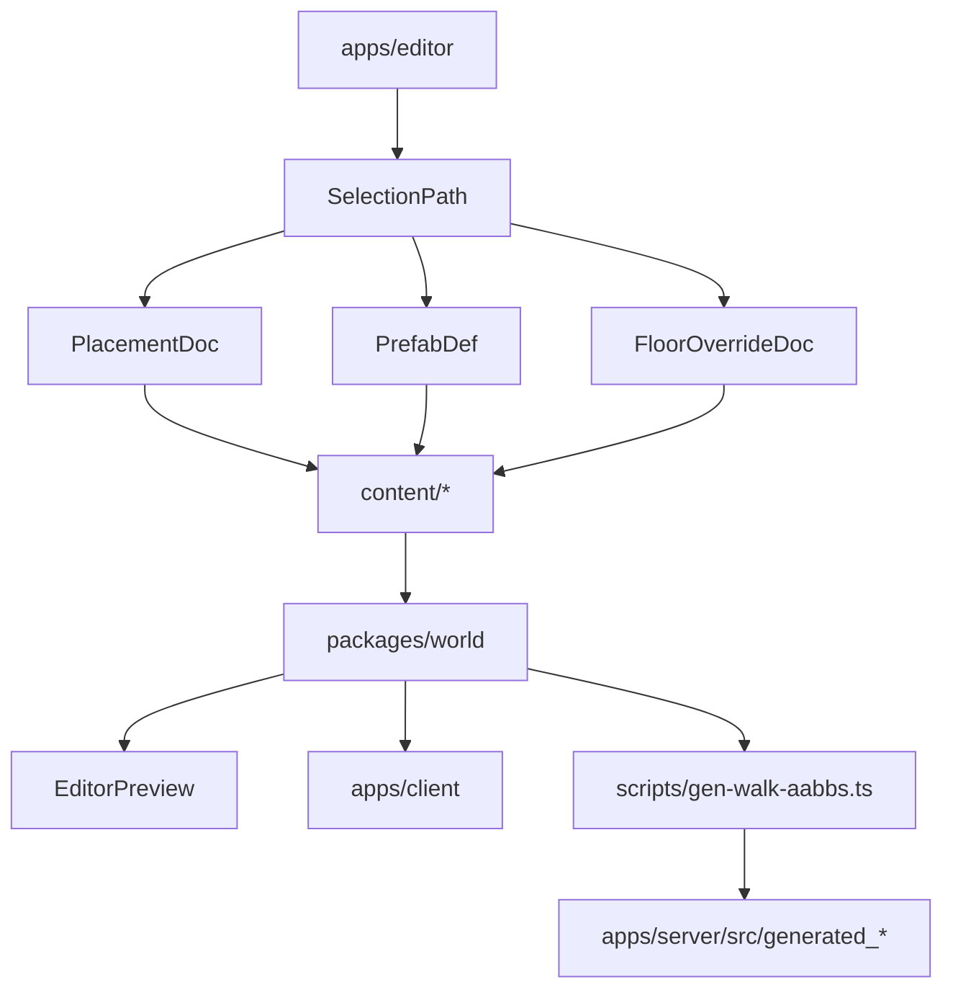

# World Editor Authoring Plan

## Outcome
Make [`apps/editor`](apps/editor) the canonical authoring surface for world layout so you can:
- click any authored object and inspect it at the right level of ownership
- move/rotate/scale it visually with gizmos
- choose whether a change is instance-local, shared across repeated floors, or shared as a prefab definition
- save directly to disk under `content/`
- alt-tab into the playable client and see the update immediately
- keep server walk/collision output synchronized after structural edits

## Existing Foundation To Leverage
The current editor already has the right skeleton; the plan should extend it rather than replace it.
- [`apps/editor/src/editor/editorBootstrap.ts`](apps/editor/src/editor/editorBootstrap.ts) already loads [`content/building/mammoth.json`](content/building/mammoth.json), floor docs, and interior docs from `/content/...`.
- [`apps/editor/src/editor/editorSceneRuntime.ts`](apps/editor/src/editor/editorSceneRuntime.ts) already has ray picking, `TransformControls`, structural rebuilds, and store-to-scene sync.
- [`apps/editor/src/ui/EditorChrome.tsx`](apps/editor/src/ui/EditorChrome.tsx), [`apps/editor/src/ui/EditorChromeInspector.tsx`](apps/editor/src/ui/EditorChromeInspector.tsx), and [`apps/editor/src/ui/EditorChromeOutliner.tsx`](apps/editor/src/ui/EditorChromeOutliner.tsx) already provide the first version of outliner/inspector/save workflows.
- [`apps/editor/src/vite/editorDevMiddleware.ts`](apps/editor/src/vite/editorDevMiddleware.ts) already serves `content/**` and writes floor/interior/building docs back to disk.
- [`apps/client/src/game/fpSessionWorldMount.ts`](apps/client/src/game/fpSessionWorldMount.ts) and [`apps/client/src/game/fpSessionContentLoad.ts`](apps/client/src/game/fpSessionContentLoad.ts) already consume the authored world docs in the playable client.
- The new collision path is already partially in place: [`apps/client/src/game/fpPlayerCollision.ts`](apps/client/src/game/fpPlayerCollision.ts) resolves against a shared static `CollisionSpatialIndex` plus dynamic elevator AABBs; [`apps/client/src/game/fpElevatorWorld.ts`](apps/client/src/game/fpElevatorWorld.ts) supplies live elevator collision AABBs; [`apps/server/src/movement.rs`](apps/server/src/movement.rs) mirrors that split with generated static solids plus procedural elevator collision from [`apps/server/src/elevator.rs`](apps/server/src/elevator.rs).
- Repeated storeys already exist through repeated `floorDocId` references in [`content/building/mammoth.json`](content/building/mammoth.json), so “edit once, update many floors” is already a natural fit for shared authoring.

## Target Authoring Model
Split authoring into explicit save units so the inspector can always tell you what you are editing.
- `BuildingDoc`: building frame, repeated storey refs, cores, unit/template mappings.
- `FloorDoc`: shared floor-plate layout reused by many storeys.
- `InteriorDoc`: shared streamable interior layout.
- `CellDoc`: exterior/chunk layout, decals, and portals.
- `PrefabDef` (new): reusable authored assembly for things like elevator cabs, elevator landing door sets, signage clusters, collision/helper volumes, and material defaults.
- `FloorOverrideDoc` (new): sparse per-storey patch data for “floor 7 only” edits without forking the entire shared `FloorDoc`.

That yields the authoring behaviors you asked for:
- Edit the elevator landing door prefab once and every placement updates.
- Edit `floor_mamutica_typical` once and every repeated typical floor updates.
- Add signs, unique trigger volumes, or texture/material overrides on just one storey through a per-storey override layer.

## Architecture

## Workstream 1: Schema And Save Units
Extend [`packages/schemas`](packages/schemas/src) so the editor can distinguish shared definitions from placed instances cleanly.
- Add `PrefabDef` and `PrefabComponentDef` schemas under [`packages/schemas/src`](packages/schemas/src). Keep them small and composable: child transforms, optional asset/prefab refs, optional material/collision metadata, optional named sockets.
- Add `FloorOverrideDoc` under [`packages/schemas/src`](packages/schemas/src) keyed by `buildingId + levelIndex`, containing sparse add/update/delete patches and storey-local metadata.
- Normalize instance-level override fields across [`packages/schemas/src/floor.ts`](packages/schemas/src/floor.ts) and [`packages/schemas/src/placements.ts`](packages/schemas/src/placements.ts) so floors/interiors/cells share the same mental model where possible.
- Add parse/serialize/assert helpers in [`packages/world/src/index.ts`](packages/world/src/index.ts) and any shared tool package already used for schema validation.
- Keep backward compatibility for existing `prefabId` usage so the editor/runtime can migrate incrementally rather than breaking all current content at once.
- Define the migration story explicitly:
  - existing `prefabId`-only floor/interior/cell content must continue loading unchanged
  - new `PrefabDef` content should be adoptable incrementally per asset family
  - `FloorOverrideDoc` must layer on top without requiring existing repeated-floor content to be rewritten
- Define content discovery as part of the schema/save-unit work, not as an afterthought. The editor needs one deterministic way to discover authorable docs, whether that is directory convention, manifest files, or generated indices under `content/`.

## Workstream 2: World Resolution Layer
Move world assembly logic into a shared resolution pipeline in [`packages/world`](packages/world/src) so the editor and client render the same authored truth.
- Introduce a prefab resolver that expands `PrefabDef` into instantiated scene nodes for editor preview and runtime world mounting.
- Upgrade floor/interior/cell builders so they can apply, in order: shared prefab definition, placement transform, placement overrides, then optional storey override patches.
- Keep the current placeholder-driven flow working initially by bridging existing `prefabId` classification in [`packages/world/src/floorPlaceholderMeshes.ts`](packages/world/src/floorPlaceholderMeshes.ts) to the new resolver rather than rewriting everything at once.
- Add stable object identity metadata to instantiated objects: owning doc id, storey level, entity/object id, prefab id, component path, and override provenance. This metadata is the key that will let the editor inspect “any component, floor, etc.” accurately.
- Centralize repeated-storey expansion so one `FloorDoc` plus one optional `FloorOverrideDoc` resolves deterministically for a given `levelIndex`.
- Keep collision-relevant authored geometry flowing through the same shared world/layout inputs consumed by collision generation. The editor may author shaft openings, doorway widths, blocker volumes, and other static geometry inputs, but it must not create a second source of truth outside [`packages/world`](packages/world/src) for shapes that later feed `buildStaticCollisionSceneForBuilding` or its unified-collision successor.
- Treat dynamic elevator collision as runtime state layered on top of authored layout, not editor-authored per-frame geometry. The editor can author the static descriptors and shared layout inputs that define cab/landing/hoistway bounds, but live collision still comes from runtime door/cab state in [`apps/client/src/game/fpElevatorWorld.ts`](apps/client/src/game/fpElevatorWorld.ts) and [`apps/server/src/elevator.rs`](apps/server/src/elevator.rs).

## Workstream 3: Editor Document Model
Refactor editor state so it is driven by save units and selection paths instead of only `selectedId` plus active doc ids.
- Extend [`apps/editor/src/state/editorStore.ts`](apps/editor/src/state/editorStore.ts) and [`apps/editor/src/state/editorStoreTypes.ts`](apps/editor/src/state/editorStoreTypes.ts) with:
  - loaded `cellDocs`
  - loaded `prefabDefs`
  - loaded `floorOverrideDocs`
  - an `activeSaveUnit` type such as `floorDoc`, `interiorDoc`, `cellDoc`, `prefabDef`, `floorOverride`
  - a rich `SelectionPath` that captures instance id, prefab component path, owning storey, and source doc ids
- Update [`apps/editor/src/editor/editorBootstrap.ts`](apps/editor/src/editor/editorBootstrap.ts) to load these doc families from `/content/...` using a manifest-driven approach instead of hand-assembling only floors and interiors.
- Rework [`apps/editor/src/editor/editorBuildingContentMount.ts`](apps/editor/src/editor/editorBuildingContentMount.ts) so floor, interior, cell, and prefab-preview modes all use the same world-resolution helpers.
- Preserve the current `contentStructureEpoch` rebuild pattern in [`apps/editor/src/editor/editorSceneRuntime.ts`](apps/editor/src/editor/editorSceneRuntime.ts), but trigger structural versus transform-only refreshes from richer provenance-aware state.
- Define deterministic selection ownership rules for overlapping authored scopes. If the clicked object exists through a shared floor doc, a prefab component, and a storey override, the editor must resolve the same default selection path every time and offer explicit scope switches in the inspector rather than guessing differently based on scene traversal order.

## Workstream 4: Selection, Outliner, Inspector, And Gizmos
Turn the editor UI into a real authoring tool instead of a flat JSON row editor.
- Replace the flat outliner in [`apps/editor/src/ui/EditorChromeOutliner.tsx`](apps/editor/src/ui/EditorChromeOutliner.tsx) with a filterable tree that can group by:
  - save unit
  - storey
  - placement instance
  - prefab component
- Upgrade picking in [`apps/editor/src/editor/editorSceneRuntime.ts`](apps/editor/src/editor/editorSceneRuntime.ts) to resolve the nearest authored component path, not just a top-level placed object id.
- Expand [`apps/editor/src/ui/EditorChromeInspector.tsx`](apps/editor/src/ui/EditorChromeInspector.tsx) into clear edit scopes:
  - `Instance`: move only this placement
  - `Shared floor/interior/cell doc`: edit the reused authored layout
  - `Shared prefab`: edit the reusable component definition
  - `Storey override`: apply a local patch for one level only
- Add explicit actions like `Edit shared prefab`, `Promote to storey override`, `Detach from shared`, and `Select owner doc` so there is never ambiguity about what Save will write.
- Add component-aware transform editing so clicking an elevator door leaf can move just that leaf in prefab space, while clicking the whole placement can move the whole authored door set in world space.
- Keep the current transform-control plumbing and undo/redo foundations in [`apps/editor/src/editor/editorSceneRuntime.ts`](apps/editor/src/editor/editorSceneRuntime.ts) and [`apps/editor/src/state/editorStoreHistory.ts`](apps/editor/src/state/editorStoreHistory.ts), but extend them to record the target edit scope.

## Workstream 5: Authoring Throughput And Low-Manual-Placement Tools
Make the editor optimized for spending time building the world, not nudging raw transforms one object at a time.
- Add socket / anchor authoring for prefabs so reusable pieces can snap together intentionally: doorway centers, corridor joins, elevator shaft faces, sign mounts, ceiling/wall/floor attachment points.
- Add smart placement modes:
  - snap to grid
  - snap to socket
  - drop to floor / nearest walkable support
  - align to wall face / ceiling / surface normal
  - spawn relative to selected object instead of only “in front of camera”
- Add batch authoring tools so common world-building tasks are not manual one-offs:
  - duplicate in line / arc / radial array
  - mirror across local or world axes
  - distribute evenly between anchors
  - replace selected prefab ids in bulk
  - multi-select transform / delete / reparent to shared prefab
- Add semantic authoring components so collision, openings, portals, and helper volumes are derived from intent instead of hand-placing raw blocker boxes:
  - `walkableSurface`
  - `blockingVolume`
  - `doorwayOpening`
  - `portalAnchor`
  - `elevatorShaftOpening`
  - `interactionVolume`
- Make those semantic components feed shared world-generation code in [`packages/world`](packages/world/src), so most collision and gameplay-relevant helper geometry is generated automatically from authored intent.
- Keep manual volume placement only as a deliberate escape hatch for unusual cases, not as the default workflow for normal building authoring.
- Add visual overlays that help you trust generated results without leaving the editor:
  - walkable surface preview
  - static collision solid preview
  - portal / spawn / helper-volume preview
  - repeated-storey inheritance preview versus local override preview
- Add search and curation to the authoring palette:
  - searchable prefab/asset library
  - favorites / recent items
  - tags such as `corridor`, `elevator`, `signage`, `shell`, `door`, `volume`
  - warnings when selecting deprecated or collision-unsafe building blocks
- Add prefab/template macros for high-repeat structures so large building sections are authored by intent:
  - elevator bank template
  - repeated corridor bay template
  - stair core template
  - unit frontage / sign / utility cluster templates
- Make auto-ownership rules explicit so placements land in the right save unit without manual bookkeeping: owner by pivot/storey/cell with warnings on ambiguous boundary cases.

## Workstream 6: Navigation And Large-World Viewport UX
Make moving through the world fast and obvious so a large map does not feel like fighting the camera.
- Treat navigation as a primary feature, not a side effect of Three.js orbit controls. The editor should support multiple camera modes with explicit UI and shortcuts:
  - `Fly`: WASD + mouse-look for long-distance traversal
  - `Orbit`: inspect a selected object/prefab/component closely
  - `Pan/Top`: plan-view and alignment work for layout editing
- Add a movement-speed model that works at world scale:
  - normal, fast, and very-fast fly speeds
  - mouse wheel or shortcut-adjustable camera speed
  - optional sprint modifier
  - framing shortcuts so you do not have to physically travel everywhere by dragging
- Add jump/teleport navigation tools so large-world traversal is instant when needed:
  - jump to storey / level
  - jump to floor doc / interior doc / cell id
  - jump to selected object
  - jump to coordinates
  - bookmarks / saved viewpoints
  - recents / back-forward navigation history
- Add world-orientation overlays so navigation remains understandable at scale:
  - minimap or coarse world map overlay
  - axes / north indicator
  - current coordinates
  - current cell / storey / active save unit
  - optional grid and cell boundaries
- Add selection-driven framing so navigation and editing reinforce each other:
  - `F` frame selection
  - `Shift+F` frame owning document / storey
  - “focus active doc” button for the current floor/interior/cell/prefab
  - smooth camera transitions so context is preserved
- Add visibility/isolation tools to reduce the need to physically navigate around clutter:
  - solo selected save unit
  - hide nonselected storeys
  - fade inherited / noneditable context
  - clip/section planes for stacked floors and dense interiors
- Keep the default interaction visually easy:
  - obvious on-screen camera mode indicator
  - shortcut hints
  - reset camera action
  - sane first-launch default that lands you in useful world context instead of a confusing empty angle
- For very large worlds, navigation must prefer “go to” workflows over manual dragging. Dragging/orbiting should be best for local inspection, while global movement should rely on fly controls, jumps, bookmarks, and framing.

## Workstream 7: Content Modes And Authoring Surfaces
Broaden the editor from floor/interior-only into the full world authoring app.
- Add `CellDoc` mode using [`packages/world/src/index.ts`](packages/world/src/index.ts) `buildCellMeshes` support and new editor chrome selectors.
- Add `Prefab` mode for authoring shared assemblies in isolation with a neutral preview scene plus optional in-context preview.
- Add `Storey override` mode for one selected `levelIndex`, with preview showing inherited `FloorDoc` content plus local patches.
- Expand the building editor in [`apps/editor/src/ui/EditorChrome.tsx`](apps/editor/src/ui/EditorChrome.tsx) beyond `worldOrigin` to cover `floorRefs`, cores, unit templates, and override bindings.
- Replace the current “prefab palette from ids already used in docs” with a proper prefab library loaded from disk.

## Workstream 8: Persistence And Reload
Unify persistence around a single clean contract: edit in memory, save one explicit document, hot-reload everywhere.
- Extend [`apps/editor/src/vite/editorDevMiddleware.ts`](apps/editor/src/vite/editorDevMiddleware.ts) with save/load endpoints for prefab defs, cell docs, and floor override docs, using the same validation and path-hardening style already used for floor/interior/building saves.
- Add granular replace/reload flows that actually use the existing `replaceFloorDocFromRemote`, `replaceInteriorDocFromRemote`, and `replaceBuildingFromRemote` patterns in [`apps/editor/src/state/editorStore.ts`](apps/editor/src/state/editorStore.ts), plus equivalent replacements for new doc types.
- Mirror the FP presentation hot-reload pattern from [`apps/client/src/game/weaponPresentationDevHotReload.ts`](apps/client/src/game/weaponPresentationDevHotReload.ts) for authored world docs so the playable client can poll `/content/...` in dev and rebuild world content in place.
- Refactor [`apps/client/src/game/fpSessionWorldMount.ts`](apps/client/src/game/fpSessionWorldMount.ts) so world mounting can rebuild the full static world package without a full page refresh: visuals, walk-surface sampling, static collision scene, and `CollisionSpatialIndex` must all refresh together from the same authored inputs.
- Wire [`apps/client/src/game/mountFpSession.ts`](apps/client/src/game/mountFpSession.ts) to swap in rebuilt static-world state atomically, rather than patching only meshes or only collision indexes. The editor must never leave the client in a half-reloaded state where visuals, walk support, and static blockers disagree.
- Do not hot-reload dynamic elevator collision semantics from editor-authored scene deltas. Live elevator AABBs should continue to come from runtime state and shared layout constants, not from an editor-only mutation layer.
- Make Save messaging explicit about the target written file, whether the edit was shared or local, and whether follow-up collision regeneration is required.
- Define reload failure behavior up front. If a saved edit cannot be reloaded into the client/editor static-world pipeline, the UI must surface a hard failure state and preserve the last known-good runtime state instead of silently applying a partial refresh.

## Workstream 9: Collision And Server Alignment
Close the loop so authored structural changes are never visually correct but server-wrong.
- Make this workstream explicitly compatible with [`.cursor/plans/unified_collision_system_45b44d43.plan.md`](.cursor/plans/unified_collision_system_45b44d43.plan.md): the editor must not invent a second collision authoring path or a second set of geometry rules. All collision follow-up should flow through shared world-generation code in [`packages/world`](packages/world/src), with the editor only classifying saves and triggering the existing regeneration entrypoint.
- Treat [`scripts/gen-walk-aabbs.ts`](scripts/gen-walk-aabbs.ts) as the current compatibility bridge, not the final architecture. Today it is the one repo command that keeps server artifacts aligned after authored structural edits; as the unified collision plan lands, this hook should continue pointing at the canonical generator entrypoint even if the generated artifact grows from walk tops into full collision data.
- Respect the current runtime split that already exists in code:
  - static authored world collision is derived from shared world data into a client `CollisionSpatialIndex` in [`apps/client/src/game/fpSessionWorldMount.ts`](apps/client/src/game/fpSessionWorldMount.ts) and server generated shards consumed by [`apps/server/src/movement.rs`](apps/server/src/movement.rs)
  - dynamic elevator collision is emitted procedurally from live elevator state in [`apps/client/src/game/fpElevatorWorld.ts`](apps/client/src/game/fpElevatorWorld.ts) and [`apps/server/src/elevator.rs`](apps/server/src/elevator.rs)
  - the editor must preserve that contract instead of trying to serialize live elevator blocker geometry back into content docs
- Classify editor saves into collision-impact buckets using shared metadata on save units and prefab/components rather than ad hoc UI heuristics:
  - `noCollisionImpact`: labels, nonblocking decorative materials, comments, inspector-only metadata
  - `staticCollisionImpact`: floor plates, walls, ceilings, stair geometry, shaft shells, blocker volumes, doorway/opening changes
  - `dynamicCollisionImpact`: elevator cabs, cab doors, landing doors, hoistway opening descriptors, other future kinematic blockers
- For elevator-related authoring, distinguish carefully between:
  - shared static layout inputs that may require regeneration because they affect the geometry produced by `packages/world` or generated server artifacts
  - runtime state and thresholds that must remain code/shared-layout driven, such as door-open gating, cab docking passage rules, and live collision emission in [`apps/client/src/game/fpElevatorLandingExteriorDoor.ts`](apps/client/src/game/fpElevatorLandingExteriorDoor.ts), [`apps/client/src/game/fpElevatorWorld.ts`](apps/client/src/game/fpElevatorWorld.ts), and [`apps/server/src/elevator.rs`](apps/server/src/elevator.rs)
- Do not make the editor a source of truth for hand-tuned collision constants currently mirrored between client and server. If future authoring requires those values to become data-driven, that migration must happen through a shared schema/layout path consumed by both sides together, not by editor-only JSON that one runtime ignores.
- State the explicit non-goal for Phases 1-4: the editor will not author live elevator runtime state, door-open thresholds, docking passage rules, or client/server-only collision tuning constants. Those remain runtime/shared-code concerns until a dedicated shared-data migration is designed.
- Surface that dependency directly in the editor UI when relevant:
  - show a persistent “server artifacts stale” badge after qualifying saves
  - show exactly which command must be run now: `pnpm content:gen-walk-aabbs`
  - explain that this currently refreshes both walk-support data and generated collision solids, and is expected to remain the single rebuild step while the unified collision system is being rolled out
  - clear the warning only after explicit successful regeneration or a full reload that confirms generated artifacts are current
- Keep the command integration narrow and safe on Windows:
  - prefer invoking the existing repo command `pnpm content:gen-walk-aabbs`, not calling internal scripts directly
  - only offer auto-run behind an explicit editor action such as `Save + Rebuild Server Collision`
  - serialize runs so repeated saves cannot spawn overlapping generators
  - capture stdout/stderr and surface failures without pretending the world is synchronized
- Keep generated outputs in lockstep with authored content using the current artifact set, not just walk tops:
  - [`apps/server/src/generated_walk_surfaces.rs`](apps/server/src/generated_walk_surfaces.rs) and shard files
  - generated collision-solid outputs emitted by the same pipeline
  - any future unified collision artifact that replaces or expands those files should be wired to the same editor follow-up flow rather than introducing a parallel command
- Add a concrete artifact-freshness mechanism so “stale” is not only a UI guess. The plan should include either timestamp/hash metadata, a generator stamp file, or another deterministic marker tying the last authored structural save to the last successful artifact rebuild.
- Do not gate regeneration solely on file type. A `PrefabDef` save or `FloorOverrideDoc` save can affect collision if the changed component carries collision/blocker semantics, while a `FloorDoc` save might not if it only touches nonblocking metadata. The impact decision should come from shared authored tags/components, not from where the JSON happened to live.
- Add acceptance checks specific to compatibility with the unified collision plan:
  - a structural editor save marks artifacts stale and points to the canonical rebuild step
  - a nonstructural save does not require a rebuild
  - after running `pnpm content:gen-walk-aabbs`, both gameplay support and server collision artifacts reflect the same authored edit
  - client hot reload rebuilds visuals, walk support, and static collision together from the same authored revision
  - elevator runtime collision still comes from live car/door state after the static rebuild, not from serialized editor-only blocker meshes
  - when the unified collision scene replaces the current bake internals, the editor workflow and user-facing rebuild contract remain unchanged

## Workstream 10: Tests
Ship this with focused coverage so the authoring model is trustworthy.
- Schema tests for new `PrefabDef` and `FloorOverrideDoc` parsing/validation.
- Resolver tests in [`packages/world`](packages/world/src) covering inheritance order: shared prefab -> placement override -> storey override.
- Editor store tests for selection scope changes, save-unit routing, undo/redo, and remote replacement.
- Middleware tests around path allowlists, validation failures, and correct target file routing.
- Client hot-reload tests for doc replacement and scene rebuild behavior where practical.
- Add CI-facing validation that checks authored docs plus generated collision artifacts are in sync, so stale server outputs are caught before merge rather than only during local iteration.
- Acceptance tests for the critical user workflows:
  - edit shared elevator door prefab once -> every repeated placement updates
  - edit shared `floor_mamutica_typical` -> all typical levels update
  - add floor-specific sign/volume/material override to one storey -> only that storey changes
  - save to disk -> reload editor -> open playable client -> world matches disk
  - place common world pieces with snapping/templates/semantic helpers instead of hand-nudging every transform
  - author a collision-relevant opening or blocker from semantic editor components and confirm collision artifacts derive it without manual blocker-box placement
  - navigate from one distant part of the world to another quickly using jump/fly/bookmark tools without relying on long drag/orbit travel

## Workstream 11: Documentation And Workflow
Document the authoring model so using the editor becomes easier than hand-editing JSON.
- Update [`docs/architecture/editor.md`](docs/architecture/editor.md) with the new save-unit model, selection scopes, and hot-reload loop.
- Update [`docs/architecture/persistence.md`](docs/architecture/persistence.md) to include prefab defs and floor override docs alongside floors/interiors/cells/building docs.
- Update [`docs/content-building.md`](docs/content-building.md) with the exact regeneration rules after structural edits.
- Add a short operator guide for the editor: how to choose edit scope, when to use storey overrides, and how to verify that gameplay and server collision match.
- Document the preferred authoring path as “author intent and shared structures first, manual transforms second, manual collision volumes last-resort only.”
- Document the navigation model clearly: how to fly, how to frame, how to jump to docs/storeys/cells, and how to work comfortably in a large world without dragging the viewport everywhere.

## Suggested Build Order
The implementation should land in four explicit phases so editor progress never gets ahead of the collision/runtime contract.

### Phase 1: Collision-Safe Editor Foundation
Goal: make the editor a safe authoring frontend for the existing shared world/collision pipeline before adding richer prefab editing.
- Extend schemas and shared resolution helpers only where needed to represent authored ownership cleanly without changing runtime collision semantics.
- Add `CellDoc` loading/editing, richer selection provenance, and save-unit tracking in the editor store.
- Refactor editor mounting so all structural preview flows still resolve through shared `packages/world` code.
- Add collision-impact classification and stale-artifact UI so structural saves explicitly route through `pnpm content:gen-walk-aabbs`.
- Add the client-side static-world rebuild path so visuals, walk support, and static collision refresh together from the same authored revision.
- Define content discovery/loading rules and migration/backcompat behavior for existing `prefabId`-only docs.
- Add deterministic selection ownership rules and reload-failure handling before expanding authoring scope.
- Add generated-result overlays early so the editor can show walk/collision/portal previews before richer authoring tools arrive.
- Add the first large-world navigation pass early: fly camera, frame-selection, jump-to-storey/doc, speed control, and camera reset should arrive in the foundation phase so every later authoring feature is usable at scale.

### Phase 2: Prefab / Component Authoring
Goal: let you click into reusable authored structures like elevator assemblies and edit the shared definition deliberately.
- Add `PrefabDef` / component schemas and shared prefab resolution.
- Add prefab library, prefab mode, component-aware picking, and inspector scope actions like `Edit shared prefab`.
- Preserve the rule that prefab edits only change shared authored layout inputs; they do not directly override runtime elevator collision behavior or hardcoded client/server thresholds.
- Add tests for prefab inheritance, component transforms, and save routing.
- Add sockets, anchors, and shared template macros so prefab authoring reduces manual placement work rather than just moving the same complexity into another JSON file.

### Phase 3: Storey Overrides
Goal: support “typical floor, but this one level is special” without forking shared floor docs.
- Add `FloorOverrideDoc` schemas, persistence, and resolution order on top of shared `FloorDoc` and prefab content.
- Add storey-override mode and explicit `Promote to storey override` workflows in the inspector/outliner.
- Ensure collision-impact classification works at override scope, so only structurally meaningful overrides mark server artifacts stale.
- Add acceptance coverage for shared typical-floor edits versus one-storey exceptions.
- Add batch tools, ownership inference, and smart snapping for override placement so one-off floor edits still feel fast instead of devolving into manual transform cleanup.

### Phase 4: Client Hot Reload + Rebuild Workflow
Goal: close the loop so save -> rebuild -> playtest is fast, explicit, and trustworthy.
- Finish granular editor reload and client hot reload for authored world docs.
- Add explicit rebuild actions such as `Save + Rebuild Server Collision` using the canonical repo command on Windows-safe rails.
- Surface rebuild success/failure state clearly in the editor and keep stale-artifact warnings honest.
- Finalize docs and operator workflow so the editor becomes the default path for world iteration instead of hand-editing JSON.
- Add artifact freshness tracking and CI validation so local rebuild expectations are enforced at the repository level too.
- Finish navigation polish for large-world daily use: bookmarks, recents, minimap/world-map overlays, and isolation/sectioning tools.

## Phase Gates
Each phase should satisfy a hard gate before moving to the next.
- Phase 1 gate: the editor can save authored world changes without creating any client/server/static/dynamic collision divergence, while preserving backcompat with existing content, deterministic selection/reload behavior, and basic large-world navigation that does not depend on dragging the scene everywhere.
- Phase 2 gate: shared prefab editing works without creating a second collision-constant source of truth, and materially reduces manual placement via sockets/templates rather than just exposing more raw transforms.
- Phase 3 gate: storey-local overrides remain sparse, predictable, collision-aware, and efficient enough that floor-specific authoring does not require hand-placing every special case from scratch.
- Phase 4 gate: save/rebuild/reload/playtest is fast enough that it replaces the current manual JSON iteration loop, stale generated artifacts are detectable both locally and in CI, and large-world navigation is polished enough for daily use.

## Acceptance Bar
This plan is complete when the following are true:
- The editor can inspect and transform any authored world object at the correct scope.
- Shared edits and storey-local edits are explicit and predictable.
- Saving writes only the intended document under `content/`.
- The playable client reflects saved world changes immediately in dev.
- Static world hot reload refreshes visuals, walk sampling, and static collision in one atomic path.
- Server collision artifacts are regenerated through the canonical shared pipeline whenever structural content changes, without introducing editor-only collision rules that would diverge from the unified collision plan.
- Elevator collision behavior remains owned by the shared client/server runtime path and is not silently overridden by editor-only scene edits or mismatched constants.
- Existing `prefabId`-only content continues to load and save safely during migration to richer authoring docs.
- The editor discovers authorable content deterministically and resolves overlapping ownership scopes consistently.
- Rebuild freshness is measurable, visible, and enforced in CI rather than relying on manual discipline alone.
- Most common world-building tasks can be completed through snapping, templates, semantic authoring components, and bulk tools rather than repetitive hand-placement and manual blocker setup.
- Collision-relevant world behavior is authored primarily as shared layout intent, with generated previews and rebuilds handling the heavy lifting instead of requiring manual collision babysitting.
- Moving around a large world is fast and obvious: local inspection uses orbit/framing, global traversal uses fly/jump/bookmark workflows, and the editor never assumes dragging the screen is the primary way to navigate.
- The whole pipeline is documented well enough that editing in `apps/editor` is faster and safer than doing layout assembly through raw JSON and AI alone.