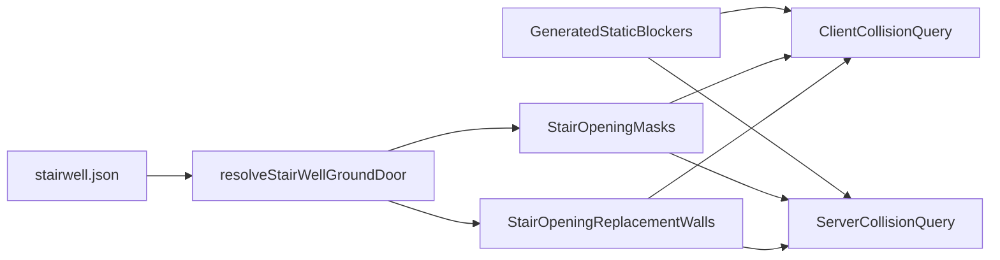

# Live Stair Opening Collision

## Recommendation
Implement the narrow hybrid path:
- Keep generated static collision as the base.
- Make only stair opening edits (`entryOpening`, `groundEntryOpening`, `secondaryEntryOpening`) runtime-dynamic.
- Do not move stair flights, landings, or other stair geometry onto the live path.
- Do not move walk-surface AABBs onto the live path; this plan is blocker-only.

This is the best trade-off because the existing collision stack already supports runtime blockers on both sides of gameplay:
- Client dynamic source hook in [packages/world/src/fpCharacterController.ts](packages/world/src/fpCharacterController.ts) and [apps/client/src/game/fpPlayerCollision.ts](apps/client/src/game/fpPlayerCollision.ts)
- Server runtime collision collector pattern in [apps/server/src/elevator/generated_player_collision.rs](apps/server/src/elevator/generated_player_collision.rs)

## Design

The runtime layer should do two things for each authored stair opening:
- Suppress stale static blockers inside a tight opening envelope.
- Re-add only the wall pieces that should remain around the opening (side slices and top slice for both the stair shaft wall and matching corridor wall punch region, including the typical-storey south-side secondary opening).

That lets the player pass through the live hole without rebuilding the full `generated_collision_solids` set.

## Planned Changes
1. Extract a small shared world helper for stair opening collision deltas.
- Add a helper near [packages/world/src/stairElevatorPlaceholders.ts](packages/world/src/stairElevatorPlaceholders.ts) / [packages/world/src/floorPlaceholderMeshes.ts](packages/world/src/floorPlaceholderMeshes.ts) that computes, from `resolveStairWellGroundDoor(...)` and `resolveStairWellSupplementalDoors(...)`, a localized set of:
  - ignore masks for the opening cutout
  - replacement blocker AABBs for the remaining shaft/corridor wall slices
- Keep this helper scoped to blocker wall-hole edits only, not stair tread geometry or walk surfaces.

2. Plug the helper into client runtime collision.
- In [apps/client/src/game/fpSessionWorldMount.ts](apps/client/src/game/fpSessionWorldMount.ts), source live stair opening data from `content/elevator/stairwell.json` as it already does for visuals.
- In [apps/client/src/game/fpPlayerCollision.ts](apps/client/src/game/fpPlayerCollision.ts), add a dynamic collision source that:
  - skips static blockers intersecting the live opening masks
  - visits replacement AABBs from the shared helper
- Reuse existing `DynamicBlockerSource` shape rather than introducing a new collision pipeline.
- Ensure the overlay covers both the primary stair opening and the persisted south-side `secondaryEntryOpening`.

3. Add a matching authoritative server runtime layer.
- Add a stair-opening runtime collector beside [apps/server/src/elevator/generated_player_collision.rs](apps/server/src/elevator/generated_player_collision.rs), but scoped to static stair opening edits rather than elevators.
- Feed it into the server collision query path in [apps/server/src/movement.rs](apps/server/src/movement.rs).
- For parity, embed only the small stair opening authoring payload into the server build instead of regenerating all collision shards. The goal is: stair opening edits stop depending on `generated_collision_solids.rs` updates.

4. Narrow collision-artifact staleness rules.
- Update the fingerprint/status logic in [scripts/worldCollisionArtifacts.ts](scripts/worldCollisionArtifacts.ts) and [apps/editor/src/vite/editorDevMiddleware.ts](apps/editor/src/vite/editorDevMiddleware.ts) so changing only stair opening fields does not mark the full world collision artifacts stale.
- Keep walk-surface generation and all other stair/corridor/building geometry changes on the existing full-regeneration path.

5. Add focused regression tests.
- World helper tests for mask/replacement AABB generation.
- Client collision tests proving the edited stair opening becomes passable while nearby wall still blocks.
- Client/server parity tests proving the typical-storey south `secondaryEntryOpening` is also passable while adjacent wall slices still block.
- Editor/status test coverage proving opening-only edits (`entryOpening`, `groundEntryOpening`, `secondaryEntryOpening`) no longer demand `pnpm content:gen-walk-aabbs`.

## Key Files
- [packages/world/src/stairElevatorPlaceholders.ts](packages/world/src/stairElevatorPlaceholders.ts)
- [packages/world/src/floorPlaceholderMeshes.ts](packages/world/src/floorPlaceholderMeshes.ts)
- [packages/world/src/fpCharacterController.ts](packages/world/src/fpCharacterController.ts)
- [apps/client/src/game/fpPlayerCollision.ts](apps/client/src/game/fpPlayerCollision.ts)
- [apps/client/src/game/fpSessionWorldMount.ts](apps/client/src/game/fpSessionWorldMount.ts)
- [apps/server/src/character_controller.rs](apps/server/src/character_controller.rs)
- [apps/server/src/movement.rs](apps/server/src/movement.rs)
- [apps/server/src/elevator/generated_player_collision.rs](apps/server/src/elevator/generated_player_collision.rs)
- [scripts/worldCollisionArtifacts.ts](scripts/worldCollisionArtifacts.ts)
- [apps/editor/src/vite/editorDevMiddleware.ts](apps/editor/src/vite/editorDevMiddleware.ts)