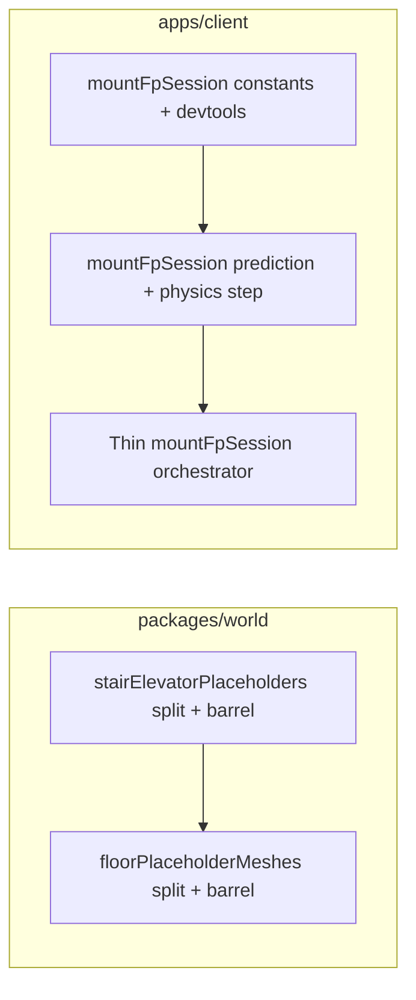

# Refactor plan: mountFpSession, floorPlaceholderMeshes, stairElevatorPlaceholders

## Goals

- **Reduce cognitive load**: each file owns one primary concern; files stay roughly under ~400–600 lines where practical.
- **Preserve behavior**: no intentional gameplay/network/visual changes; especially preserve **allocation-free** patterns in [`apps/client/src/game/mountFpSession.ts`](apps/client/src/game/mountFpSession.ts) (object pools, `_walkOpts`, `_mainStepOpts`, replay pools).
- **Stable API**: [`packages/world/src/index.ts`](packages/world/src/index.ts) and direct importers (`buildingFloorStack.ts`, tests, scripts) keep working via **re-exports** from thin barrels (`stairElevatorPlaceholders.ts`, `floorPlaceholderMeshes.ts`) until you optionally migrate imports later.

---

## 1. [`packages/world/src/stairElevatorPlaceholders.ts`](packages/world/src/stairElevatorPlaceholders.ts) (~2k lines)

**Current layout (from structure scan):**

- **Constants / editor IDs** (top): `STAIR_WELL_*`, `SHAFT_*`, types.
- **`addShaftShell`** (~lines 311–985): largest single unit — open hoistway mesh + ground door bands + exterior cladding branches.
- **Elevator entry**: `ElevatorShaftPlaceholderOpts`, `elevatorGroundDoorOpeningLocals`, `addElevatorShaftPlaceholder` (~compact).
- **Preview / editor**: `buildStairWellPreviewRoot`, `rebuildStairWellPreviewRoot`, opening proxies, `stairWellEntryOpeningFromProxyMesh`, transform helpers (`applyStairWellPartTransforms`, …).
- **Door resolution**: `resolveStairWellGroundDoor`, `resolveStairWellSupplementalDoors`, `stairShaftDoorTangentSpanShaftLocal`, `normalizeStairDoorVerticalSpan`.
- **Assembly**: `addStairWellPlaceholder` (~lines 1849–2050) composes layout + `addShaftShell` + treads/landings + props.

**Proposed modules (under `packages/world/src/`):**

| New file | Responsibility |
|----------|----------------|
| `stairElevatorShaftConstants.ts` | Exported `SHAFT_*` doubles, shared materials/refs used by shaft + elevator helpers (or keep materials beside shell). |
| `stairWellEditorIds.ts` | `STAIR_WELL_EDITOR_PART_IDS`, proxy IDs, `isStairWellOpeningProxyId`, related types. |
| `stairWellMaterials.ts` | `createStairWellMaterials`, `StairWellMaterialSet`, `applyCabMaterialSlot` usage (internal). |
| `shaftShell.ts` | **`addShaftShell`** + strictly local helpers only used by it (extract carefully to avoid exporting a dozen privates). |
| `elevatorShaftPlaceholder.ts` | `ElevatorShaftPlaceholderOpts`, `elevatorGroundDoorOpeningLocals`, `addElevatorShaftPlaceholder`. |
| `stairWellGroundDoorResolve.ts` | `resolveStairWellGroundDoor`, `resolveStairWellSupplementalDoors`, `stairShaftDoorTangentSpanShaftLocal`, `normalizeStairDoorVerticalSpan` (and types like `ResolvedStairWellGroundDoor`). |
| `stairWellPreviewRoot.ts` | Preview/rebuild/opening-proxy/edit flows that are **not** needed for runtime floor mesh build (depends on editor IDs + geometry helpers). |
| `stairWellPlaceholder.ts` | **`addStairWellPlaceholder`** + small private helpers (`tagGeneratedStairWellShellParts`, tread/landing loops) if they stay coupled. |

**Barrel:** [`stairElevatorPlaceholders.ts`](packages/world/src/stairElevatorPlaceholders.ts) becomes `export * from "./shaftShell.js"` … (or explicit re-exports) so [`floorPlaceholderMeshes.ts`](packages/world/src/floorPlaceholderMeshes.ts) and [`index.ts`](packages/world/src/index.ts) need **no** import-path churn initially.

**Dependency order:** constants → materials → `shaftShell` → elevator + placeholder → preview (may import from placeholder helpers). Run **`packages/world` tests** touched by [`stairElevatorPlaceholders.test.ts`](packages/world/src/stairElevatorPlaceholders.test.ts), [`stairWellPreview.test.ts`](packages/world/src/stairWellPreview.test.ts), [`stairDoorThresholdCollision.test.ts`](packages/world/src/stairDoorThresholdCollision.test.ts) after each slice.

---

## 2. [`packages/world/src/floorPlaceholderMeshes.ts`](packages/world/src/floorPlaceholderMeshes.ts) (~2.2k lines)

**Current layout:**

- **Classification / materials**: `classifyPrefab`, `matsFor`, `PlaceholderKind`.
- **Corridor hole / sign plumbing**: `corridorShellHolesFromStairPunches`, merges, `elevatorCorridorSignPlacementsFromPunches`, Koncar sign meshes, lobby door centers — long but cohesive “corridor ↔ shaft door” logic (~lines 214–896).
- **`addHollowRoomShell`** (~1040–1422): large branching wall/cladding/exterior-window path.
- **`buildFloorMeshes`** (~1447+): iterates `FloorDoc`, builds punches, calls `addHollowRoomShell`, shaft placeholders, etc.
- **Stair opening collision** (~1864+): `StairOpeningCollisionOverlay`, `buildStairOpeningCollisionOverlayForBuilding`, masks — already a **clean tail export**.

**Proposed modules:**

| New file | Responsibility |
|----------|----------------|
| `floorPlaceholderPrefabKind.ts` | `PlaceholderKind`, `classifyPrefab`, `matsFor` (imports [`floorPlaceholderMeshMaterials.ts`](packages/world/src/floorPlaceholderMeshMaterials.ts)). |
| `floorCorridorShaftPunches.ts` | Corridor wall holes, stair/elev punches, sign placement helpers (`resolveCorridorShaftDoorContacts` … through `mergeStairCorridorSignPlacements`). |
| `floorPlaceholderSignMeshes.ts` | `addKoncarElevatorSignMeshes`, `createKoncarElevatorSignMaterial` (if you want signage isolated). |
| `hollowRoomShell.ts` | **`addHollowRoomShell`** + `lobbyDoorCentersAlong`, `addShellFloorCeilingPieces`, `markNewChildrenNoCollision`, `addExteriorWallCladding` **if** those are only used here (otherwise pass deps). Types: `HollowShellOpts`, `CorridorShellWallHoles`, `PlateStairCorridorDoorPunch`. |
| `buildFloorMeshes.ts` | **`buildFloorMeshes`** + `expandBoxForPlacedObject` — orchestration only; imports hollow shell + punches. |
| `stairOpeningCollisionOverlay.ts` | Move exported overlay functions + `collectNamedBoxCollisionAabbs` / mask builders from the current tail. |

**Barrel:** Keep [`floorPlaceholderMeshes.ts`](packages/world/src/floorPlaceholderMeshes.ts) re-exporting `buildFloorMeshes`, `classifyPrefab`, and stair-overlay symbols for [`index.ts`](packages/world/src/index.ts) and tests.

**Note:** [`floorPlaceholderMeshes.ts`](packages/world/src/floorPlaceholderMeshes.ts) imports from [`stairElevatorPlaceholders.js`](packages/world/src/stairElevatorPlaceholders.ts); complete **stairElevator split first** (or at least keep barrel stable) to avoid duplicate symbols.

---

## 3. [`apps/client/src/game/mountFpSession.ts`](apps/client/src/game/mountFpSession.ts) (~2.5k lines)

**Dominant shape:** a single `export async function mountFpSession` containing setup, subscriptions, **large inline dev APIs** (`__mmDoorDebug`, `__mmElevDebug`, `__mmWallProbe`), **prediction/reconcile** (`reconcileLocalPredictionToServer`, intent queue), **`simulatePredictedPlayerStep`**, input handlers, and the **RAF tick** loop.

**Extraction strategy (minimize closure breakage):**

1. **`fpSessionConstants.ts`** (same folder)  
   Move top-of-file constants (`NET_INTERVAL_MS`, AOI sizes, damping, pitch limits, storage keys). Keeps the main file readable.

2. **`fpSessionDevTools.ts` (or three files)**  
   Extract **pure or mostly-pure** dev surfaces:
   - Factory functions: `createDoorDebugApi(deps)`, `createElevDebugApi(deps)`, `createWallProbeApi(deps)` where `deps` are narrow interfaces (`pos`, `camera`, `fpElevators`, `roundV`, collision snapshot fns, etc.).
   - Install stubs (`installMmWallProbeLoadingStub`) stay next to factories.
   - **Avoid** capturing half the session—pass callbacks for anything that reads live player state.

3. **`fpSessionPrediction.ts`**  
   Extract **reconcile + intent bookkeeping**:
   - Types: `PendingMoveIntent`, intent queue compaction.
   - Functions: `inputFromBitsInto`, `reconcileLocalPredictionToServer` **as factory** `createReconcileHandlers(ctx)` so `simulatePredictedPlayerStep` and elevator hooks remain injectable.
   - Keep comments about WASD idle vs elevator rider (lines ~1568–1600 area) — they document subtle bugs already fixed.

4. **`fpSessionPhysicsStep.ts`**  
   Extract `simulatePredictedPlayerStep` + elevator walk-merge constants (`ELEVATOR_WALK_MERGE_SKIP_VY`). It should accept explicit arguments/options rather than closing over `__mmDoorDebugState` when possible; door-debug logging can stay a single optional `onDoorDebugFrame` callback.

5. **Leave in `mountFpSession.ts`**  
   WebGPU/scene/renderer setup, subscription wiring, `mountFp*` calls, RAF loop glue, teardown `return () => { … }`.

**Risk controls:**

- **No new per-frame allocations** in extracted physics/reconcile paths; keep pooled `_walkOpts`, `_replayStepOpts`, `_mainStepOpts` either in `mountFpSession` and passed down, or owned by a small **`FpSessionRuntime` class** constructed once.
- Extract **after** a baseline behavior check (manual: movement, elevator ride, door collision, reconnect if applicable).

---

## Suggested execution order

1. **World:** Split [`stairElevatorPlaceholders.ts`](packages/world/src/stairElevatorPlaceholders.ts) first; run world tests.  
2. **World:** Split [`floorPlaceholderMeshes.ts`](packages/world/src/floorPlaceholderMeshes.ts); run world tests + any editor build that consumes world.  
3. **Client:** Refactor [`mountFpSession.ts`](apps/client/src/game/mountFpSession.ts) last (no dependency on world splits, but benefits from momentum and test discipline).

---

## Verification

- `pnpm` test (or repo’s standard script) for `packages/world` after each world PR-sized chunk.
- Smoke: FP session boots, walk, elevator, apartment doors, hotbar — plus dev-console probes if you rely on them (`__mmDoorDebug`, `__mmWallProbe`).
- Optional: **line-count gate** in CI later (e.g. warn if file > 800 lines) — not required for this refactor itself.
