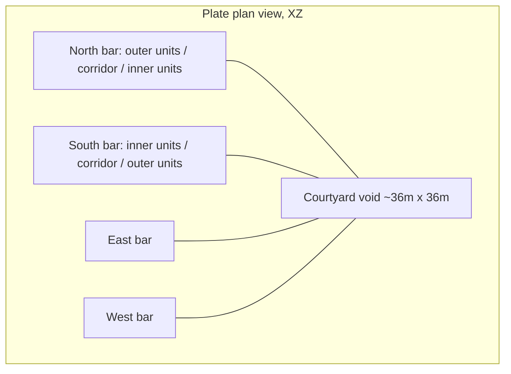

# Square Courtyard Ring (Compact, Double-Loaded)

## Target geometry

- Outer footprint: 80 m x 80 m square.
- Bar depth per side: 9 (outer units) + 3.85 (corridor) + 9 (inner units) = **21.85 m**.
- Courtyard void: 80 - 2 x 21.85 = **~36.3 m x 36.3 m** (open to sky).
- Corridor centrelines at +/-29.075 on the axis perpendicular to each bar; corridors run the full 80 m and overlap in a 3.85 x 3.85 crossroads at each corner (natural T/X junctions, walkable).
- Units constrained to `x in [-27.15, +27.15]` on N/S bars (and mirrored on E/W) so no unit collides with a perpendicular corridor. Result: **7 bays per row** x 2 rows x 4 bars = up to 56 units, minus 2 slots per bar lost to the core -> **~48 apartments/floor** x 10 floors = ~480 doors total (well under the 608 we used to ship with 19 floors).
- Four core stations, one per side at the bar midpoint. Original Mamutica convention preserved: **stair outboard, elevator inboard** of each corridor so both open into the corridor.



## What changes

### 1. Rewrite [scripts/gen-mamutica-floor-doc.mjs](scripts/gen-mamutica-floor-doc.mjs)

Replace the single-bar generator with a ring generator. Keep all existing constants (`CORRIDOR_WIDTH_M`, `UNIT_DEPTH_M`, `UNIT_ALONG_Z_M`, `BAY_GAP_M`, `STOREY_SPACING_M`) so unit bays, doors, and storey spacing remain identical to today.

New parameters at top of file:

```js
const OUTER_SIDE_M = 80;
const BAR_DEPTH_M = CORRIDOR_WIDTH_M + 2 * UNIT_DEPTH_M; // 21.85
const CORRIDOR_CENTERLINE_OFFSET_M = OUTER_SIDE_M / 2 - BAR_DEPTH_M / 2; // 29.075
const CORRIDOR_HALF_W = CORRIDOR_WIDTH_M / 2; // 1.925
// Units must stay within the inner X range on N/S bars (and Z range on E/W) so
// corner crossroads stay clear:
const UNIT_TANGENT_MAX = CORRIDOR_CENTERLINE_OFFSET_M - CORRIDOR_HALF_W - 0.05; // ~27.1
```

Emit, per side, three kinds of objects using a single `writeBar(side)` helper that computes positions in the side's local frame then rotates into world via a flat axis-swap (no rotation on the PlacedObject; we just swap which extent goes into `scale[0]` vs `scale[2]`):

- 1 x `corridor_segment_a` running the full `OUTER_SIDE_M` along the bar's tangent axis.
- Up to 7 outer-row units + up to 7 inner-row units per bar, bay-pitched at `UNIT_ALONG_Z_M`, centered on the bar's tangent origin, clipped to `|tangent| <= UNIT_TANGENT_MAX`, skipping the centre bay that the core occupies.
- 1 x `stair_well_a` outboard of corridor, 1 x `elevator_shaft_a` inboard, both at the bar midpoint. Scale axes swap between N/S bars (stair long axis = X) and E/W bars (stair long axis = Z).

Same logic used for both `writeTypicalFloor` and `writeGroundFloor`. Ground floor:
- Swaps `corridor_segment_a` for `lobby_hall_a`, widened to 7.5 m (matches existing lobby-hall width ratio), omits residential units, keeps the four core stations.
- Omits the hub-only elevator that existed at the podium (`elev_hub_w` + `stair_hub_e`) since every bar now has its own core.
- Updates `recommended_spawn_xz_m` to `[0, 0]` which lands the player inside the courtyard.

### 2. Update non-generated runtime assumptions

This cannot stay content-only as currently written.

- [apps/server/src/elevator_layout.rs](apps/server/src/elevator_layout.rs) hardcodes the old five-shaft west-bank linear spine, so it must be updated for the new four mid-bar cores. This includes new shaft keys, plate-space positions, and per-side door faces.
- Elevator-related tests and assumptions must move with it, especially in [apps/server/src/elevator/mod.rs](apps/server/src/elevator/mod.rs) and [apps/client/src/game/fpElevatorVolumes.test.ts](apps/client/src/game/fpElevatorVolumes.test.ts).
- Layout tests in [packages/world/src/mamuticaFloorLayout.test.ts](packages/world/src/mamuticaFloorLayout.test.ts) currently assume east/west-only rows and should be rewritten around ring invariants instead of the old linear arrangement.
- Ground-floor spawn should **not** default to `[0, 0]` unless regen proves the courtyard point is intentionally walkable. Safer default: a known corridor/lobby spawn on the south side. If `(0,0)` is kept, verification must explicitly prove it lands on valid walk geometry.

### 3. Regenerate derived content

All three commands are already defined in [package.json](package.json):

```powershell
pnpm content:gen-mamutica-floor
pnpm content:gen-apartment-doors
pnpm content:gen-walk-aabbs
```

- `gen-mamutica-floor`: writes the new `content/building/floors/floor_mamutica_typical.json` + `floor_mamutica_ground.json`.
- `gen-apartment-doors`: rebuilds [packages/world/src/generatedApartmentDoors.ts](packages/world/src/generatedApartmentDoors.ts) + `apps/server/src/generated_apartment_doors.rs`. The adjacency pass in [packages/world/src/unitEntryAdjacency.ts](packages/world/src/unitEntryAdjacency.ts) is already face-generic (picks `n`/`s`/`e`/`w` per unit based on corridor overlap), so N-bar units get south-facing doors, E-bar units get west-facing doors, etc., with zero code edits.
- `gen-walk-aabbs`: rebuilds `apps/server/src/generated_walk_surfaces.rs`, `generated_collision_solids.rs`, and `packages/world/src/generatedCollisionArtifacts.ts`. Footprint expands from the current ~[-16.55,16.55] x [-119.6,119.6] linear band to a ~[-40,40] x [-40,40] square envelope.

### 4. Touch-up [content/building/mammoth.json](content/building/mammoth.json) metadata

- Update `slotTemplates.floorRange` upper bound stays at `[2, 11]` (already fixed last turn).
- Update `slotTemplates.unitIndexRange`, which is currently `[1, 40]`, if the new typical floor really targets ~48 apartments.
- Update `gameplay_numbering_note` to mention the ring layout.
- Update `building_access_note` so it no longer describes the old hub / linear-core arrangement.
- Leave `worldOrigin` and `floorRefs` alone.

## Verification after content regeneration

- `git status` should show only: the two floor JSONs, the two generated-apartment-door files, the generated-walk/collision files, collision stamp, and optionally `mammoth.json` metadata.
- Rebuild/redeploy the local server module after regen. Stair opening/runtime overlays and other floor-json-driven runtime consumers need a rebuild, not just the `pnpm content:*` commands.
- Smoke test by running the local `check-apartment-door-passthrough.ts` script (already exists at [scripts/check-apartment-door-passthrough.ts](scripts/check-apartment-door-passthrough.ts)) - it walks every `(floor, unit, face)` and asserts the collision lane is passable when the door opens. This is the single best regression check for the new layout because it exercises the exact adjacency-plus-collision chain that just got rotated 90 degrees for two of the four bars.
- Run representative elevator/layout tests after updating the hardcoded shaft layout.
- Perform one in-game smoke pass on the rebuilt local module: verify spawn lands on walkable ground, use at least one elevator, and enter at least one apartment on each relevant face.

## Non-goals / called out risks

- Runtime code changes are expected in the elevator layout path and possibly small metadata/spawn coherence touchups. This is not purely authoring JSON plus generator edits.
- **Corridor corner visual clipping**: The four corridor AABBs overlap in 3.85 x 3.85 squares at each corner. Walls from two perpendicular shells will clip each other in that square. Functionally (walk surface, adjacency, collision) it is fine; the corner just reads as an open crossroads. If visual cleanup is desired later, the fix is a dedicated `corridor_corner_a` prefab, not a rework of today's plan.
- **No stair/elevator at corners**: Starting with 4 mid-bar stations to keep "matching" parity across sides. Adding 4 corner stations is a one-line loop addition to the generator if desired later.
- **Spawn position**: The old plan assumed courtyard `(x=z=0)` is safe, but with a hollow ring that point may be a walk-surface hole. Prefer an authored lobby/corridor spawn unless verification proves `(0,0)` is intentionally walkable.
- The apartment-unit-kit panel widths are authored at 1.26 m and already match both horizontal and vertical wall orientations, so the door kit renderer does not need tuning.
