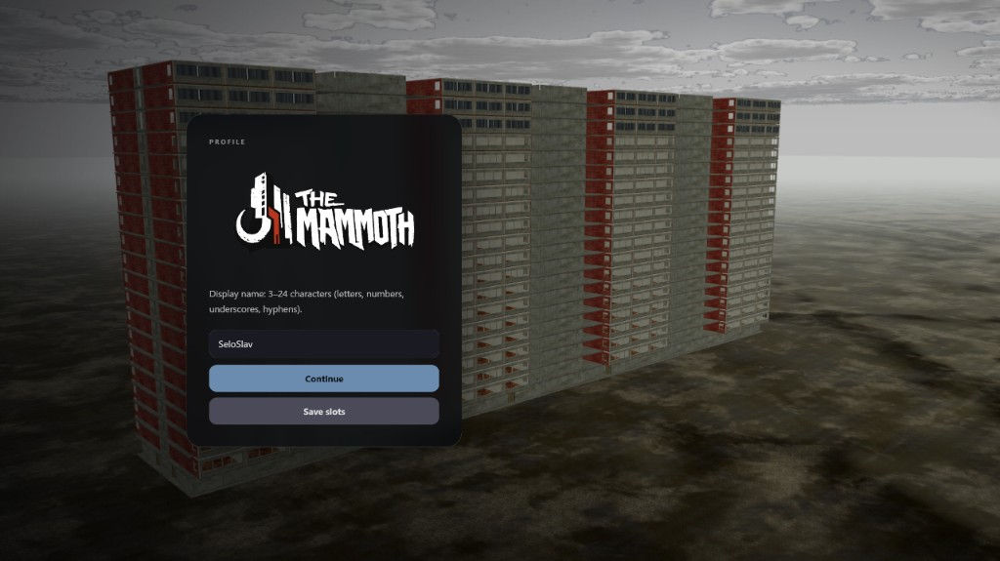
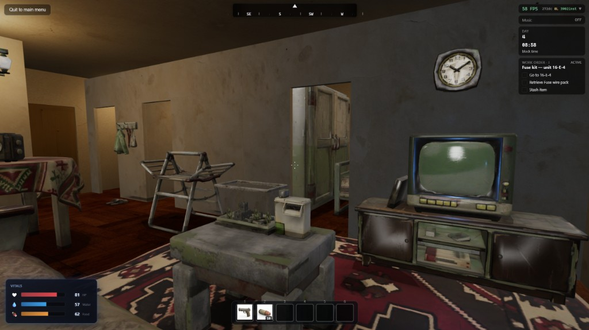
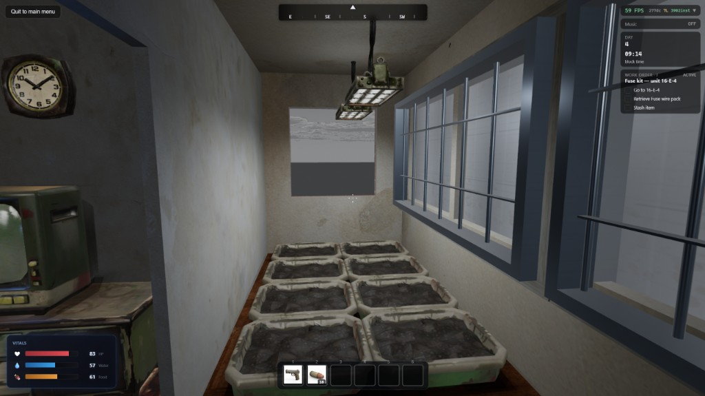
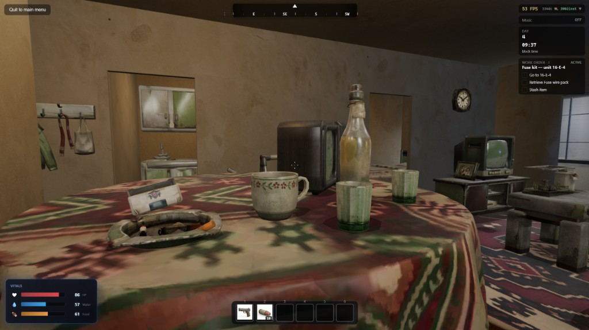
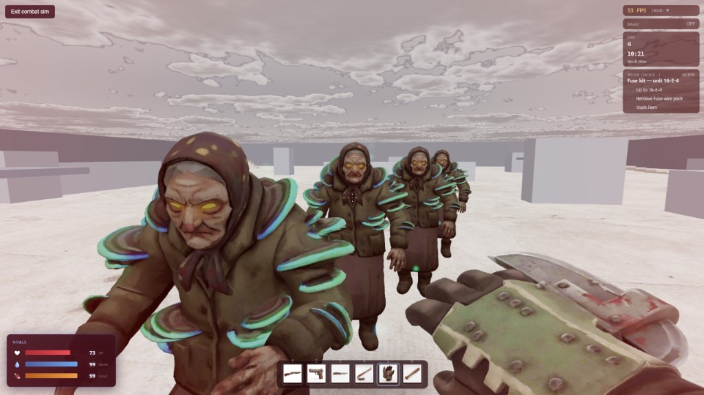
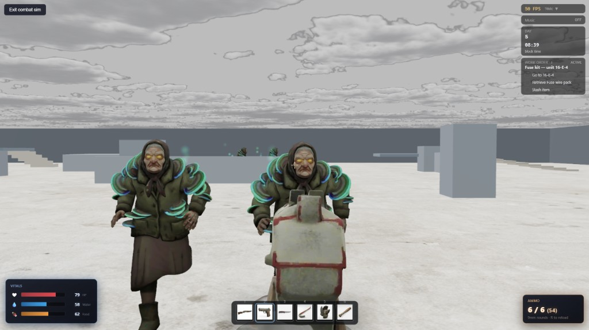
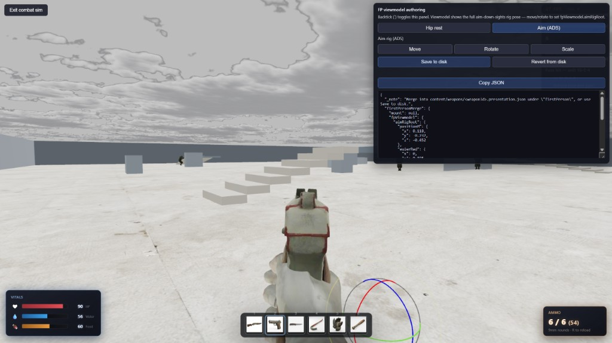
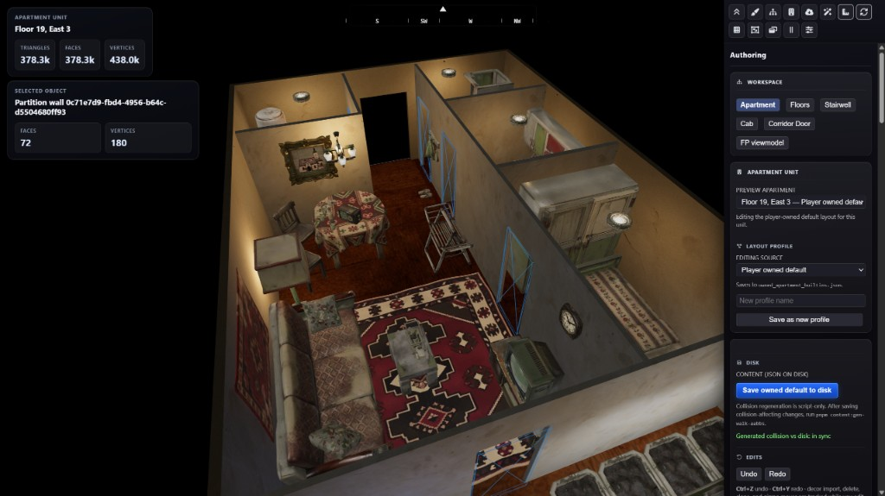

# The Mammoth



Browser-first **persistent multiplayer survival** prototype set in a huge Slavic apartment tower (Mamutica) and its neighborhood. TypeScript monorepo: **Three.js** game runtime, **React** for HUD/menus only, **SpaceTimeDB** for live multiplayer state, authored world data on disk under `content/`.

**Honest scope:** this is a **weak first pass** — lots of stubs, perf cliffs, incomplete loops, and rough edges. It is still a real codebase worth exploring: you can walk the building, claim apartments, fight in a sandbox arena, author floors in an editor, and extend systems without starting from zero.

---

## Quick start

**Prerequisites:** Node **18+**, [pnpm](https://pnpm.io/) **9**, [SpacetimeDB CLI](https://spacetimedb.com/) (for multiplayer / persistence).

```bash
git clone <repo-url>
cd the-mammoth
pnpm install
```

**1. Start the database** (separate terminal — stays running):

```bash
spacetime start
```

**2. Publish the server module** (once per clone, again after Rust schema/reducer changes):

```bash
spacetime publish mammoth-local --project-path apps/server
pnpm client:generate   # TypeScript bindings for tables/reducers
```

**3. Run the game client:**

```bash
pnpm dev:client
# → http://localhost:5173
```

Optional: `pnpm dev` also brings up the **world editor** and a local **auth** server. Client-only is enough for most playtests.

**FPS sandbox (no megablock):** `http://localhost:5173/?combatSim=1` — empty arena, same guns/viewmodels/reload/melee reducers as live FP, babushka spawns in a ring.

**Live building NPCs:** with Spacetime connected, babushkas spawn on **elevator deck 16** (`levelIndex` **17**, extraction band) — six melee grannies, `session_key` like `megablock:floor:17`. They **do not pathfind** (no corridor graph, no doorway routing); server AI is chase + separation + clamp to the floor footprint. **Melee only** — no ranged NPCs; tuning is forgiving. Optional dev flag: `?fpnpc=1` or `localStorage.mammothFpWorldNpcs=1` (presenters also mount whenever the DB is connected).

**Second player locally:** same URL in normal + private/incognito windows works for presence and shared tables, but gameplay is tuned for **solo** (see below).

Copy env hints from `apps/client/.env.example` if you change DB name or Spacetime URI (`VITE_SPACETIME_DATABASE` must match `spacetime publish <name>`).

---

## What you get today

| Area | Notes |
|------|--------|
| **Megablock FP** | First-person walk through authored floors, elevators, stairs, corridors, apartment shells; interior visibility/culling, loot, stash, doors. |
| **FPS combat** | Viewmodel system, firearms with reload, melee weapons, damage feedback; `?combatSim=1` isolates this. |
| **NPCs** | Babushka melee on **floor 16** in Mamutica + combat-sim arena; no nav mesh / doors; easy to kill. Not shippable at building scale ([docs](docs/architecture/fp-world-npc-readiness.md)). |
| **Multiplayer plumbing** | SpaceTimeDB tables/reducers throughout; **play loop is solo-first** — client-trusted movement, guest-by-default, several co-op paths gated off. |
| **World editor** | `pnpm editor:dev` — same engine stack as the client; place/edit content, import models, save to `content/`. |
| **Content pipeline** | Floor/building JSON, GLB assets, codegen for walk AABBs/collision, apartment door stock, mesh optimization scripts. |
| **Rendering** | WebGPU-oriented Three.js path, TSL materials, floor-plate streaming, merged static geo, instancing — see `packages/engine` and `docs/architecture/`. |

**Design intent (not all implemented):** day jobs, floor orders, extraction runs, apartment life — [docs/core-game-loop.md](docs/core-game-loop.md). First scripted slice: [docs/vertical-slice-day1-storage-run.md](docs/vertical-slice-day1-storage-run.md).

---

## Screenshots

**Apartment interiors / live Mamutica**

<p>
  
  
  
</p>

**Combat sim / weapons / NPCs**

<p>
  
  
  
</p>

**World editor**

<p>
  
</p>

---

## Client ↔ server sync (solo-first)

The client always talks to **SpaceTimeDB** (`apps/server` Rust module). Many systems are **wired for multiplayer/co-op** (shared tables, reducers, subscriptions) but the **default experience is one guest player** with client-heavy authority.

**Typical flow (movement):** each ~20 Hz the client runs FP locomotion locally, then calls `submitPlayerLocomotionSnapshot` with position/velocity/aim — server writes **`player_pose`** (trusted solo snapshot, not full server physics). The client still **reconciles** when replicated `player_pose` drifts ([`fpSessionLocalPrediction.ts`](apps/client/src/game/fpSession/fpSessionLocalPrediction.ts)).

**Other reducers you will see in code:**

| Client call | Server / table | What it does |
|-------------|----------------|--------------|
| `submitPlayerLocomotionSnapshot` | `player_pose`, `player_input` | Feet, yaw, vitals gate |
| `pickupDroppedItem` | `dropped_item` | Loot on same storey / unit rules |
| `submitFirearmReload` / hitscan paths | combat tables | Guns share combat-sim + live FP |
| `elevatorHail`, `elevatorSelectFloor` | elevator state | Cab / landing sync |
| `enterCombatSim` / `leaveCombatSim` | `world_npc` arena rows | `?combatSim=1` spawns |
| `apartment` claim / door toggles | `apartment_unit`, doors | Claims on by default for guests |

**Mostly off or dev-gated today:**

- **Account auth** — `VITE_ENABLE_ACCOUNT_AUTH` unset → automatic **guest** WebSocket; OIDC in `apps/auth` is optional.
- **Registered-only apartment claims** — server flag `MAMMOTH_REQUIRE_REGISTERED_APARTMENT_CLAIMS` defaults **off** so guests can claim wardrobes too.
- **Strict server movement** — no dedicated server-side character controller for Mamutica; prediction + snapshot trust instead.
- **NPC scale** — `SELECT * FROM world_npc` globally; fine for a handful of babushkas, not dozens of players × floors.
- **Co-op semantics** — no squad/loot rules, shared objectives, or dedicated second-player polish; two tabs prove replication, not a shipped co-op mode.

Combat sim (`?combatSim=1`) uses the **same** `mountFpSession` RAF, weapons, and reducers; it swaps the world for an arena and stubs apartment/stash/grow subsystems ([`fpSessionInertSubsystems.ts`](apps/client/src/game/fpSession/fpSessionInertSubsystems.ts)).

---

## Repository map

```
apps/client     — Vite + Three.js game + React HUD
apps/editor     — World authoring tool
apps/server     — SpaceTimeDB Rust module
apps/auth       — OpenAuth (optional sign-in)
packages/engine — Rendering, viewmodels, materials, post-processing
packages/world  — Building/floor docs, collision, procedural mesh helpers
packages/game   — Shared gameplay rules/types
packages/schemas— Zod document schemas
content/        — Authored floors, building defs, apartment data, references
static/         — Models, textures, audio served to client
docs/           — Architecture and game design (start: docs/PROJECT.md)
```

Starter `apps/web` / `apps/docs` from the Turborepo template are reference-only.

---

## Common commands

| Command | Purpose |
|---------|---------|
| `pnpm dev:client` | Game client (port **5173**) |
| `pnpm editor:dev` | World editor |
| `pnpm server:build` | Build SpacetimeDB WASM module |
| `pnpm client:generate` | Regenerate client bindings after server changes |
| `pnpm content:gen-walk-aabbs` | Regenerate server walk surfaces after floor JSON edits |
| `pnpm test` | Unit tests across packages |
| `pnpm check-types` | Typecheck monorepo |

After editing `content/building/` or floor docs, run walk-AABB codegen before expecting correct server grounding ([docs/content-building.md](docs/content-building.md)).

---

## Documentation

- **[docs/README.md](docs/README.md)** — index  
- **[docs/PROJECT.md](docs/PROJECT.md)** — vision, stack, milestones  
- **[apps/client/README.md](apps/client/README.md)** — client dev, second port, multiplayer  
- **[apps/server/README.md](apps/server/README.md)** — Spacetime publish, auth, apartment flags  

---

## If you want to go further

The repo is meant to be **forked and pushed**: add floors in the editor, wire new reducers, tighten FP perf, give NPCs real nav/door awareness, or harden real co-op (server movement, scoped subscriptions, population caps). Expect incomplete APIs in hot paths — read the code, run `pnpm test`, use `?combatSim=1` for guns-only, or ride the elevator to **deck 16** to punch babushkas in the real building.

**Stack:** pnpm + Turbo · TypeScript · Three.js ~0.183 · React 19 · Vite · SpacetimeDB 2.x · Rust server module.
