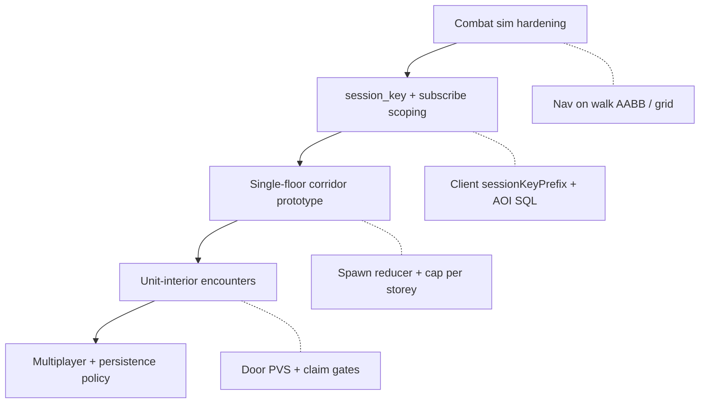

# FP world NPCs — readiness (not shippable yet)

**Status:** Combat-sim prototype only. **Do not spawn NPCs in the live Mamutica FP session** until the milestones below are met.

The building already has the scale problem (19 occupied storeys, 24 units per typical floor, corridor + elevator + stair traffic). NPCs add authoritative AI ticks, collision, replication, audio, and visibility cost on top of that. The combat sim exists to exercise **one isolated arena** without paying megablock complexity first.

---

## What works today

### Combat sim (isolated arena)

| Layer | State |
|-------|--------|
| **Server** | `world_npc` table, `npc_tick_step` schedule (~20 Hz), babushka AI (idle → aggro → melee → death), `apply_npc_damage`, peer separation, arena clamp for `session_key` prefix `combat_sim:{unit_key}` |
| **Entry** | `enter_combat_sim` / `leave_combat_sim` in `apps/server/src/combat_sim.rs` |
| **Spawns** | Default ring of babushkas on enter; optional authored anchors via `combat_sim_npc_spawn` + client sync before enter |
| **Client** | `mountCombatSimSession` → `mountFpSession({ combatSimMode: true })` with **`createFpNpcSession` enabled** |
| **Combat** | Shared hitscan / melee reducers with live FP; open-arena LOS skip while session NPCs live |

Client entry path: `apps/client/src/game/combatSim/mountCombatSimSession.ts`.

### Live Mamutica FP session

| Layer | State |
|-------|--------|
| **`createFpNpcSession`** | **Off by default** — mounted when `?fpnpc=1` / `mammothFpWorldNpcs` or combat sim; not production-ready for building-scale AI |
| **Server AI** | Babushka step assumes combat-sim arena clamp when `session_key.starts_with("combat_sim:")`; **no megablock nav mesh, corridor graph, or unit-scoped wander** |
| **Spawning** | No reducer or content pipeline to place persistent/building NPCs in corridor or units |
| **Subscriptions** | Initial client batch includes `SELECT * FROM world_npc` globally — acceptable for a handful of combat-sim rows, **not** for building-scale population without AOI / session scoping |

---

## Client pieces already landed (for when we are ready)

These are **preparation**, not permission to spawn in Mamutica:

| Piece | Location | Notes |
|-------|----------|--------|
| **`WorldNpcPresenterPool`** | `packages/engine/src/npc/BabushkaNpcPresenter.ts` | Babushka GLB, animation smoothing, hit debug overlay |
| **`fpNpcSession`** | `apps/client/src/game/npc/fpNpcSession.ts` | Subscribes to `world_npc`, audio (combat + idle + epitaph), blood/spore FX |
| **Render PVS gate** | `apps/client/src/game/npc/fpNpcRenderPvs.ts` | Storey band + corridor door PVS — hide NPCs on wrong floor or inside closed units (CPU-side, no GPU readback) |
| **`frustumCulled = true`** | Babushka skinned meshes | Three.js frustum pass after PVS gate |
| **Tag** | `MAMMOTH_FP_WORLD_NPC_UD` | Skip megablock perf probes / floor walks |

Wiring megablock NPCs is mostly: mount `createFpNpcSession` in `mountFpSession.ts` (non–combat-sim branch) with the same `getRenderPvsGate` hook already used in combat sim, plus **`sessionKeyPrefix`** filtering so each client only presents relevant rows.

---

## Why megablock is not ready

### 1. No building spawn model

Combat sim spawns into a **flat arena** derived from one `ApartmentUnit` bounds (`combat_sim_arena_center`, ring layout, corpse respawn). There is no equivalent for:

- corridor patrols
- unit-interior encounters tied to claim state
- floor/storey-scoped population caps
- elevator / stair transitions

**Needed:** authored spawn tables or reducers scoped by `unit_key`, floor, or zone — and a **`session_key` convention** for live world (e.g. `megablock:floor:12` or per-unit) with clear ownership and despawn rules.

### 2. AI and physics are combat-sim shaped

`step_all_world_npcs` in `apps/server/src/npc.rs`:

- chases **`chase_identity`** (combat-sim owner)
- **clamps to combat arena** only for `combat_sim:` keys
- **despawns corpses** and respawns only in combat sim

Live building needs: walk surfaces on **merged megablock AABBs**, door/passage awareness, aggro through walls (or not), multi-player targets, and **no** implicit arena boundary.

### 3. Replication and subscription scale

Today: `world_npc` is a **public** table; client initial subscribe pulls **all rows**. Fine for ≤10 combat-sim babushkas. Unacceptable for dozens of NPCs × many players without:

- spatial or session-scoped subscriptions (SpacetimeDB RLS / filtered queries)
- or strict row count caps + `session_key` filters on the client

### 4. Performance budget

See [fp-building-mesh-visibility.md](fp-building-mesh-visibility.md) and [fp-apartment-interior-performance.md](fp-apartment-interior-performance.md). Adding skinned NPCs in corridors raises:

- draw calls / skinning cost
- shadow policy (currently NPCs: `castShadow = false`)
- audio (spatial idle, aggro, combat — already implemented per NPC in `fpNpcSession`)

Corridor **door PVS** (`packages/world/src/buildingCorridorPvs.ts`) reduces *visible* NPCs but does not reduce **simulation** cost — server still ticks every live row.

### 5. Gameplay / product gaps

Not implemented for live world:

- NPC persistence across sessions (when to save, when to reset)
- interaction with apartment claim, doors, elevators, other players
- loot / quest hooks on building NPC defeat
- content authoring for spawn points in editor or JSON

### 6. Multiplayer fairness

Combat sim is **solo-scoped** (owner’s unit, owner’s chase target). Building NPCs need explicit rules: who owns aggro, who gets credit, whether AI runs on server only for all observers (yes — already true), and anti-exploit spawn triggers.

---

## Recommended path (order of work)

1. **Keep iterating in combat sim only** — AI, weapons, presentation, perf.
2. **Define live `session_key` scheme + subscription filters** before any megablock spawn reducer ships.
3. **Prototype one storey** — e.g. max N babushkas in corridor nodes on floor 13, server tick only when players on that band (optional optimization).
4. **Mount `createFpNpcSession` in Mamutica** behind a feature flag after (2) and (3); reuse `fpNpcRenderPvsGate`.
5. **Authoring + design** — spawn markers, encounter tables, reset rules.

---

## Milestone checklist (gate before live spawn)

Use this as a PR / release gate. All should be **checked intentionally**, not assumed.

- [ ] **`session_key` spec** for live world documented and implemented on server insert
- [ ] **Client subscribes** only to relevant NPC rows (prefix or AOI), not global `SELECT * FROM world_npc`
- [x] **Client row filter** — `fpNpcSession` `sessionKeyPrefix` (`megablock:` / `combat_sim:`) before presenters
- [x] **`createFpNpcSession` mounted** in `mountFpSession` when `?fpnpc=1` / `mammothFpWorldNpcs` (combat sim always on)
- [ ] **Server AI** uses megablock walk/collision (not combat arena clamp) for live keys
- [ ] **Population cap** per storey / unit / server
- [ ] **Despawn / persistence** policy written and tested
- [ ] **Multiplayer** aggro and damage attribution tested with 2+ clients in same corridor
- [ ] **Perf capture** with `?fpdebug=1`: frame ms and visible NPC count on target hardware
- [ ] **Audio** spatial load acceptable with max planned NPC count
- [ ] **Design sign-off** on where NPCs can exist (corridor only? claimed units? events?)

---

## Key code references

| Area | Path |
|------|------|
| Server NPC table + tick | `apps/server/src/npc.rs` |
| Combat sim enter/spawn | `apps/server/src/combat_sim.rs` |
| Authoring combat spawns | `apps/server/src/combat_sim_npc_spawn.rs` |
| Client NPC session | `apps/client/src/game/npc/fpNpcSession.ts` |
| Mamutica mount (NPC **off**) | `apps/client/src/game/mountFpSession.ts` — `fpNpcSession = isCombatSim ? … : null` |
| Combat sim mount (NPC **on**) | `apps/client/src/game/combatSim/mountCombatSimSession.ts` |
| Render visibility gate | `apps/client/src/game/npc/fpNpcRenderPvs.ts` |
| Corridor door PVS | `packages/world/src/buildingCorridorPvs.ts` |
| Replicated snapshot shape | `packages/game/src/npc/replicatedNpcSnapshot.ts` |

---

## Related docs

- [fp-building-mesh-visibility.md](fp-building-mesh-visibility.md) — floor plate band, unit scoping, corridor PVS integration
- [fp-apartment-interior-performance.md](fp-apartment-interior-performance.md) — decor / GPU baseline; NPCs must not regress these captures
- [fp-prediction-view-smoothing.md](fp-prediction-view-smoothing.md) — network tick vs visual follow (same concern for NPC meshes)

---

## Takeaway

**Combat sim proves combat + presentation.** **Mamutica does not spawn NPCs yet** — on purpose. Turning on `createFpNpcSession` in the main FP mount without server spawn scoping, AI retargeting, and subscription filters would replicate rows globally and simulate babushkas with arena logic that does not match the building. Finish the checklist above before the first live spawn reducer merges.
